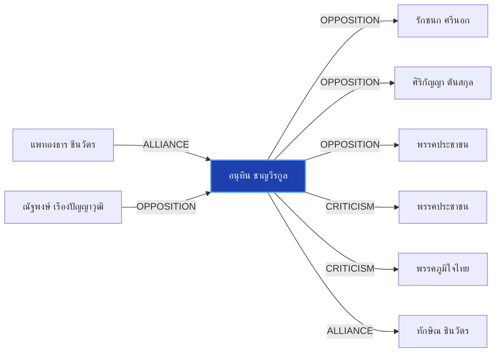

# อนุทิน ชาญวีรกูล

> **สังกัด**: พรรคภูมิใจไทย | **บทบาท**: รองนายกรัฐมนตรี และ รมว.มหาดไทย | **ขั้วการเมือง**: Government

## 📊 ข้อมูลสังเขป & สถิติ
- **การปรากฏในข่าว 30 วันล่าสุด**: 35 ครั้ง
- **สถานะทางการเมือง**: Government
- **ชื่อเรียก/ฉายา**: อนุทิน, เสี่ยหนู, หัวหน้าพรรคภูมิใจไทย, มท.1

## 🌐 แผนผังความสัมพันธ์ (Semantic Network)

## 🔗 โครงข่ายความสัมพันธ์และเหตุการณ์สำคัญ
- **OPPOSITION** ➔ [[entities/raknok_srinork|รักชนก ศรีนอก]]: อนุทิน ชาญวีรกูล และ รักชนก ศรีนอก มีปฏิสัมพันธ์ในประเด็นการเมือง (เมื่อ 2026-08-02)
  > *"69 “อนุทิน-รักชนก” คว้าแชมป์โดดเด่นประจำเดือน - Thairath"*
- **ALLIANCE** ➔ [[entities/paetongtarn_shinawatra|แพทองธาร ชินวัตร]]: แพทองธาร ชินวัตร และ อนุทิน ชาญวีรกูล ในขั้วการเมืองเดียวกัน (Government) (เมื่อ 2026-08-28)
  > *"นภินทร เปิดทำเนียบ แจงโกงเลือกส.ว. ลั่นไม่โง่ทำผิดกฎหมาย ฝากถึง เป๋า-ยิ่งชีพ เจอกันในศาล"*
- **OPPOSITION** ➔ [[entities/sirikanya_tansakun|ศิริกัญญา ตันสกุล]]: อนุทิน ชาญวีรกูล และ ศิริกัญญา ตันสกุล มีปฏิสัมพันธ์ในประเด็นการเมือง (เมื่อ 2026-08-09)
  > *"POLITICS: ‘อนุทิน’ โพสต์ “ถ้ายังวิ่งชนกำแพงอยู่ มันก็เจ็บหัวอีก” หลัง ‘ศิริกัญญา’ เปิดใจสู้ปัญหาในพรรคเหมือนสู้กับกำแพง วันนี้ (9 ส"*
- **OPPOSITION** ➔ [[entities/natthaphong_ruengpanyawut|ณัฐพงษ์ เรืองปัญญาวุฒิ]]: ณัฐพงษ์ เรืองปัญญาวุฒิ และ อนุทิน ชาญวีรกูล มีปฏิสัมพันธ์ในประเด็นการเมือง (เมื่อ 2026-08-28)
  > *"‘ชลน่าน’ ยันขึ้นเวทีฝ่ายค้าน ขอ พท.แล้ว ชี้ไม่กระทบสัมพันธ์ ‘ภูมิใจไทย’"*
- **OPPOSITION** ➔ [[entities/peoples_party|พรรคประชาชน]]: อนุทิน ชาญวีรกูล และ พรรคประชาชน มีปฏิสัมพันธ์ในประเด็นการเมือง (เมื่อ 2026-08-28)
  > *"‘ชลน่าน’ ยันขึ้นเวทีฝ่ายค้าน ขอ พท.แล้ว ชี้ไม่กระทบสัมพันธ์ ‘ภูมิใจไทย’"*
- **CRITICISM** ➔ [[entities/peoples_party|พรรคประชาชน]]: อนุทิน ชาญวีรกูล วิพากษ์วิจารณ์/ตรวจสอบท่าทีของ พรรคประชาชน (เมื่อ 2026-08-28)
  > *"2569 วงเงินไม่เกิน 400,000 ล้านบาท โดยเฉพาะในส่วนของแผนงานที่ 2 กรอบวงเงิน 200,000 ล้านบาท เพื่อปรับโครงสร้างและสร้างการเปลี่ยนผ่านด้านพลังงานของประเทศว่า ยืนยันว่ารัฐบาลภายใต้การนำของนายอนุทิน ชาญวีรกูล นายกรัฐมนตรี พร้อมเดินหน้าตามกรอบกฎหมาย รัฐบาล"*
- **CRITICISM** ➔ [[entities/bhumjaithai_party|พรรคภูมิใจไทย]]: อนุทิน ชาญวีรกูล วิพากษ์วิจารณ์/ตรวจสอบท่าทีของ พรรคภูมิใจไทย (เมื่อ 2026-08-11)
  > *"พิชายซัดอนุทิน “ทำการเมืองอุปลักษณ์” ธนพรสวน “กำแพงอนุทิน เป็นเพียงสีสันทางการเมือง” #พรรคประชาชน #อนุทิน #ภูมิใจไทย #การเมือง #TheStandardNews #TheStandardNow - facebook"*
- **ALLIANCE** ➔ [[entities/thaksin_shinawatra|ทักษิณ ชินวัตร]]: อนุทิน ชาญวีรกูล และ ทักษิณ ชินวัตร ในขั้วการเมืองเดียวกัน (Government) (เมื่อ 2026-08-15)
  > *"วิเคราะห์ภาพบินเข้าทัพฟ้า-ไหว้ทักษิณ ธนพร มอง 'อนุทิน-ภูมิใจไทย' ขยับจากตัวแปร สู่ 'ผู้กำหนดเกม' การเมืองไทย - แนวหน้า"*
- **MEMBER_OF** ➔ [[entities/bhumjaithai_party|พรรคภูมิใจไทย]]: อนุทิน ชาญวีรกูล สังกัด/ดำรงตำแหน่งใน พรรคภูมิใจไทย (เมื่อ 2026-08-28)
  > *"‘ชลน่าน’ ยันขึ้นเวทีฝ่ายค้าน ขอ พท.แล้ว ชี้ไม่กระทบสัมพันธ์ ‘ภูมิใจไทย’"*
- **OPPOSITION** ➔ [[entities/election_commission|คณะกรรมการการเลือกตั้ง (กกต.)]]: อนุทิน ชาญวีรกูล และ คณะกรรมการการเลือกตั้ง (กกต.) มีปฏิสัมพันธ์ในประเด็นการเมือง (เมื่อ 2026-08-28)
  > *"นภินทร เปิดทำเนียบ แจงโกงเลือกส.ว. ลั่นไม่โง่ทำผิดกฎหมาย ฝากถึง เป๋า-ยิ่งชีพ เจอกันในศาล"*
- **OPPOSITION** ➔ [[entities/parit_wacharasindhu|พริษฐ์ วัชรสินธุ]]: อนุทิน ชาญวีรกูล และ พริษฐ์ วัชรสินธุ มีปฏิสัมพันธ์ในประเด็นการเมือง (เมื่อ 2026-08-28)
  > *"นภินทร เปิดทำเนียบ แจงโกงเลือกส.ว. ลั่นไม่โง่ทำผิดกฎหมาย ฝากถึง เป๋า-ยิ่งชีพ เจอกันในศาล"*
- **CRITICISM** ➔ [[entities/senate_thailand|วุฒิสภา (สว.)]]: อนุทิน ชาญวีรกูล วิพากษ์วิจารณ์/ตรวจสอบท่าทีของ วุฒิสภา (สว.) (เมื่อ 2026-08-28)
  > *"บวรศักดิ์ ซัดองค์กรอิสระ ความเชื่อมั่นตกต่ำ หนุนแก้รธน. ชง 5 ข้อรื้อสรรหา-คืนสิทธิปชช.ถอดถอน"*
- **ALLIANCE** ➔ [[entities/pheu_thai_party|พรรคเพื่อไทย]]: อนุทิน ชาญวีรกูล และ พรรคเพื่อไทย ในขั้วการเมืองเดียวกัน (Government) (เมื่อ 2026-08-28)
  > *"เพื่อไทย ไฟเขียว ชลน่าน ร่วมเวทีฝ่ายค้าน ชี้สัมพันธ์รัฐบาลแน่นปึ้ก พร้อมเดินตามแนวอนุทิน"*
- **OPPOSITION** ➔ [[entities/senate_thailand|วุฒิสภา (สว.)]]: อนุทิน ชาญวีรกูล และ วุฒิสภา (สว.) มีปฏิสัมพันธ์ในประเด็นการเมือง (เมื่อ 2026-08-28)
  > *"‘ชลน่าน’ ยันขึ้นเวทีฝ่ายค้าน ขอ พท.แล้ว ชี้ไม่กระทบสัมพันธ์ ‘ภูมิใจไทย’"*
- **ALLIANCE** ➔ [[entities/senate_thailand|วุฒิสภา (สว.)]]: อนุทิน ชาญวีรกูล และ วุฒิสภา (สว.) ร่วมมือทางการเมือง/พรรคร่วมรัฐบาล (เมื่อ 2026-08-27)
  > *"POLITICS: ’อนุทิน‘ โยนถาม ‘ชลน่าน’ ตอบ หลังมีชื่อขึ้นเวทีฝ่ายค้าน บอก พรรคใครพรรคมัน ชี้ พรรคร่วมรัฐบาลมีกฎกติกามารยาทอยู่แล้ว ไม่หวั่น เกมวัดใจ ‘เพื่อไทย‘ โหวตปม ฮั้ว สว. มั่นใจเสถียรภาพรัฐบาล - คะแนนโหวตชัดเจน วันนี้ (27 ส.ค. 69) นายอนุทิน ชาญวีรกู"*
- **ALLIANCE** ➔ [[entities/democrat_party|พรรคประชาธิปัตย์]]: อนุทิน ชาญวีรกูล และ พรรคประชาธิปัตย์ ในขั้วการเมืองเดียวกัน (Government) (เมื่อ 2026-08-28)
  > *"‘ชลน่าน’ ยันขึ้นเวทีฝ่ายค้าน ขอ พท.แล้ว ชี้ไม่กระทบสัมพันธ์ ‘ภูมิใจไทย’"*
- **CRITICISM** ➔ [[entities/paetongtarn_shinawatra|แพทองธาร ชินวัตร]]: แพทองธาร ชินวัตร วิพากษ์วิจารณ์/ตรวจสอบท่าทีของ อนุทิน ชาญวีรกูล (เมื่อ 2026-08-28)
  > *"2569 วงเงินไม่เกิน 400,000 ล้านบาท โดยเฉพาะในส่วนของแผนงานที่ 2 กรอบวงเงิน 200,000 ล้านบาท เพื่อปรับโครงสร้างและสร้างการเปลี่ยนผ่านด้านพลังงานของประเทศว่า ยืนยันว่ารัฐบาลภายใต้การนำของนายอนุทิน ชาญวีรกูล นายกรัฐมนตรี พร้อมเดินหน้าตามกรอบกฎหมาย รัฐบาล"*
- **CRITICISM** ➔ [[entities/natthaphong_ruengpanyawut|ณัฐพงษ์ เรืองปัญญาวุฒิ]]: ณัฐพงษ์ เรืองปัญญาวุฒิ วิพากษ์วิจารณ์/ตรวจสอบท่าทีของ อนุทิน ชาญวีรกูล (เมื่อ 2026-08-28)
  > *"บวรศักดิ์ ซัดองค์กรอิสระ ความเชื่อมั่นตกต่ำ หนุนแก้รธน. ชง 5 ข้อรื้อสรรหา-คืนสิทธิปชช.ถอดถอน"*
- **CRITICISM** ➔ [[entities/parit_wacharasindhu|พริษฐ์ วัชรสินธุ]]: อนุทิน ชาญวีรกูล วิพากษ์วิจารณ์/ตรวจสอบท่าทีของ พริษฐ์ วัชรสินธุ (เมื่อ 2026-08-28)
  > *"บวรศักดิ์ ซัดองค์กรอิสระ ความเชื่อมั่นตกต่ำ หนุนแก้รธน. ชง 5 ข้อรื้อสรรหา-คืนสิทธิปชช.ถอดถอน"*
- **CRITICISM** ➔ [[entities/election_commission|คณะกรรมการการเลือกตั้ง (กกต.)]]: อนุทิน ชาญวีรกูล วิพากษ์วิจารณ์/ตรวจสอบท่าทีของ คณะกรรมการการเลือกตั้ง (กกต.) (เมื่อ 2026-08-28)
  > *"บวรศักดิ์ ซัดองค์กรอิสระ ความเชื่อมั่นตกต่ำ หนุนแก้รธน. ชง 5 ข้อรื้อสรรหา-คืนสิทธิปชช.ถอดถอน"*
- **CRITICISM** ➔ [[entities/nacc|คณะกรรมการ ป.ป.ช.]]: อนุทิน ชาญวีรกูล วิพากษ์วิจารณ์/ตรวจสอบท่าทีของ คณะกรรมการ ป.ป.ช. (เมื่อ 2026-08-28)
  > *"บวรศักดิ์ ซัดองค์กรอิสระ ความเชื่อมั่นตกต่ำ หนุนแก้รธน. ชง 5 ข้อรื้อสรรหา-คืนสิทธิปชช.ถอดถอน"*
- **CRITICISM** ➔ [[entities/constitution_amendment|การแก้ไขรัฐธรรมนูญ]]: อนุทิน ชาญวีรกูล วิพากษ์วิจารณ์/ตรวจสอบท่าทีของ การแก้ไขรัฐธรรมนูญ (เมื่อ 2026-08-28)
  > *"บวรศักดิ์ ซัดองค์กรอิสระ ความเชื่อมั่นตกต่ำ หนุนแก้รธน. ชง 5 ข้อรื้อสรรหา-คืนสิทธิปชช.ถอดถอน"*
- **OPPOSITION** ➔ [[entities/nacc|คณะกรรมการ ป.ป.ช.]]: อนุทิน ชาญวีรกูล และ คณะกรรมการ ป.ป.ช. มีปฏิสัมพันธ์ในประเด็นการเมือง (เมื่อ 2026-08-28)
  > *"ปชน. เปิดเวที NEWนนท์ ‘ปิยบุตร’ ย้ำไม่ใช่สงครามยึดจังหวัด ‘เดชรัต’ ชูฟื้นศก.ท่าน้ำนนท์"*

## 📑 เอกสารและข่าวที่เกี่ยวข้อง
- ดูสรุปข่าวรอบ 30 วันใน [[wiki/index#Source Summaries|Index Summaries]]
