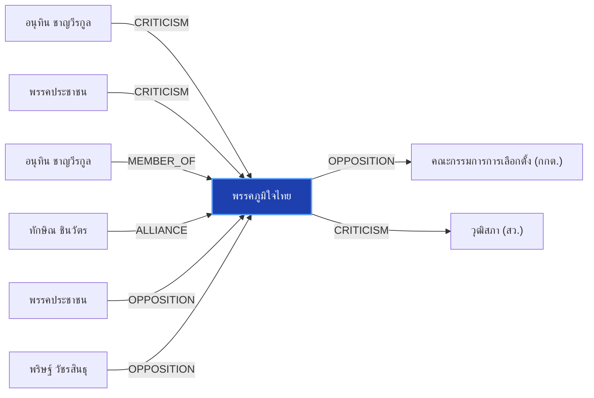

# พรรคภูมิใจไทย

> **สังกัด**: 🔵 พรรคภูมิใจไทย | **บทบาท**: พรรคร่วมรัฐบาล | **ขั้วการเมือง**: Government

## 📊 ข้อมูลสังเขป & สถิติ
- **การปรากฏในข่าว 30 วันล่าสุด**: 31 ครั้ง
- **สถานะทางการเมือง**: Government
- **ชื่อเรียก/ฉายา**: พรรคภูมิใจไทย, ภูมิใจไทย, ภท., ค่ายน้ำเงิน

## 🌐 แผนผังความสัมพันธ์ (Semantic Network)

## 🔗 โครงข่ายความสัมพันธ์และเหตุการณ์สำคัญ
- **CRITICISM** ➔ [[entities/anutin_charnvirakul|อนุทิน ชาญวีรกูล]]: อนุทิน ชาญวีรกูล วิพากษ์วิจารณ์/ตรวจสอบท่าทีของ พรรคภูมิใจไทย (เมื่อ 2026-08-11)
  > *"พิชายซัดอนุทิน “ทำการเมืองอุปลักษณ์” ธนพรสวน “กำแพงอนุทิน เป็นเพียงสีสันทางการเมือง” #พรรคประชาชน #อนุทิน #ภูมิใจไทย #การเมือง #TheStandardNews #TheStandardNow - facebook"*
- **CRITICISM** ➔ [[entities/peoples_party|พรรคประชาชน]]: พรรคประชาชน วิพากษ์วิจารณ์/ตรวจสอบท่าทีของ พรรคภูมิใจไทย (เมื่อ 2026-08-28)
  > *"กมธ.ศาสนา จี้รัฐสกัดคลิป ขบวนแห่ล้อเลียนนวดไทยเชิงลามก ห่วงกระทบภาพลักษณ์มรดกภูมิปัญญาโลก"*
- **MEMBER_OF** ➔ [[entities/anutin_charnvirakul|อนุทิน ชาญวีรกูล]]: อนุทิน ชาญวีรกูล สังกัด/ดำรงตำแหน่งใน พรรคภูมิใจไทย (เมื่อ 2026-08-29)
  > *"มงคล สุระสัจจะ และ เกรียงไกร ศรีรักษ์ เข้าแจง กกต. ยันเลือก สว. โปร่งใส ไร้จัดตั้ง"*
- **ALLIANCE** ➔ [[entities/thaksin_shinawatra|ทักษิณ ชินวัตร]]: ทักษิณ ชินวัตร และ พรรคภูมิใจไทย ในขั้วการเมืองเดียวกัน (Government) (เมื่อ 2026-08-15)
  > *"วิเคราะห์ภาพบินเข้าทัพฟ้า-ไหว้ทักษิณ ธนพร มอง 'อนุทิน-ภูมิใจไทย' ขยับจากตัวแปร สู่ 'ผู้กำหนดเกม' การเมืองไทย - แนวหน้า"*
- **OPPOSITION** ➔ [[entities/peoples_party|พรรคประชาชน]]: พรรคประชาชน และ พรรคภูมิใจไทย มีปฏิสัมพันธ์ในประเด็นการเมือง (เมื่อ 2026-08-28)
  > *"กมธ.งบ 70 เตรียมชงสภาฯ ถกวาระ 2-3 วันที่ 7-9 ก.ย. ย้ำทุกบาทต้องคุ้มค่า"*
- **OPPOSITION** ➔ [[entities/election_commission|คณะกรรมการการเลือกตั้ง (กกต.)]]: พรรคภูมิใจไทย และ คณะกรรมการการเลือกตั้ง (กกต.) มีปฏิสัมพันธ์ในประเด็นการเมือง (เมื่อ 2026-08-29)
  > *"มงคล สุระสัจจะ และ เกรียงไกร ศรีรักษ์ เข้าแจง กกต. ยันเลือก สว. โปร่งใส ไร้จัดตั้ง"*
- **OPPOSITION** ➔ [[entities/parit_wacharasindhu|พริษฐ์ วัชรสินธุ]]: พริษฐ์ วัชรสินธุ และ พรรคภูมิใจไทย มีปฏิสัมพันธ์ในประเด็นการเมือง (เมื่อ 2026-08-28)
  > *"นภินทร เปิดทำเนียบ แจงโกงเลือกส.ว. ลั่นไม่โง่ทำผิดกฎหมาย ฝากถึง เป๋า-ยิ่งชีพ เจอกันในศาล"*
- **CRITICISM** ➔ [[entities/senate_thailand|วุฒิสภา (สว.)]]: พรรคภูมิใจไทย วิพากษ์วิจารณ์/ตรวจสอบท่าทีของ วุฒิสภา (สว.) (เมื่อ 2026-08-17)
  > *"THE STANDARD. . ไอติมซัดอนุทิน ปมซักฟอกรัฐบาล “อภิปรายฮั้ว สว. นอกเกมยังไง” #พรรคประชาชน #ฮั้วสว #กกต #อนุทิน #ภูมิใจไทย #การเมือง #TheStandardNews #TheStandardNow - facebook.com"*
- **ALLIANCE** ➔ [[entities/paetongtarn_shinawatra|แพทองธาร ชินวัตร]]: แพทองธาร ชินวัตร และ พรรคภูมิใจไทย ในขั้วการเมืองเดียวกัน (Government) (เมื่อ 2026-08-29)
  > *"มงคล สุระสัจจะ และ เกรียงไกร ศรีรักษ์ เข้าแจง กกต. ยันเลือก สว. โปร่งใส ไร้จัดตั้ง"*
- **ALLIANCE** ➔ [[entities/pheu_thai_party|พรรคเพื่อไทย]]: พรรคเพื่อไทย และ พรรคภูมิใจไทย ในขั้วการเมืองเดียวกัน (Government) (เมื่อ 2026-08-29)
  > *"เกาะประเด็นการเมือง ท่าทีพรรคร่วมรัฐบาล รอวันร้าว ‘ภูมิใจไทย-เพื่อไทย’ - เดลินิวส์"*
- **OPPOSITION** ➔ [[entities/senate_thailand|วุฒิสภา (สว.)]]: พรรคภูมิใจไทย และ วุฒิสภา (สว.) มีปฏิสัมพันธ์ในประเด็นการเมือง (เมื่อ 2026-08-29)
  > *"มงคล สุระสัจจะ และ เกรียงไกร ศรีรักษ์ เข้าแจง กกต. ยันเลือก สว. โปร่งใส ไร้จัดตั้ง"*
- **OPPOSITION** ➔ [[entities/raknok_srinork|รักชนก ศรีนอก]]: รักชนก ศรีนอก และ พรรคภูมิใจไทย มีปฏิสัมพันธ์ในประเด็นการเมือง (เมื่อ 2026-08-27)
  > *"รักชนก พรรคประชาชน ถาม ศุภชัย พรรคภูมิใจไทย ทำไมไม่เรียกประชุมสักที"*
- **OPPOSITION** ➔ [[entities/nacc|คณะกรรมการ ป.ป.ช.]]: พรรคภูมิใจไทย และ คณะกรรมการ ป.ป.ช. มีปฏิสัมพันธ์ในประเด็นการเมือง (เมื่อ 2026-08-28)
  > *"กมธ.ตำรวจ ไม่รับเรื่อง เลขาฯพระปกเกล้ารีดเงินแลกเข้าเรียนปปร. พร้อมปลดคนแจ้งความพ้นกมธ."*
- **OPPOSITION** ➔ [[entities/natthaphong_ruengpanyawut|ณัฐพงษ์ เรืองปัญญาวุฒิ]]: ณัฐพงษ์ เรืองปัญญาวุฒิ และ พรรคภูมิใจไทย มีปฏิสัมพันธ์ในประเด็นการเมือง (เมื่อ 2026-08-28)
  > *"‘ชลน่าน’ ยันขึ้นเวทีฝ่ายค้าน ขอ พท.แล้ว ชี้ไม่กระทบสัมพันธ์ ‘ภูมิใจไทย’"*
- **ALLIANCE** ➔ [[entities/democrat_party|พรรคประชาธิปัตย์]]: พรรคภูมิใจไทย และ พรรคประชาธิปัตย์ ในขั้วการเมืองเดียวกัน (Government) (เมื่อ 2026-08-28)
  > *"‘ชลน่าน’ ยันขึ้นเวทีฝ่ายค้าน ขอ พท.แล้ว ชี้ไม่กระทบสัมพันธ์ ‘ภูมิใจไทย’"*
- **OPPOSITION** ➔ [[entities/yingcheep_atchanont|ยิ่งชีพ อัชฌานนท์]]: ยิ่งชีพ อัชฌานนท์ และ พรรคภูมิใจไทย มีปฏิสัมพันธ์ในประเด็นการเมือง (เมื่อ 2026-08-28)
  > *"นภินทร เปิดทำเนียบ แจงโกงเลือกส.ว. ลั่นไม่โง่ทำผิดกฎหมาย ฝากถึง เป๋า-ยิ่งชีพ เจอกันในศาล"*
- **LEGAL_ACTION** ➔ [[entities/yingcheep_atchanont|ยิ่งชีพ อัชฌานนท์]]: กระบวนการทางกฎหมาย/ตรวจสอบระหว่าง ยิ่งชีพ อัชฌานนท์ และ พรรคภูมิใจไทย (เมื่อ 2026-08-28)
  > *"ยิ่งชีพ ปลุกบี้ #สั่งฟ้องสว. ยันไม่มีถ้า.. ชี้ 5 ซีนาริโอ กกต.ไม่ฟ้อง ระบอบสีน้ำเงินเฟื่องฟูแน่"*
- **LEGAL_ACTION** ➔ [[entities/peoples_party|พรรคประชาชน]]: กระบวนการทางกฎหมาย/ตรวจสอบระหว่าง พรรคประชาชน และ พรรคภูมิใจไทย (เมื่อ 2026-08-28)
  > *"ยิ่งชีพ ปลุกบี้ #สั่งฟ้องสว. ยันไม่มีถ้า.. ชี้ 5 ซีนาริโอ กกต.ไม่ฟ้อง ระบอบสีน้ำเงินเฟื่องฟูแน่"*
- **LEGAL_ACTION** ➔ [[entities/constitutional_court|ศาลรัฐธรรมนูญ]]: กระบวนการทางกฎหมาย/ตรวจสอบระหว่าง พรรคภูมิใจไทย และ ศาลรัฐธรรมนูญ (เมื่อ 2026-08-28)
  > *"ยิ่งชีพ ปลุกบี้ #สั่งฟ้องสว. ยันไม่มีถ้า.. ชี้ 5 ซีนาริโอ กกต.ไม่ฟ้อง ระบอบสีน้ำเงินเฟื่องฟูแน่"*
- **LEGAL_ACTION** ➔ [[entities/election_commission|คณะกรรมการการเลือกตั้ง (กกต.)]]: กระบวนการทางกฎหมาย/ตรวจสอบระหว่าง พรรคภูมิใจไทย และ คณะกรรมการการเลือกตั้ง (กกต.) (เมื่อ 2026-08-28)
  > *"ยิ่งชีพ ปลุกบี้ #สั่งฟ้องสว. ยันไม่มีถ้า.. ชี้ 5 ซีนาริโอ กกต.ไม่ฟ้อง ระบอบสีน้ำเงินเฟื่องฟูแน่"*
- **LEGAL_ACTION** ➔ [[entities/nacc|คณะกรรมการ ป.ป.ช.]]: กระบวนการทางกฎหมาย/ตรวจสอบระหว่าง พรรคภูมิใจไทย และ คณะกรรมการ ป.ป.ช. (เมื่อ 2026-08-28)
  > *"ยิ่งชีพ ปลุกบี้ #สั่งฟ้องสว. ยันไม่มีถ้า.. ชี้ 5 ซีนาริโอ กกต.ไม่ฟ้อง ระบอบสีน้ำเงินเฟื่องฟูแน่"*
- **LEGAL_ACTION** ➔ [[entities/senate_thailand|วุฒิสภา (สว.)]]: กระบวนการทางกฎหมาย/ตรวจสอบระหว่าง พรรคภูมิใจไทย และ วุฒิสภา (สว.) (เมื่อ 2026-08-28)
  > *"ยิ่งชีพ ปลุกบี้ #สั่งฟ้องสว. ยันไม่มีถ้า.. ชี้ 5 ซีนาริโอ กกต.ไม่ฟ้อง ระบอบสีน้ำเงินเฟื่องฟูแน่"*
- **OPPOSITION** ➔ [[entities/constitution_amendment|การแก้ไขรัฐธรรมนูญ]]: พรรคภูมิใจไทย และ การแก้ไขรัฐธรรมนูญ มีปฏิสัมพันธ์ในประเด็นการเมือง (เมื่อ 2026-08-28)
  > *"ยิ่งชีพ ปลุกบี้ #สั่งฟ้องสว. ยันไม่มีถ้า.. ชี้ 5 ซีนาริโอ กกต.ไม่ฟ้อง ระบอบสีน้ำเงินเฟื่องฟูแน่"*
- **OPPOSITION** ➔ [[entities/mongkol_surasajja|มงคล สุระสัจจะ]]: มงคล สุระสัจจะ และ พรรคภูมิใจไทย มีปฏิสัมพันธ์ในประเด็นการเมือง (เมื่อ 2026-08-29)
  > *"มงคล สุระสัจจะ และ เกรียงไกร ศรีรักษ์ เข้าแจง กกต. ยันเลือก สว. โปร่งใส ไร้จัดตั้ง"*
- **OPPOSITION** ➔ [[entities/kriangkrai_srirak|พล.อ.เกรียงไกร ศรีรักษ์]]: พล.อ.เกรียงไกร ศรีรักษ์ และ พรรคภูมิใจไทย มีปฏิสัมพันธ์ในประเด็นการเมือง (เมื่อ 2026-08-29)
  > *"มงคล สุระสัจจะ และ เกรียงไกร ศรีรักษ์ เข้าแจง กกต. ยันเลือก สว. โปร่งใส ไร้จัดตั้ง"*
- **OPPOSITION** ➔ [[entities/boonsong_noisophon|บุญส่ง น้อยโสภณ]]: บุญส่ง น้อยโสภณ และ พรรคภูมิใจไทย มีปฏิสัมพันธ์ในประเด็นการเมือง (เมื่อ 2026-08-29)
  > *"มงคล สุระสัจจะ และ เกรียงไกร ศรีรักษ์ เข้าแจง กกต. ยันเลือก สว. โปร่งใส ไร้จัดตั้ง"*

## 📑 เอกสารและข่าวที่เกี่ยวข้อง
- ดูสรุปข่าวรอบ 30 วันใน [[wiki/index#Source Summaries|Index Summaries]]
