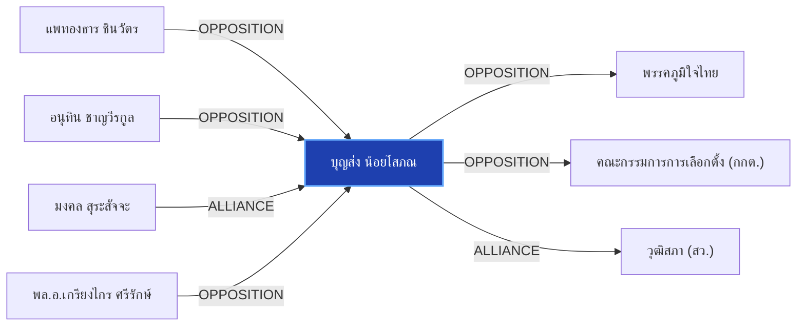

# บุญส่ง น้อยโสภณ

> **สังกัด**: 🏛️ วุฒิสภา | **บทบาท**: รองประธานวุฒิสภา คนที่ 2 / อดีต กกต. | **ขั้วการเมือง**: Independent

## 📊 ข้อมูลสังเขป & สถิติ
- **การปรากฏในข่าว 30 วันล่าสุด**: 1 ครั้ง
- **สถานะทางการเมือง**: Independent
- **ชื่อเรียก/ฉายา**: บุญส่ง น้อยโสภณ, บุญส่ง, รองประธานวุฒิสภา คนที่ 2

## 🌐 แผนผังความสัมพันธ์ (Semantic Network)

## 🔗 โครงข่ายความสัมพันธ์และเหตุการณ์สำคัญ
- **OPPOSITION** ➔ [[entities/paetongtarn_shinawatra|แพทองธาร ชินวัตร]]: แพทองธาร ชินวัตร และ บุญส่ง น้อยโสภณ มีปฏิสัมพันธ์ในประเด็นการเมือง (เมื่อ 2026-08-29)
  > *"มงคล สุระสัจจะ และ เกรียงไกร ศรีรักษ์ เข้าแจง กกต. ยันเลือก สว. โปร่งใส ไร้จัดตั้ง"*
- **OPPOSITION** ➔ [[entities/anutin_charnvirakul|อนุทิน ชาญวีรกูล]]: อนุทิน ชาญวีรกูล และ บุญส่ง น้อยโสภณ มีปฏิสัมพันธ์ในประเด็นการเมือง (เมื่อ 2026-08-29)
  > *"มงคล สุระสัจจะ และ เกรียงไกร ศรีรักษ์ เข้าแจง กกต. ยันเลือก สว. โปร่งใส ไร้จัดตั้ง"*
- **ALLIANCE** ➔ [[entities/mongkol_surasajja|มงคล สุระสัจจะ]]: มงคล สุระสัจจะ และ บุญส่ง น้อยโสภณ ร่วมมือทางการเมือง/พรรคร่วมรัฐบาล (เมื่อ 2026-08-29)
  > *"ทุกท่านมีความเป็นอิสระตามรัฐธรรมนูญ ขณะที่นายบุญส่ง น้อยโสภณ รองประธานวุฒิสภา คนที่ 2 ระบุว่าวุฒิสภายังคงเดินหน้าทำหน้าที่พิจารณาร่างกฎหมายและเห็นชอบองค์กรอิสระตามปกติ"*
- **OPPOSITION** ➔ [[entities/kriangkrai_srirak|พล.อ.เกรียงไกร ศรีรักษ์]]: พล.อ.เกรียงไกร ศรีรักษ์ และ บุญส่ง น้อยโสภณ มีปฏิสัมพันธ์ในประเด็นการเมือง (เมื่อ 2026-08-29)
  > *"มงคล สุระสัจจะ และ เกรียงไกร ศรีรักษ์ เข้าแจง กกต. ยันเลือก สว. โปร่งใส ไร้จัดตั้ง"*
- **OPPOSITION** ➔ [[entities/bhumjaithai_party|พรรคภูมิใจไทย]]: บุญส่ง น้อยโสภณ และ พรรคภูมิใจไทย มีปฏิสัมพันธ์ในประเด็นการเมือง (เมื่อ 2026-08-29)
  > *"มงคล สุระสัจจะ และ เกรียงไกร ศรีรักษ์ เข้าแจง กกต. ยันเลือก สว. โปร่งใส ไร้จัดตั้ง"*
- **OPPOSITION** ➔ [[entities/election_commission|คณะกรรมการการเลือกตั้ง (กกต.)]]: บุญส่ง น้อยโสภณ และ คณะกรรมการการเลือกตั้ง (กกต.) มีปฏิสัมพันธ์ในประเด็นการเมือง (เมื่อ 2026-08-29)
  > *"มงคล สุระสัจจะ และ เกรียงไกร ศรีรักษ์ เข้าแจง กกต. ยันเลือก สว. โปร่งใส ไร้จัดตั้ง"*
- **ALLIANCE** ➔ [[entities/senate_thailand|วุฒิสภา (สว.)]]: บุญส่ง น้อยโสภณ และ วุฒิสภา (สว.) ร่วมมือทางการเมือง/พรรคร่วมรัฐบาล (เมื่อ 2026-08-29)
  > *"ทุกท่านมีความเป็นอิสระตามรัฐธรรมนูญ ขณะที่นายบุญส่ง น้อยโสภณ รองประธานวุฒิสภา คนที่ 2 ระบุว่าวุฒิสภายังคงเดินหน้าทำหน้าที่พิจารณาร่างกฎหมายและเห็นชอบองค์กรอิสระตามปกติ"*

## 📑 เอกสารและข่าวที่เกี่ยวข้อง
- ดูสรุปข่าวรอบ 30 วันใน [[wiki/index#Source Summaries|Index Summaries]]
