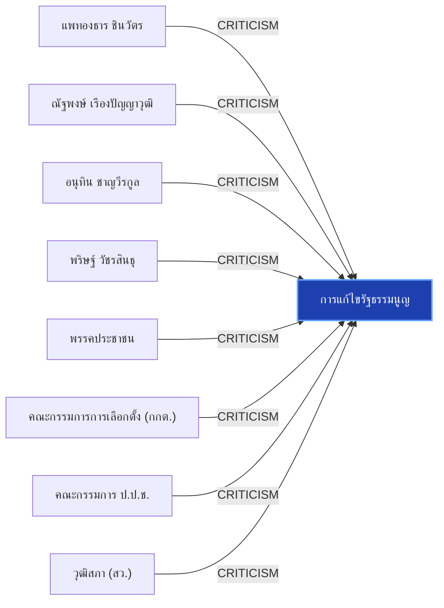

# การแก้ไขรัฐธรรมนูญ

> **สังกัด**: รัฐสภา | **บทบาท**: วาระการปฏิรูปกติกาการเมืองและหมวดจริยธรรม | **ขั้วการเมือง**: Cross-Party

## 📊 ข้อมูลสังเขป & สถิติ
- **การปรากฏในข่าว 30 วันล่าสุด**: 5 ครั้ง
- **สถานะทางการเมือง**: Cross-Party
- **ชื่อเรียก/ฉายา**: แก้รัฐธรรมนูญ, แก้ไขรัฐธรรมนูญ, แก้ รธน., แก้มาตรฐานจริยธรรม

## 🌐 แผนผังความสัมพันธ์ (Semantic Network)

## 🔗 โครงข่ายความสัมพันธ์และเหตุการณ์สำคัญ
- **CRITICISM** ➔ [[entities/paetongtarn_shinawatra|แพทองธาร ชินวัตร]]: แพทองธาร ชินวัตร วิพากษ์วิจารณ์/ตรวจสอบท่าทีของ การแก้ไขรัฐธรรมนูญ (เมื่อ 2026-08-28)
  > *"บวรศักดิ์ ซัดองค์กรอิสระ ความเชื่อมั่นตกต่ำ หนุนแก้รธน. ชง 5 ข้อรื้อสรรหา-คืนสิทธิปชช.ถอดถอน"*
- **CRITICISM** ➔ [[entities/natthaphong_ruengpanyawut|ณัฐพงษ์ เรืองปัญญาวุฒิ]]: ณัฐพงษ์ เรืองปัญญาวุฒิ วิพากษ์วิจารณ์/ตรวจสอบท่าทีของ การแก้ไขรัฐธรรมนูญ (เมื่อ 2026-08-28)
  > *"บวรศักดิ์ ซัดองค์กรอิสระ ความเชื่อมั่นตกต่ำ หนุนแก้รธน. ชง 5 ข้อรื้อสรรหา-คืนสิทธิปชช.ถอดถอน"*
- **CRITICISM** ➔ [[entities/anutin_charnvirakul|อนุทิน ชาญวีรกูล]]: อนุทิน ชาญวีรกูล วิพากษ์วิจารณ์/ตรวจสอบท่าทีของ การแก้ไขรัฐธรรมนูญ (เมื่อ 2026-08-28)
  > *"บวรศักดิ์ ซัดองค์กรอิสระ ความเชื่อมั่นตกต่ำ หนุนแก้รธน. ชง 5 ข้อรื้อสรรหา-คืนสิทธิปชช.ถอดถอน"*
- **CRITICISM** ➔ [[entities/parit_wacharasindhu|พริษฐ์ วัชรสินธุ]]: พริษฐ์ วัชรสินธุ วิพากษ์วิจารณ์/ตรวจสอบท่าทีของ การแก้ไขรัฐธรรมนูญ (เมื่อ 2026-08-28)
  > *"บวรศักดิ์ ซัดองค์กรอิสระ ความเชื่อมั่นตกต่ำ หนุนแก้รธน. ชง 5 ข้อรื้อสรรหา-คืนสิทธิปชช.ถอดถอน"*
- **CRITICISM** ➔ [[entities/peoples_party|พรรคประชาชน]]: พรรคประชาชน วิพากษ์วิจารณ์/ตรวจสอบท่าทีของ การแก้ไขรัฐธรรมนูญ (เมื่อ 2026-08-28)
  > *"บวรศักดิ์ ซัดองค์กรอิสระ ความเชื่อมั่นตกต่ำ หนุนแก้รธน. ชง 5 ข้อรื้อสรรหา-คืนสิทธิปชช.ถอดถอน"*
- **CRITICISM** ➔ [[entities/election_commission|คณะกรรมการการเลือกตั้ง (กกต.)]]: คณะกรรมการการเลือกตั้ง (กกต.) วิพากษ์วิจารณ์/ตรวจสอบท่าทีของ การแก้ไขรัฐธรรมนูญ (เมื่อ 2026-08-28)
  > *"บวรศักดิ์ ซัดองค์กรอิสระ ความเชื่อมั่นตกต่ำ หนุนแก้รธน. ชง 5 ข้อรื้อสรรหา-คืนสิทธิปชช.ถอดถอน"*
- **CRITICISM** ➔ [[entities/nacc|คณะกรรมการ ป.ป.ช.]]: คณะกรรมการ ป.ป.ช. วิพากษ์วิจารณ์/ตรวจสอบท่าทีของ การแก้ไขรัฐธรรมนูญ (เมื่อ 2026-08-28)
  > *"บวรศักดิ์ ซัดองค์กรอิสระ ความเชื่อมั่นตกต่ำ หนุนแก้รธน. ชง 5 ข้อรื้อสรรหา-คืนสิทธิปชช.ถอดถอน"*
- **CRITICISM** ➔ [[entities/senate_thailand|วุฒิสภา (สว.)]]: วุฒิสภา (สว.) วิพากษ์วิจารณ์/ตรวจสอบท่าทีของ การแก้ไขรัฐธรรมนูญ (เมื่อ 2026-08-28)
  > *"บวรศักดิ์ ซัดองค์กรอิสระ ความเชื่อมั่นตกต่ำ หนุนแก้รธน. ชง 5 ข้อรื้อสรรหา-คืนสิทธิปชช.ถอดถอน"*
- **OPPOSITION** ➔ [[entities/peoples_party|พรรคประชาชน]]: พรรคประชาชน และ การแก้ไขรัฐธรรมนูญ มีปฏิสัมพันธ์ในประเด็นการเมือง (เมื่อ 2026-08-28)
  > *"ยิ่งชีพ ปลุกบี้ #สั่งฟ้องสว. ยันไม่มีถ้า.. ชี้ 5 ซีนาริโอ กกต.ไม่ฟ้อง ระบอบสีน้ำเงินเฟื่องฟูแน่"*
- **OPPOSITION** ➔ [[entities/bhumjaithai_party|พรรคภูมิใจไทย]]: พรรคภูมิใจไทย และ การแก้ไขรัฐธรรมนูญ มีปฏิสัมพันธ์ในประเด็นการเมือง (เมื่อ 2026-08-28)
  > *"ยิ่งชีพ ปลุกบี้ #สั่งฟ้องสว. ยันไม่มีถ้า.. ชี้ 5 ซีนาริโอ กกต.ไม่ฟ้อง ระบอบสีน้ำเงินเฟื่องฟูแน่"*
- **LEGAL_ACTION** ➔ [[entities/constitutional_court|ศาลรัฐธรรมนูญ]]: กระบวนการทางกฎหมาย/ตรวจสอบระหว่าง ศาลรัฐธรรมนูญ และ การแก้ไขรัฐธรรมนูญ (เมื่อ 2026-08-28)
  > *"ยิ่งชีพ ปลุกบี้ #สั่งฟ้องสว. ยันไม่มีถ้า.. ชี้ 5 ซีนาริโอ กกต.ไม่ฟ้อง ระบอบสีน้ำเงินเฟื่องฟูแน่"*
- **LEGAL_ACTION** ➔ [[entities/election_commission|คณะกรรมการการเลือกตั้ง (กกต.)]]: กระบวนการทางกฎหมาย/ตรวจสอบระหว่าง คณะกรรมการการเลือกตั้ง (กกต.) และ การแก้ไขรัฐธรรมนูญ (เมื่อ 2026-08-28)
  > *"ยิ่งชีพ ปลุกบี้ #สั่งฟ้องสว. ยันไม่มีถ้า.. ชี้ 5 ซีนาริโอ กกต.ไม่ฟ้อง ระบอบสีน้ำเงินเฟื่องฟูแน่"*
- **LEGAL_ACTION** ➔ [[entities/nacc|คณะกรรมการ ป.ป.ช.]]: กระบวนการทางกฎหมาย/ตรวจสอบระหว่าง คณะกรรมการ ป.ป.ช. และ การแก้ไขรัฐธรรมนูญ (เมื่อ 2026-08-28)
  > *"ยิ่งชีพ ปลุกบี้ #สั่งฟ้องสว. ยันไม่มีถ้า.. ชี้ 5 ซีนาริโอ กกต.ไม่ฟ้อง ระบอบสีน้ำเงินเฟื่องฟูแน่"*
- **LEGAL_ACTION** ➔ [[entities/senate_thailand|วุฒิสภา (สว.)]]: กระบวนการทางกฎหมาย/ตรวจสอบระหว่าง วุฒิสภา (สว.) และ การแก้ไขรัฐธรรมนูญ (เมื่อ 2026-08-28)
  > *"ยิ่งชีพ ปลุกบี้ #สั่งฟ้องสว. ยันไม่มีถ้า.. ชี้ 5 ซีนาริโอ กกต.ไม่ฟ้อง ระบอบสีน้ำเงินเฟื่องฟูแน่"*
- **OPPOSITION** ➔ [[entities/paetongtarn_shinawatra|แพทองธาร ชินวัตร]]: แพทองธาร ชินวัตร และ การแก้ไขรัฐธรรมนูญ มีปฏิสัมพันธ์ในประเด็นการเมือง (เมื่อ 2026-08-28)
  > *"วิชา อัดองค์กรอิสระ ต้องยึดโยงประชาชน ชม ‘ยิ่งชีพ’ เปิดข้อมูลโกง ส.ว."*
- **OPPOSITION** ➔ [[entities/nacc|คณะกรรมการ ป.ป.ช.]]: คณะกรรมการ ป.ป.ช. และ การแก้ไขรัฐธรรมนูญ มีปฏิสัมพันธ์ในประเด็นการเมือง (เมื่อ 2026-08-28)
  > *"วิชา อัดองค์กรอิสระ ต้องยึดโยงประชาชน ชม ‘ยิ่งชีพ’ เปิดข้อมูลโกง ส.ว."*
- **OPPOSITION** ➔ [[entities/senate_thailand|วุฒิสภา (สว.)]]: วุฒิสภา (สว.) และ การแก้ไขรัฐธรรมนูญ มีปฏิสัมพันธ์ในประเด็นการเมือง (เมื่อ 2026-08-28)
  > *"วิชา อัดองค์กรอิสระ ต้องยึดโยงประชาชน ชม ‘ยิ่งชีพ’ เปิดข้อมูลโกง ส.ว."*
- **OPPOSITION** ➔ [[entities/democrat_party|พรรคประชาธิปัตย์]]: พรรคประชาธิปัตย์ และ การแก้ไขรัฐธรรมนูญ มีปฏิสัมพันธ์ในประเด็นการเมือง (เมื่อ 2026-08-28)
  > *"อภิสิทธิ์ ชี้ องค์กรอิสระวิกฤต ถูกแทรกแซงครบวงจร มองแก้รธน. เป็นโอกาสทอง รื้อที่มา ‘องค์กรอิสระ-สว.’"*
- **OPPOSITION** ➔ [[entities/constitutional_court|ศาลรัฐธรรมนูญ]]: ศาลรัฐธรรมนูญ และ การแก้ไขรัฐธรรมนูญ มีปฏิสัมพันธ์ในประเด็นการเมือง (เมื่อ 2026-08-28)
  > *"อภิสิทธิ์ ชี้ องค์กรอิสระวิกฤต ถูกแทรกแซงครบวงจร มองแก้รธน. เป็นโอกาสทอง รื้อที่มา ‘องค์กรอิสระ-สว.’"*
- **OPPOSITION** ➔ [[entities/election_commission|คณะกรรมการการเลือกตั้ง (กกต.)]]: คณะกรรมการการเลือกตั้ง (กกต.) และ การแก้ไขรัฐธรรมนูญ มีปฏิสัมพันธ์ในประเด็นการเมือง (เมื่อ 2026-08-28)
  > *"อภิสิทธิ์ ชี้ องค์กรอิสระวิกฤต ถูกแทรกแซงครบวงจร มองแก้รธน. เป็นโอกาสทอง รื้อที่มา ‘องค์กรอิสระ-สว.’"*

## 📑 เอกสารและข่าวที่เกี่ยวข้อง
- ดูสรุปข่าวรอบ 30 วันใน [[wiki/index#Source Summaries|Index Summaries]]
