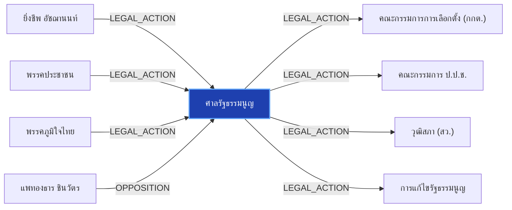

# ศาลรัฐธรรมนูญ

> **สังกัด**: ⚖️ ตุลาการ | **บทบาท**: ศาลสูงสุดด้านรัฐธรรมนูญ | **ขั้วการเมือง**: Judicial

## 📊 ข้อมูลสังเขป & สถิติ
- **การปรากฏในข่าว 30 วันล่าสุด**: 3 ครั้ง
- **สถานะทางการเมือง**: Judicial
- **ชื่อเรียก/ฉายา**: ศาลรัฐธรรมนูญ, ศาล รธน.

## 🌐 แผนผังความสัมพันธ์ (Semantic Network)

## 🔗 โครงข่ายความสัมพันธ์และเหตุการณ์สำคัญ
- **LEGAL_ACTION** ➔ [[entities/yingcheep_atchanont|ยิ่งชีพ อัชฌานนท์]]: กระบวนการทางกฎหมาย/ตรวจสอบระหว่าง ยิ่งชีพ อัชฌานนท์ และ ศาลรัฐธรรมนูญ (เมื่อ 2026-08-28)
  > *"ยิ่งชีพ ปลุกบี้ #สั่งฟ้องสว. ยันไม่มีถ้า.. ชี้ 5 ซีนาริโอ กกต.ไม่ฟ้อง ระบอบสีน้ำเงินเฟื่องฟูแน่"*
- **LEGAL_ACTION** ➔ [[entities/peoples_party|พรรคประชาชน]]: กระบวนการทางกฎหมาย/ตรวจสอบระหว่าง พรรคประชาชน และ ศาลรัฐธรรมนูญ (เมื่อ 2026-08-28)
  > *"ยิ่งชีพ ปลุกบี้ #สั่งฟ้องสว. ยันไม่มีถ้า.. ชี้ 5 ซีนาริโอ กกต.ไม่ฟ้อง ระบอบสีน้ำเงินเฟื่องฟูแน่"*
- **LEGAL_ACTION** ➔ [[entities/bhumjaithai_party|พรรคภูมิใจไทย]]: กระบวนการทางกฎหมาย/ตรวจสอบระหว่าง พรรคภูมิใจไทย และ ศาลรัฐธรรมนูญ (เมื่อ 2026-08-28)
  > *"ยิ่งชีพ ปลุกบี้ #สั่งฟ้องสว. ยันไม่มีถ้า.. ชี้ 5 ซีนาริโอ กกต.ไม่ฟ้อง ระบอบสีน้ำเงินเฟื่องฟูแน่"*
- **LEGAL_ACTION** ➔ [[entities/election_commission|คณะกรรมการการเลือกตั้ง (กกต.)]]: กระบวนการทางกฎหมาย/ตรวจสอบระหว่าง ศาลรัฐธรรมนูญ และ คณะกรรมการการเลือกตั้ง (กกต.) (เมื่อ 2026-08-28)
  > *"ยิ่งชีพ ปลุกบี้ #สั่งฟ้องสว. ยันไม่มีถ้า.. ชี้ 5 ซีนาริโอ กกต.ไม่ฟ้อง ระบอบสีน้ำเงินเฟื่องฟูแน่"*
- **LEGAL_ACTION** ➔ [[entities/nacc|คณะกรรมการ ป.ป.ช.]]: กระบวนการทางกฎหมาย/ตรวจสอบระหว่าง ศาลรัฐธรรมนูญ และ คณะกรรมการ ป.ป.ช. (เมื่อ 2026-08-28)
  > *"ยิ่งชีพ ปลุกบี้ #สั่งฟ้องสว. ยันไม่มีถ้า.. ชี้ 5 ซีนาริโอ กกต.ไม่ฟ้อง ระบอบสีน้ำเงินเฟื่องฟูแน่"*
- **LEGAL_ACTION** ➔ [[entities/senate_thailand|วุฒิสภา (สว.)]]: กระบวนการทางกฎหมาย/ตรวจสอบระหว่าง ศาลรัฐธรรมนูญ และ วุฒิสภา (สว.) (เมื่อ 2026-08-28)
  > *"ยิ่งชีพ ปลุกบี้ #สั่งฟ้องสว. ยันไม่มีถ้า.. ชี้ 5 ซีนาริโอ กกต.ไม่ฟ้อง ระบอบสีน้ำเงินเฟื่องฟูแน่"*
- **LEGAL_ACTION** ➔ [[entities/constitution_amendment|การแก้ไขรัฐธรรมนูญ]]: กระบวนการทางกฎหมาย/ตรวจสอบระหว่าง ศาลรัฐธรรมนูญ และ การแก้ไขรัฐธรรมนูญ (เมื่อ 2026-08-28)
  > *"ยิ่งชีพ ปลุกบี้ #สั่งฟ้องสว. ยันไม่มีถ้า.. ชี้ 5 ซีนาริโอ กกต.ไม่ฟ้อง ระบอบสีน้ำเงินเฟื่องฟูแน่"*
- **OPPOSITION** ➔ [[entities/paetongtarn_shinawatra|แพทองธาร ชินวัตร]]: แพทองธาร ชินวัตร และ ศาลรัฐธรรมนูญ มีปฏิสัมพันธ์ในประเด็นการเมือง (เมื่อ 2026-08-28)
  > *"อภิสิทธิ์ ชี้ องค์กรอิสระวิกฤต ถูกแทรกแซงครบวงจร มองแก้รธน. เป็นโอกาสทอง รื้อที่มา ‘องค์กรอิสระ-สว.’"*
- **OPPOSITION** ➔ [[entities/peoples_party|พรรคประชาชน]]: พรรคประชาชน และ ศาลรัฐธรรมนูญ มีปฏิสัมพันธ์ในประเด็นการเมือง (เมื่อ 2026-08-28)
  > *"อภิสิทธิ์ ชี้ องค์กรอิสระวิกฤต ถูกแทรกแซงครบวงจร มองแก้รธน. เป็นโอกาสทอง รื้อที่มา ‘องค์กรอิสระ-สว.’"*
- **OPPOSITION** ➔ [[entities/democrat_party|พรรคประชาธิปัตย์]]: พรรคประชาธิปัตย์ และ ศาลรัฐธรรมนูญ มีปฏิสัมพันธ์ในประเด็นการเมือง (เมื่อ 2026-08-28)
  > *"อภิสิทธิ์ ชี้ องค์กรอิสระวิกฤต ถูกแทรกแซงครบวงจร มองแก้รธน. เป็นโอกาสทอง รื้อที่มา ‘องค์กรอิสระ-สว.’"*
- **OPPOSITION** ➔ [[entities/election_commission|คณะกรรมการการเลือกตั้ง (กกต.)]]: ศาลรัฐธรรมนูญ และ คณะกรรมการการเลือกตั้ง (กกต.) มีปฏิสัมพันธ์ในประเด็นการเมือง (เมื่อ 2026-08-28)
  > *") แต่ไม่ประสบความสำเร็จ จนกระทั่งเกิดการเรียกร้องให้มีการจัดทำรัฐธรรมนูญฉบับปี 2540 แนวคิดในเรื่องนี้จึงเข้าไปอยู่ในกฎหมายสูงสุดเป็นครั้งแรก มีศาลรัฐธรรมนูญ ศาลปกครอง คณะกรรมการการเลือกตั้ง(กกต"*
- **OPPOSITION** ➔ [[entities/nacc|คณะกรรมการ ป.ป.ช.]]: ศาลรัฐธรรมนูญ และ คณะกรรมการ ป.ป.ช. มีปฏิสัมพันธ์ในประเด็นการเมือง (เมื่อ 2026-08-28)
  > *"อภิสิทธิ์ ชี้ องค์กรอิสระวิกฤต ถูกแทรกแซงครบวงจร มองแก้รธน. เป็นโอกาสทอง รื้อที่มา ‘องค์กรอิสระ-สว.’"*
- **OPPOSITION** ➔ [[entities/senate_thailand|วุฒิสภา (สว.)]]: ศาลรัฐธรรมนูญ และ วุฒิสภา (สว.) มีปฏิสัมพันธ์ในประเด็นการเมือง (เมื่อ 2026-08-28)
  > *"อภิสิทธิ์ ชี้ องค์กรอิสระวิกฤต ถูกแทรกแซงครบวงจร มองแก้รธน. เป็นโอกาสทอง รื้อที่มา ‘องค์กรอิสระ-สว.’"*
- **OPPOSITION** ➔ [[entities/constitution_amendment|การแก้ไขรัฐธรรมนูญ]]: ศาลรัฐธรรมนูญ และ การแก้ไขรัฐธรรมนูญ มีปฏิสัมพันธ์ในประเด็นการเมือง (เมื่อ 2026-08-28)
  > *"อภิสิทธิ์ ชี้ องค์กรอิสระวิกฤต ถูกแทรกแซงครบวงจร มองแก้รธน. เป็นโอกาสทอง รื้อที่มา ‘องค์กรอิสระ-สว.’"*
- **CRITICISM** ➔ [[entities/mongkol_surasajja|มงคล สุระสัจจะ]]: มงคล สุระสัจจะ วิพากษ์วิจารณ์/ตรวจสอบท่าทีของ ศาลรัฐธรรมนูญ (เมื่อ 2026-08-29)
  > *"นันทนา นันทวโรภาส และ สว.พันธุ์ใหม่ จี้ 229 สว. เอี่ยวคดีฮั้วหยุดปฏิบัติหน้าที่"*
- **OPPOSITION** ➔ [[entities/nanthana_nanthavaropas|นันทนา นันทวโรภาส]]: นันทนา นันทวโรภาส และ ศาลรัฐธรรมนูญ มีปฏิสัมพันธ์ในประเด็นการเมือง (เมื่อ 2026-08-29)
  > *"นันทนา ระบุว่า การโหวตรับรองกรรมการองค์กรอิสระ อาทิ ตุลาการศาลรัฐธรรมนูญ และ ป"*
- **CRITICISM** ➔ [[entities/tewarit_maneechay|เทวฤทธิ์ มณีฉาย]]: เทวฤทธิ์ มณีฉาย วิพากษ์วิจารณ์/ตรวจสอบท่าทีของ ศาลรัฐธรรมนูญ (เมื่อ 2026-08-29)
  > *"นันทนา นันทวโรภาส และ สว.พันธุ์ใหม่ จี้ 229 สว. เอี่ยวคดีฮั้วหยุดปฏิบัติหน้าที่"*
- **CRITICISM** ➔ [[entities/sawaeng_boonmee|แสวง บุญมี]]: แสวง บุญมี วิพากษ์วิจารณ์/ตรวจสอบท่าทีของ ศาลรัฐธรรมนูญ (เมื่อ 2026-08-29)
  > *"นันทนา นันทวโรภาส และ สว.พันธุ์ใหม่ จี้ 229 สว. เอี่ยวคดีฮั้วหยุดปฏิบัติหน้าที่"*
- **CRITICISM** ➔ [[entities/election_commission|คณะกรรมการการเลือกตั้ง (กกต.)]]: ศาลรัฐธรรมนูญ วิพากษ์วิจารณ์/ตรวจสอบท่าทีของ คณะกรรมการการเลือกตั้ง (กกต.) (เมื่อ 2026-08-29)
  > *"นันทนา นันทวโรภาส และ สว.พันธุ์ใหม่ จี้ 229 สว. เอี่ยวคดีฮั้วหยุดปฏิบัติหน้าที่"*
- **CRITICISM** ➔ [[entities/nacc|คณะกรรมการ ป.ป.ช.]]: ศาลรัฐธรรมนูญ วิพากษ์วิจารณ์/ตรวจสอบท่าทีของ คณะกรรมการ ป.ป.ช. (เมื่อ 2026-08-29)
  > *"นันทนา นันทวโรภาส และ สว.พันธุ์ใหม่ จี้ 229 สว. เอี่ยวคดีฮั้วหยุดปฏิบัติหน้าที่"*
- **CRITICISM** ➔ [[entities/senate_thailand|วุฒิสภา (สว.)]]: ศาลรัฐธรรมนูญ วิพากษ์วิจารณ์/ตรวจสอบท่าทีของ วุฒิสภา (สว.) (เมื่อ 2026-08-29)
  > *"นันทนา นันทวโรภาส และ สว.พันธุ์ใหม่ จี้ 229 สว. เอี่ยวคดีฮั้วหยุดปฏิบัติหน้าที่"*

## 📑 เอกสารและข่าวที่เกี่ยวข้อง
- ดูสรุปข่าวรอบ 30 วันใน [[wiki/index#Source Summaries|Index Summaries]]
