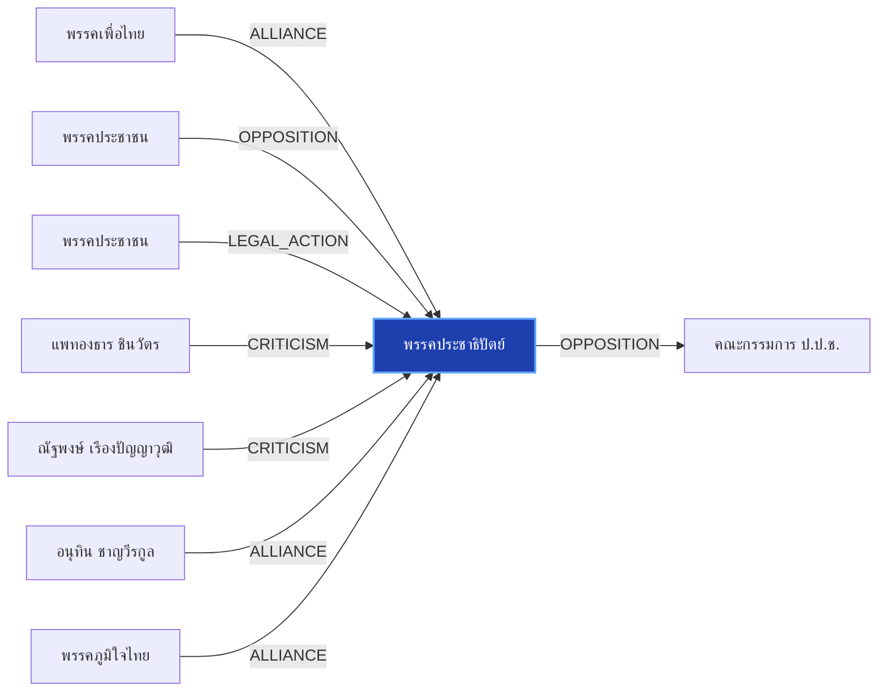

# พรรคประชาธิปัตย์

> **สังกัด**: 🟦 พรรคประชาธิปัตย์ | **บทบาท**: พรรคร่วมรัฐบาล | **ขั้วการเมือง**: Government

## 📊 ข้อมูลสังเขป & สถิติ
- **การปรากฏในข่าว 30 วันล่าสุด**: 7 ครั้ง
- **สถานะทางการเมือง**: Government
- **ชื่อเรียก/ฉายา**: พรรคประชาธิปัตย์, ประชาธิปัตย์, ปชป.

## 🌐 แผนผังความสัมพันธ์ (Semantic Network)

## 🔗 โครงข่ายความสัมพันธ์และเหตุการณ์สำคัญ
- **ALLIANCE** ➔ [[entities/pheu_thai_party|พรรคเพื่อไทย]]: พรรคเพื่อไทย และ พรรคประชาธิปัตย์ ในขั้วการเมืองเดียวกัน (Government) (เมื่อ 2026-08-28)
  > *"‘ชลน่าน’ ยันขึ้นเวทีฝ่ายค้าน ขอ พท.แล้ว ชี้ไม่กระทบสัมพันธ์ ‘ภูมิใจไทย’"*
- **OPPOSITION** ➔ [[entities/peoples_party|พรรคประชาชน]]: พรรคประชาชน และ พรรคประชาธิปัตย์ มีปฏิสัมพันธ์ในประเด็นการเมือง (เมื่อ 2026-08-28)
  > *"บัญชีรายชื่อ พรรคประชาธิปัตย์ กล่าวถึงสถานการณ์การหลอกลวงประชาชนผ่านขบวนการสแกมเมอร์ ที่ยังคงเกิดขึ้นอย่างต่อเนื่อง โดยเห็นว่ามาตรการป้องกันที่สำนักงานตำรวจแห่งชาติและธนาคารแห่งประเทศไทยดำเนินการอยู่ในปัจจุบัน โดยเฉพาะการสแกนใบหน้า อาจยังไม่เพียงพอต่"*
- **OPPOSITION** ➔ [[entities/nacc|คณะกรรมการ ป.ป.ช.]]: พรรคประชาธิปัตย์ และ คณะกรรมการ ป.ป.ช. มีปฏิสัมพันธ์ในประเด็นการเมือง (เมื่อ 2026-08-28)
  > *"อภิสิทธิ์ ชี้ องค์กรอิสระวิกฤต ถูกแทรกแซงครบวงจร มองแก้รธน. เป็นโอกาสทอง รื้อที่มา ‘องค์กรอิสระ-สว.’"*
- **LEGAL_ACTION** ➔ [[entities/peoples_party|พรรคประชาชน]]: กระบวนการทางกฎหมาย/ตรวจสอบระหว่าง พรรคประชาชน และ พรรคประชาธิปัตย์ (เมื่อ 2026-08-13)
  > *"เรื่องมันมีอยู่ว่า โอกาสทองของพรรค‘ประชาชน’ การเมืองท้องถิ่นที่‘ส้ม’ถวิลหา , ‘ใครจะเชื่อ?’และ‘จะเชื่อใคร?’ ปชป.กับจริยธรรมนักการเมือง - spacebar.th"*
- **CRITICISM** ➔ [[entities/paetongtarn_shinawatra|แพทองธาร ชินวัตร]]: แพทองธาร ชินวัตร วิพากษ์วิจารณ์/ตรวจสอบท่าทีของ พรรคประชาธิปัตย์ (เมื่อ 2026-08-28)
  > *"‘ชัยชนะ’ เสนอ ธปท. พักการโอนเงินเกิน 5 หมื่น รอตรวจสอบก่อน 6 ชั่วโมง สกัดแก๊งสแกมเมอร์"*
- **CRITICISM** ➔ [[entities/natthaphong_ruengpanyawut|ณัฐพงษ์ เรืองปัญญาวุฒิ]]: ณัฐพงษ์ เรืองปัญญาวุฒิ วิพากษ์วิจารณ์/ตรวจสอบท่าทีของ พรรคประชาธิปัตย์ (เมื่อ 2026-08-28)
  > *"หัวข้อ “การเมืองไทยในวิกฤตความเชื่อมั่น และผลกระทบต่อกลไกตรวจสอบถ่วงดุล” ร่วมกับอดีตผู้นำฝ่ายค้านอีก 2 คน ได้แก่ นายอภิสิทธิ์ เวชชาชีวะ หัวหน้าพรรคประชาธิปัตย์ (ปชป"*
- **ALLIANCE** ➔ [[entities/anutin_charnvirakul|อนุทิน ชาญวีรกูล]]: อนุทิน ชาญวีรกูล และ พรรคประชาธิปัตย์ ในขั้วการเมืองเดียวกัน (Government) (เมื่อ 2026-08-28)
  > *"‘ชลน่าน’ ยันขึ้นเวทีฝ่ายค้าน ขอ พท.แล้ว ชี้ไม่กระทบสัมพันธ์ ‘ภูมิใจไทย’"*
- **ALLIANCE** ➔ [[entities/bhumjaithai_party|พรรคภูมิใจไทย]]: พรรคภูมิใจไทย และ พรรคประชาธิปัตย์ ในขั้วการเมืองเดียวกัน (Government) (เมื่อ 2026-08-28)
  > *"‘ชลน่าน’ ยันขึ้นเวทีฝ่ายค้าน ขอ พท.แล้ว ชี้ไม่กระทบสัมพันธ์ ‘ภูมิใจไทย’"*
- **OPPOSITION** ➔ [[entities/senate_thailand|วุฒิสภา (สว.)]]: พรรคประชาธิปัตย์ และ วุฒิสภา (สว.) มีปฏิสัมพันธ์ในประเด็นการเมือง (เมื่อ 2026-08-28)
  > *"‘ชลน่าน’ ยันขึ้นเวทีฝ่ายค้าน ขอ พท.แล้ว ชี้ไม่กระทบสัมพันธ์ ‘ภูมิใจไทย’"*
- **LEGAL_ACTION** ➔ [[entities/paetongtarn_shinawatra|แพทองธาร ชินวัตร]]: กระบวนการทางกฎหมาย/ตรวจสอบระหว่าง แพทองธาร ชินวัตร และ พรรคประชาธิปัตย์ (เมื่อ 2026-08-28)
  > *"วัส ชี้ กกต.ต้องส่งศาลฟันฮั้ว สว. อย่างต่ำ 120 คน ท้าฟ้องพร้อมแฉหลักฐาน ‘อภิสิทธิ์’ เตือนฮั้ว สสร."*
- **LEGAL_ACTION** ➔ [[entities/election_commission|คณะกรรมการการเลือกตั้ง (กกต.)]]: กระบวนการทางกฎหมาย/ตรวจสอบระหว่าง พรรคประชาธิปัตย์ และ คณะกรรมการการเลือกตั้ง (กกต.) (เมื่อ 2026-08-28)
  > *"วัส ชี้ กกต.ต้องส่งศาลฟันฮั้ว สว. อย่างต่ำ 120 คน ท้าฟ้องพร้อมแฉหลักฐาน ‘อภิสิทธิ์’ เตือนฮั้ว สสร."*
- **LEGAL_ACTION** ➔ [[entities/nacc|คณะกรรมการ ป.ป.ช.]]: กระบวนการทางกฎหมาย/ตรวจสอบระหว่าง พรรคประชาธิปัตย์ และ คณะกรรมการ ป.ป.ช. (เมื่อ 2026-08-28)
  > *"วัส ชี้ กกต.ต้องส่งศาลฟันฮั้ว สว. อย่างต่ำ 120 คน ท้าฟ้องพร้อมแฉหลักฐาน ‘อภิสิทธิ์’ เตือนฮั้ว สสร."*
- **LEGAL_ACTION** ➔ [[entities/senate_thailand|วุฒิสภา (สว.)]]: กระบวนการทางกฎหมาย/ตรวจสอบระหว่าง พรรคประชาธิปัตย์ และ วุฒิสภา (สว.) (เมื่อ 2026-08-28)
  > *"วัส ชี้ กกต.ต้องส่งศาลฟันฮั้ว สว. อย่างต่ำ 120 คน ท้าฟ้องพร้อมแฉหลักฐาน ‘อภิสิทธิ์’ เตือนฮั้ว สสร."*
- **ALLIANCE** ➔ [[entities/paetongtarn_shinawatra|แพทองธาร ชินวัตร]]: แพทองธาร ชินวัตร และ พรรคประชาธิปัตย์ ในขั้วการเมืองเดียวกัน (Government) (เมื่อ 2026-08-28)
  > *"อภิสิทธิ์ ชี้ องค์กรอิสระวิกฤต ถูกแทรกแซงครบวงจร มองแก้รธน. เป็นโอกาสทอง รื้อที่มา ‘องค์กรอิสระ-สว.’"*
- **OPPOSITION** ➔ [[entities/constitutional_court|ศาลรัฐธรรมนูญ]]: พรรคประชาธิปัตย์ และ ศาลรัฐธรรมนูญ มีปฏิสัมพันธ์ในประเด็นการเมือง (เมื่อ 2026-08-28)
  > *"อภิสิทธิ์ ชี้ องค์กรอิสระวิกฤต ถูกแทรกแซงครบวงจร มองแก้รธน. เป็นโอกาสทอง รื้อที่มา ‘องค์กรอิสระ-สว.’"*
- **OPPOSITION** ➔ [[entities/election_commission|คณะกรรมการการเลือกตั้ง (กกต.)]]: พรรคประชาธิปัตย์ และ คณะกรรมการการเลือกตั้ง (กกต.) มีปฏิสัมพันธ์ในประเด็นการเมือง (เมื่อ 2026-08-28)
  > *"อภิสิทธิ์ ชี้ องค์กรอิสระวิกฤต ถูกแทรกแซงครบวงจร มองแก้รธน. เป็นโอกาสทอง รื้อที่มา ‘องค์กรอิสระ-สว.’"*
- **OPPOSITION** ➔ [[entities/constitution_amendment|การแก้ไขรัฐธรรมนูญ]]: พรรคประชาธิปัตย์ และ การแก้ไขรัฐธรรมนูญ มีปฏิสัมพันธ์ในประเด็นการเมือง (เมื่อ 2026-08-28)
  > *"อภิสิทธิ์ ชี้ องค์กรอิสระวิกฤต ถูกแทรกแซงครบวงจร มองแก้รธน. เป็นโอกาสทอง รื้อที่มา ‘องค์กรอิสระ-สว.’"*
- **OPPOSITION** ➔ [[entities/natthaphong_ruengpanyawut|ณัฐพงษ์ เรืองปัญญาวุฒิ]]: ณัฐพงษ์ เรืองปัญญาวุฒิ และ พรรคประชาธิปัตย์ มีปฏิสัมพันธ์ในประเด็นการเมือง (เมื่อ 2026-08-28)
  > *"นอกจากนี้ยังมีนายอภิสิทธิ์ เวชชาชีวะ หัวหน้าพรรคประชาธิปัตย์ และอีกหลายคนที่เป็นอดีตผู้นำฝ่ายค้าน ที่ไปร่วมงานเช่นเดียวกัน ส่วนประเด็นที่ไปพูดไม่ได้เกี่ยวกับรัฐบาล แต่ไปพูดในเรื่องของการสร้างความมั่นใจของสังคมต่อระบบการเมือง จึงไม่มีประเด็นที่ต้องห่ว"*

## 📑 เอกสารและข่าวที่เกี่ยวข้อง
- ดูสรุปข่าวรอบ 30 วันใน [[wiki/index#Source Summaries|Index Summaries]]
