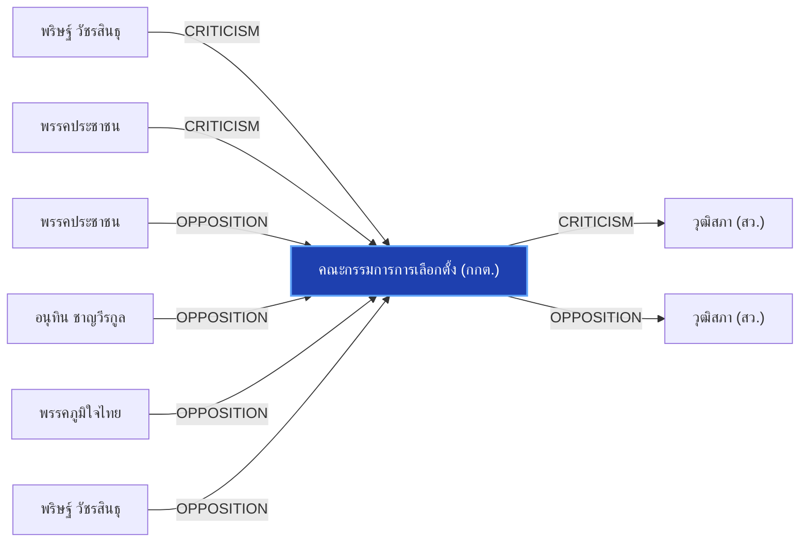

# คณะกรรมการการเลือกตั้ง (กกต.)

> **สังกัด**: 🛡️ องค์กรอิสระ | **บทบาท**: องค์กรควบคุมการเลือกตั้งและตรวจสอบพรรคการเมือง | **ขั้วการเมือง**: Independent

## 📊 ข้อมูลสังเขป & สถิติ
- **การปรากฏในข่าว 30 วันล่าสุด**: 31 ครั้ง
- **สถานะทางการเมือง**: Independent
- **ชื่อเรียก/ฉายา**: กกต., คณะกรรมการการเลือกตั้ง, สำนักงาน กกต.

## 🌐 แผนผังความสัมพันธ์ (Semantic Network)

## 🔗 โครงข่ายความสัมพันธ์และเหตุการณ์สำคัญ
- **CRITICISM** ➔ [[entities/parit_wacharasindhu|พริษฐ์ วัชรสินธุ]]: พริษฐ์ วัชรสินธุ วิพากษ์วิจารณ์/ตรวจสอบท่าทีของ คณะกรรมการการเลือกตั้ง (กกต.) (เมื่อ 2026-08-28)
  > *"บวรศักดิ์ ซัดองค์กรอิสระ ความเชื่อมั่นตกต่ำ หนุนแก้รธน. ชง 5 ข้อรื้อสรรหา-คืนสิทธิปชช.ถอดถอน"*
- **CRITICISM** ➔ [[entities/peoples_party|พรรคประชาชน]]: พรรคประชาชน วิพากษ์วิจารณ์/ตรวจสอบท่าทีของ คณะกรรมการการเลือกตั้ง (กกต.) (เมื่อ 2026-08-28)
  > *"บวรศักดิ์ ซัดองค์กรอิสระ ความเชื่อมั่นตกต่ำ หนุนแก้รธน. ชง 5 ข้อรื้อสรรหา-คืนสิทธิปชช.ถอดถอน"*
- **CRITICISM** ➔ [[entities/senate_thailand|วุฒิสภา (สว.)]]: คณะกรรมการการเลือกตั้ง (กกต.) วิพากษ์วิจารณ์/ตรวจสอบท่าทีของ วุฒิสภา (สว.) (เมื่อ 2026-08-29)
  > *"นันทนา นันทวโรภาส และ สว.พันธุ์ใหม่ จี้ 229 สว. เอี่ยวคดีฮั้วหยุดปฏิบัติหน้าที่"*
- **OPPOSITION** ➔ [[entities/peoples_party|พรรคประชาชน]]: พรรคประชาชน และ คณะกรรมการการเลือกตั้ง (กกต.) มีปฏิสัมพันธ์ในประเด็นการเมือง (เมื่อ 2026-08-29)
  > *"iLaw โดย ยิ่งชีพ อัชฌานนท์ เปิดรายงานสถิติบล็อกโหวต ชี้เครือข่ายฮั้วเลือก สว.67 คุมสภาสูง"*
- **OPPOSITION** ➔ [[entities/senate_thailand|วุฒิสภา (สว.)]]: คณะกรรมการการเลือกตั้ง (กกต.) และ วุฒิสภา (สว.) มีปฏิสัมพันธ์ในประเด็นการเมือง (เมื่อ 2026-08-29)
  > *"iLaw โดย ยิ่งชีพ อัชฌานนท์ เปิดรายงานสถิติบล็อกโหวต ชี้เครือข่ายฮั้วเลือก สว.67 คุมสภาสูง"*
- **OPPOSITION** ➔ [[entities/anutin_charnvirakul|อนุทิน ชาญวีรกูล]]: อนุทิน ชาญวีรกูล และ คณะกรรมการการเลือกตั้ง (กกต.) มีปฏิสัมพันธ์ในประเด็นการเมือง (เมื่อ 2026-08-29)
  > *"มงคล สุระสัจจะ และ เกรียงไกร ศรีรักษ์ เข้าแจง กกต. ยันเลือก สว. โปร่งใส ไร้จัดตั้ง"*
- **OPPOSITION** ➔ [[entities/bhumjaithai_party|พรรคภูมิใจไทย]]: พรรคภูมิใจไทย และ คณะกรรมการการเลือกตั้ง (กกต.) มีปฏิสัมพันธ์ในประเด็นการเมือง (เมื่อ 2026-08-29)
  > *"มงคล สุระสัจจะ และ เกรียงไกร ศรีรักษ์ เข้าแจง กกต. ยันเลือก สว. โปร่งใส ไร้จัดตั้ง"*
- **OPPOSITION** ➔ [[entities/parit_wacharasindhu|พริษฐ์ วัชรสินธุ]]: พริษฐ์ วัชรสินธุ และ คณะกรรมการการเลือกตั้ง (กกต.) มีปฏิสัมพันธ์ในประเด็นการเมือง (เมื่อ 2026-08-28)
  > *"นภินทร เปิดทำเนียบ แจงโกงเลือกส.ว. ลั่นไม่โง่ทำผิดกฎหมาย ฝากถึง เป๋า-ยิ่งชีพ เจอกันในศาล"*
- **OPPOSITION** ➔ [[entities/natthaphong_ruengpanyawut|ณัฐพงษ์ เรืองปัญญาวุฒิ]]: ณัฐพงษ์ เรืองปัญญาวุฒิ และ คณะกรรมการการเลือกตั้ง (กกต.) มีปฏิสัมพันธ์ในประเด็นการเมือง (เมื่อ 2026-08-25)
  > *"บัญชีรายชื่อ และรองหัวหน้าพรรคประชาชน กล่าวถึงกรณีคณะกรรมการการเลือกตั้ง (กกต"*
- **LEGAL_ACTION** ➔ [[entities/parit_wacharasindhu|พริษฐ์ วัชรสินธุ]]: กระบวนการทางกฎหมาย/ตรวจสอบระหว่าง พริษฐ์ วัชรสินธุ และ คณะกรรมการการเลือกตั้ง (กกต.) (เมื่อ 2026-08-25)
  > *"PARLIAMENT: 'พริษฐ์' จี้ กกต. ชัดเจนวันลงมติคดีฮั้ว สว. หวั่นตัดตอนช่วยเครือข่ายการเมือง ขู่ฟ้อง ม.157 หากยกคำร้อง วันนี้ (25 ส.ค. 69) นายพริษฐ์ วัชรสินธุ สส.บัญชีรายชื่อ และรองหัวหน้าพรรคประชาชน กล่าวถึงกรณีคณะกรรมการการเลือกตั้ง (กกต.) เตรียมลงมติส"*
- **LEGAL_ACTION** ➔ [[entities/senate_thailand|วุฒิสภา (สว.)]]: กระบวนการทางกฎหมาย/ตรวจสอบระหว่าง คณะกรรมการการเลือกตั้ง (กกต.) และ วุฒิสภา (สว.) (เมื่อ 2026-08-28)
  > *"ยิ่งชีพ ปลุกบี้ #สั่งฟ้องสว. ยันไม่มีถ้า.. ชี้ 5 ซีนาริโอ กกต.ไม่ฟ้อง ระบอบสีน้ำเงินเฟื่องฟูแน่"*
- **OPPOSITION** ➔ [[entities/yingcheep_atchanont|ยิ่งชีพ อัชฌานนท์]]: ยิ่งชีพ อัชฌานนท์ และ คณะกรรมการการเลือกตั้ง (กกต.) มีปฏิสัมพันธ์ในประเด็นการเมือง (เมื่อ 2026-08-29)
  > *"iLaw โดย ยิ่งชีพ อัชฌานนท์ เปิดรายงานสถิติบล็อกโหวต ชี้เครือข่ายฮั้วเลือก สว.67 คุมสภาสูง"*
- **OPPOSITION** ➔ [[entities/paetongtarn_shinawatra|แพทองธาร ชินวัตร]]: แพทองธาร ชินวัตร และ คณะกรรมการการเลือกตั้ง (กกต.) มีปฏิสัมพันธ์ในประเด็นการเมือง (เมื่อ 2026-08-29)
  > *"มงคล สุระสัจจะ และ เกรียงไกร ศรีรักษ์ เข้าแจง กกต. ยันเลือก สว. โปร่งใส ไร้จัดตั้ง"*
- **CRITICISM** ➔ [[entities/paetongtarn_shinawatra|แพทองธาร ชินวัตร]]: แพทองธาร ชินวัตร วิพากษ์วิจารณ์/ตรวจสอบท่าทีของ คณะกรรมการการเลือกตั้ง (กกต.) (เมื่อ 2026-08-28)
  > *"บวรศักดิ์ ซัดองค์กรอิสระ ความเชื่อมั่นตกต่ำ หนุนแก้รธน. ชง 5 ข้อรื้อสรรหา-คืนสิทธิปชช.ถอดถอน"*
- **CRITICISM** ➔ [[entities/natthaphong_ruengpanyawut|ณัฐพงษ์ เรืองปัญญาวุฒิ]]: ณัฐพงษ์ เรืองปัญญาวุฒิ วิพากษ์วิจารณ์/ตรวจสอบท่าทีของ คณะกรรมการการเลือกตั้ง (กกต.) (เมื่อ 2026-08-28)
  > *"บวรศักดิ์ ซัดองค์กรอิสระ ความเชื่อมั่นตกต่ำ หนุนแก้รธน. ชง 5 ข้อรื้อสรรหา-คืนสิทธิปชช.ถอดถอน"*
- **CRITICISM** ➔ [[entities/anutin_charnvirakul|อนุทิน ชาญวีรกูล]]: อนุทิน ชาญวีรกูล วิพากษ์วิจารณ์/ตรวจสอบท่าทีของ คณะกรรมการการเลือกตั้ง (กกต.) (เมื่อ 2026-08-28)
  > *"บวรศักดิ์ ซัดองค์กรอิสระ ความเชื่อมั่นตกต่ำ หนุนแก้รธน. ชง 5 ข้อรื้อสรรหา-คืนสิทธิปชช.ถอดถอน"*
- **CRITICISM** ➔ [[entities/nacc|คณะกรรมการ ป.ป.ช.]]: คณะกรรมการการเลือกตั้ง (กกต.) วิพากษ์วิจารณ์/ตรวจสอบท่าทีของ คณะกรรมการ ป.ป.ช. (เมื่อ 2026-08-29)
  > *"นันทนา นันทวโรภาส และ สว.พันธุ์ใหม่ จี้ 229 สว. เอี่ยวคดีฮั้วหยุดปฏิบัติหน้าที่"*
- **CRITICISM** ➔ [[entities/constitution_amendment|การแก้ไขรัฐธรรมนูญ]]: คณะกรรมการการเลือกตั้ง (กกต.) วิพากษ์วิจารณ์/ตรวจสอบท่าทีของ การแก้ไขรัฐธรรมนูญ (เมื่อ 2026-08-28)
  > *"บวรศักดิ์ ซัดองค์กรอิสระ ความเชื่อมั่นตกต่ำ หนุนแก้รธน. ชง 5 ข้อรื้อสรรหา-คืนสิทธิปชช.ถอดถอน"*
- **OPPOSITION** ➔ [[entities/nacc|คณะกรรมการ ป.ป.ช.]]: คณะกรรมการการเลือกตั้ง (กกต.) และ คณะกรรมการ ป.ป.ช. มีปฏิสัมพันธ์ในประเด็นการเมือง (เมื่อ 2026-08-29)
  > *"สมชาย แสวงการ ส่งหลักฐานเส้นทางการเงิน-โพยจัดตั้ง ฮั้วเลือก สว. ให้ กกต. และ ป.ป.ช."*
- **OPPOSITION** ➔ [[entities/sawaeng_boonmee|แสวง บุญมี]]: แสวง บุญมี และ คณะกรรมการการเลือกตั้ง (กกต.) มีปฏิสัมพันธ์ในประเด็นการเมือง (เมื่อ 2026-08-29)
  > *"กกต. เดินหน้าสอบคดีฮั้ว สว. 229 รายชื่อ นัดลงมติชี้ชะตาสอย สว. สายสีน้ำเงิน"*
- **LEGAL_ACTION** ➔ [[entities/yingcheep_atchanont|ยิ่งชีพ อัชฌานนท์]]: กระบวนการทางกฎหมาย/ตรวจสอบระหว่าง ยิ่งชีพ อัชฌานนท์ และ คณะกรรมการการเลือกตั้ง (กกต.) (เมื่อ 2026-08-28)
  > *"ยิ่งชีพ ปลุกบี้ #สั่งฟ้องสว. ยันไม่มีถ้า.. ชี้ 5 ซีนาริโอ กกต.ไม่ฟ้อง ระบอบสีน้ำเงินเฟื่องฟูแน่"*
- **LEGAL_ACTION** ➔ [[entities/peoples_party|พรรคประชาชน]]: กระบวนการทางกฎหมาย/ตรวจสอบระหว่าง พรรคประชาชน และ คณะกรรมการการเลือกตั้ง (กกต.) (เมื่อ 2026-08-28)
  > *"ยิ่งชีพ ปลุกบี้ #สั่งฟ้องสว. ยันไม่มีถ้า.. ชี้ 5 ซีนาริโอ กกต.ไม่ฟ้อง ระบอบสีน้ำเงินเฟื่องฟูแน่"*
- **LEGAL_ACTION** ➔ [[entities/bhumjaithai_party|พรรคภูมิใจไทย]]: กระบวนการทางกฎหมาย/ตรวจสอบระหว่าง พรรคภูมิใจไทย และ คณะกรรมการการเลือกตั้ง (กกต.) (เมื่อ 2026-08-28)
  > *"ยิ่งชีพ ปลุกบี้ #สั่งฟ้องสว. ยันไม่มีถ้า.. ชี้ 5 ซีนาริโอ กกต.ไม่ฟ้อง ระบอบสีน้ำเงินเฟื่องฟูแน่"*
- **LEGAL_ACTION** ➔ [[entities/constitutional_court|ศาลรัฐธรรมนูญ]]: กระบวนการทางกฎหมาย/ตรวจสอบระหว่าง ศาลรัฐธรรมนูญ และ คณะกรรมการการเลือกตั้ง (กกต.) (เมื่อ 2026-08-28)
  > *"ยิ่งชีพ ปลุกบี้ #สั่งฟ้องสว. ยันไม่มีถ้า.. ชี้ 5 ซีนาริโอ กกต.ไม่ฟ้อง ระบอบสีน้ำเงินเฟื่องฟูแน่"*
- **LEGAL_ACTION** ➔ [[entities/nacc|คณะกรรมการ ป.ป.ช.]]: กระบวนการทางกฎหมาย/ตรวจสอบระหว่าง คณะกรรมการการเลือกตั้ง (กกต.) และ คณะกรรมการ ป.ป.ช. (เมื่อ 2026-08-28)
  > *"ยิ่งชีพ ปลุกบี้ #สั่งฟ้องสว. ยันไม่มีถ้า.. ชี้ 5 ซีนาริโอ กกต.ไม่ฟ้อง ระบอบสีน้ำเงินเฟื่องฟูแน่"*
- **LEGAL_ACTION** ➔ [[entities/constitution_amendment|การแก้ไขรัฐธรรมนูญ]]: กระบวนการทางกฎหมาย/ตรวจสอบระหว่าง คณะกรรมการการเลือกตั้ง (กกต.) และ การแก้ไขรัฐธรรมนูญ (เมื่อ 2026-08-28)
  > *"ยิ่งชีพ ปลุกบี้ #สั่งฟ้องสว. ยันไม่มีถ้า.. ชี้ 5 ซีนาริโอ กกต.ไม่ฟ้อง ระบอบสีน้ำเงินเฟื่องฟูแน่"*
- **LEGAL_ACTION** ➔ [[entities/paetongtarn_shinawatra|แพทองธาร ชินวัตร]]: กระบวนการทางกฎหมาย/ตรวจสอบระหว่าง แพทองธาร ชินวัตร และ คณะกรรมการการเลือกตั้ง (กกต.) (เมื่อ 2026-08-28)
  > *"วัส ชี้ กกต.ต้องส่งศาลฟันฮั้ว สว. อย่างต่ำ 120 คน ท้าฟ้องพร้อมแฉหลักฐาน ‘อภิสิทธิ์’ เตือนฮั้ว สสร."*
- **LEGAL_ACTION** ➔ [[entities/democrat_party|พรรคประชาธิปัตย์]]: กระบวนการทางกฎหมาย/ตรวจสอบระหว่าง พรรคประชาธิปัตย์ และ คณะกรรมการการเลือกตั้ง (กกต.) (เมื่อ 2026-08-28)
  > *"วัส ชี้ กกต.ต้องส่งศาลฟันฮั้ว สว. อย่างต่ำ 120 คน ท้าฟ้องพร้อมแฉหลักฐาน ‘อภิสิทธิ์’ เตือนฮั้ว สสร."*
- **ALLIANCE** ➔ [[entities/senate_thailand|วุฒิสภา (สว.)]]: คณะกรรมการการเลือกตั้ง (กกต.) และ วุฒิสภา (สว.) ร่วมมือทางการเมือง/พรรคร่วมรัฐบาล (เมื่อ 2026-08-28)
  > *"โดย นายวัสกล่าวว่า เวลานี้องค์กรอิสระ โดยรัฐธรรมนูญ 2560 เลือกองค์กรอิสระแบบวิบัติหรือไม่ ขึ้นอยู่กับการให้ความเห็นชอบของวุฒิสภา มีข่าวว่าคณะกรรมการการเลือกตั้ง (กกต"*
- **LEGAL_ACTION** ➔ [[entities/sawaeng_boonmee|แสวง บุญมี]]: กระบวนการทางกฎหมาย/ตรวจสอบระหว่าง แสวง บุญมี และ คณะกรรมการการเลือกตั้ง (กกต.) (เมื่อ 2026-08-28)
  > *"สว.สำรอง ยื่นยธ.จี้ ‘รัฐมนตรี’ หยุดฟ้องปิดปาก ล่าคนปล่อยสำนวนลับ บี้เร่งรัดคดีฮั้วสว.ค้างเติ่ง 2 ปีแล้ว"*
- **OPPOSITION** ➔ [[entities/democrat_party|พรรคประชาธิปัตย์]]: พรรคประชาธิปัตย์ และ คณะกรรมการการเลือกตั้ง (กกต.) มีปฏิสัมพันธ์ในประเด็นการเมือง (เมื่อ 2026-08-28)
  > *"อภิสิทธิ์ ชี้ องค์กรอิสระวิกฤต ถูกแทรกแซงครบวงจร มองแก้รธน. เป็นโอกาสทอง รื้อที่มา ‘องค์กรอิสระ-สว.’"*
- **OPPOSITION** ➔ [[entities/constitutional_court|ศาลรัฐธรรมนูญ]]: ศาลรัฐธรรมนูญ และ คณะกรรมการการเลือกตั้ง (กกต.) มีปฏิสัมพันธ์ในประเด็นการเมือง (เมื่อ 2026-08-28)
  > *") แต่ไม่ประสบความสำเร็จ จนกระทั่งเกิดการเรียกร้องให้มีการจัดทำรัฐธรรมนูญฉบับปี 2540 แนวคิดในเรื่องนี้จึงเข้าไปอยู่ในกฎหมายสูงสุดเป็นครั้งแรก มีศาลรัฐธรรมนูญ ศาลปกครอง คณะกรรมการการเลือกตั้ง(กกต"*
- **OPPOSITION** ➔ [[entities/constitution_amendment|การแก้ไขรัฐธรรมนูญ]]: คณะกรรมการการเลือกตั้ง (กกต.) และ การแก้ไขรัฐธรรมนูญ มีปฏิสัมพันธ์ในประเด็นการเมือง (เมื่อ 2026-08-28)
  > *"อภิสิทธิ์ ชี้ องค์กรอิสระวิกฤต ถูกแทรกแซงครบวงจร มองแก้รธน. เป็นโอกาสทอง รื้อที่มา ‘องค์กรอิสระ-สว.’"*
- **OPPOSITION** ➔ [[entities/mongkol_surasajja|มงคล สุระสัจจะ]]: มงคล สุระสัจจะ และ คณะกรรมการการเลือกตั้ง (กกต.) มีปฏิสัมพันธ์ในประเด็นการเมือง (เมื่อ 2026-08-29)
  > *"iLaw โดย ยิ่งชีพ อัชฌานนท์ เปิดรายงานสถิติบล็อกโหวต ชี้เครือข่ายฮั้วเลือก สว.67 คุมสภาสูง"*
- **OPPOSITION** ➔ [[entities/nanthana_nanthavaropas|นันทนา นันทวโรภาส]]: นันทนา นันทวโรภาส และ คณะกรรมการการเลือกตั้ง (กกต.) มีปฏิสัมพันธ์ในประเด็นการเมือง (เมื่อ 2026-08-29)
  > *"iLaw โดย ยิ่งชีพ อัชฌานนท์ เปิดรายงานสถิติบล็อกโหวต ชี้เครือข่ายฮั้วเลือก สว.67 คุมสภาสูง"*
- **OPPOSITION** ➔ [[entities/kriangkrai_srirak|พล.อ.เกรียงไกร ศรีรักษ์]]: พล.อ.เกรียงไกร ศรีรักษ์ และ คณะกรรมการการเลือกตั้ง (กกต.) มีปฏิสัมพันธ์ในประเด็นการเมือง (เมื่อ 2026-08-29)
  > *"มงคล สุระสัจจะ และ เกรียงไกร ศรีรักษ์ เข้าแจง กกต. ยันเลือก สว. โปร่งใส ไร้จัดตั้ง"*
- **OPPOSITION** ➔ [[entities/boonsong_noisophon|บุญส่ง น้อยโสภณ]]: บุญส่ง น้อยโสภณ และ คณะกรรมการการเลือกตั้ง (กกต.) มีปฏิสัมพันธ์ในประเด็นการเมือง (เมื่อ 2026-08-29)
  > *"มงคล สุระสัจจะ และ เกรียงไกร ศรีรักษ์ เข้าแจง กกต. ยันเลือก สว. โปร่งใส ไร้จัดตั้ง"*
- **CRITICISM** ➔ [[entities/mongkol_surasajja|มงคล สุระสัจจะ]]: มงคล สุระสัจจะ วิพากษ์วิจารณ์/ตรวจสอบท่าทีของ คณะกรรมการการเลือกตั้ง (กกต.) (เมื่อ 2026-08-29)
  > *"นันทนา นันทวโรภาส และ สว.พันธุ์ใหม่ จี้ 229 สว. เอี่ยวคดีฮั้วหยุดปฏิบัติหน้าที่"*
- **CRITICISM** ➔ [[entities/nanthana_nanthavaropas|นันทนา นันทวโรภาส]]: นันทนา นันทวโรภาส วิพากษ์วิจารณ์/ตรวจสอบท่าทีของ คณะกรรมการการเลือกตั้ง (กกต.) (เมื่อ 2026-08-29)
  > *"นันทนา นันทวโรภาส และ สว.พันธุ์ใหม่ จี้ 229 สว. เอี่ยวคดีฮั้วหยุดปฏิบัติหน้าที่"*
- **CRITICISM** ➔ [[entities/tewarit_maneechay|เทวฤทธิ์ มณีฉาย]]: เทวฤทธิ์ มณีฉาย วิพากษ์วิจารณ์/ตรวจสอบท่าทีของ คณะกรรมการการเลือกตั้ง (กกต.) (เมื่อ 2026-08-29)
  > *"นันทนา นันทวโรภาส และ สว.พันธุ์ใหม่ จี้ 229 สว. เอี่ยวคดีฮั้วหยุดปฏิบัติหน้าที่"*
- **CRITICISM** ➔ [[entities/sawaeng_boonmee|แสวง บุญมี]]: แสวง บุญมี วิพากษ์วิจารณ์/ตรวจสอบท่าทีของ คณะกรรมการการเลือกตั้ง (กกต.) (เมื่อ 2026-08-29)
  > *"นันทนา นันทวโรภาส และ สว.พันธุ์ใหม่ จี้ 229 สว. เอี่ยวคดีฮั้วหยุดปฏิบัติหน้าที่"*
- **CRITICISM** ➔ [[entities/constitutional_court|ศาลรัฐธรรมนูญ]]: ศาลรัฐธรรมนูญ วิพากษ์วิจารณ์/ตรวจสอบท่าทีของ คณะกรรมการการเลือกตั้ง (กกต.) (เมื่อ 2026-08-29)
  > *"นันทนา นันทวโรภาส และ สว.พันธุ์ใหม่ จี้ 229 สว. เอี่ยวคดีฮั้วหยุดปฏิบัติหน้าที่"*
- **OPPOSITION** ➔ [[entities/itthiporn_boonpracong|อิทธิพร บุญประคอง]]: อิทธิพร บุญประคอง และ คณะกรรมการการเลือกตั้ง (กกต.) มีปฏิสัมพันธ์ในประเด็นการเมือง (เมื่อ 2026-08-29)
  > *"กกต. เดินหน้าสอบคดีฮั้ว สว. 229 รายชื่อ นัดลงมติชี้ชะตาสอย สว. สายสีน้ำเงิน"*
- **OPPOSITION** ➔ [[entities/somchai_sawangkarn|สมชาย แสวงการ]]: สมชาย แสวงการ และ คณะกรรมการการเลือกตั้ง (กกต.) มีปฏิสัมพันธ์ในประเด็นการเมือง (เมื่อ 2026-08-29)
  > *"สมชาย แสวงการ ส่งหลักฐานเส้นทางการเงิน-โพยจัดตั้ง ฮั้วเลือก สว. ให้ กกต. และ ป.ป.ช."*

## 📑 เอกสารและข่าวที่เกี่ยวข้อง
- ดูสรุปข่าวรอบ 30 วันใน [[wiki/index#Source Summaries|Index Summaries]]
