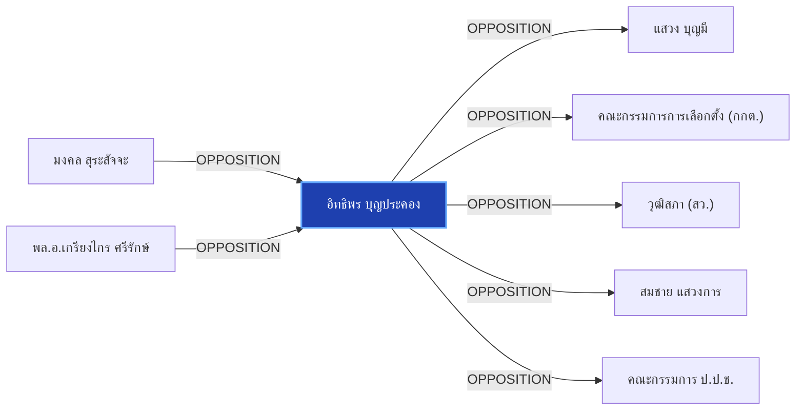

# อิทธิพร บุญประคอง

> **สังกัด**: 🛡️ องค์กรอิสระ (กกต.) | **บทบาท**: ประธานคณะกรรมการการเลือกตั้ง (กกต.) | **ขั้วการเมือง**: Independent

## 📊 ข้อมูลสังเขป & สถิติ
- **การปรากฏในข่าว 30 วันล่าสุด**: 2 ครั้ง
- **สถานะทางการเมือง**: Independent
- **ชื่อเรียก/ฉายา**: อิทธิพร บุญประคอง, อิทธิพร, ประธาน กกต.

## 🌐 แผนผังความสัมพันธ์ (Semantic Network)

## 🔗 โครงข่ายความสัมพันธ์และเหตุการณ์สำคัญ
- **OPPOSITION** ➔ [[entities/mongkol_surasajja|มงคล สุระสัจจะ]]: มงคล สุระสัจจะ และ อิทธิพร บุญประคอง มีปฏิสัมพันธ์ในประเด็นการเมือง (เมื่อ 2026-08-29)
  > *"", "มงคล สุระสัจจะ", "เกรียงไกร ศรีรักษ์", "แสวง บุญมี", "อิทธิพร บุญประคอง"]"*
- **OPPOSITION** ➔ [[entities/kriangkrai_srirak|พล.อ.เกรียงไกร ศรีรักษ์]]: พล.อ.เกรียงไกร ศรีรักษ์ และ อิทธิพร บุญประคอง มีปฏิสัมพันธ์ในประเด็นการเมือง (เมื่อ 2026-08-29)
  > *"", "มงคล สุระสัจจะ", "เกรียงไกร ศรีรักษ์", "แสวง บุญมี", "อิทธิพร บุญประคอง"]"*
- **OPPOSITION** ➔ [[entities/sawaeng_boonmee|แสวง บุญมี]]: อิทธิพร บุญประคอง และ แสวง บุญมี มีปฏิสัมพันธ์ในประเด็นการเมือง (เมื่อ 2026-08-29)
  > *"", "มงคล สุระสัจจะ", "เกรียงไกร ศรีรักษ์", "แสวง บุญมี", "อิทธิพร บุญประคอง"]"*
- **OPPOSITION** ➔ [[entities/election_commission|คณะกรรมการการเลือกตั้ง (กกต.)]]: อิทธิพร บุญประคอง และ คณะกรรมการการเลือกตั้ง (กกต.) มีปฏิสัมพันธ์ในประเด็นการเมือง (เมื่อ 2026-08-29)
  > *"กกต. เดินหน้าสอบคดีฮั้ว สว. 229 รายชื่อ นัดลงมติชี้ชะตาสอย สว. สายสีน้ำเงิน"*
- **OPPOSITION** ➔ [[entities/senate_thailand|วุฒิสภา (สว.)]]: อิทธิพร บุญประคอง และ วุฒิสภา (สว.) มีปฏิสัมพันธ์ในประเด็นการเมือง (เมื่อ 2026-08-29)
  > *"กกต. เดินหน้าสอบคดีฮั้ว สว. 229 รายชื่อ นัดลงมติชี้ชะตาสอย สว. สายสีน้ำเงิน"*
- **OPPOSITION** ➔ [[entities/somchai_sawangkarn|สมชาย แสวงการ]]: อิทธิพร บุญประคอง และ สมชาย แสวงการ มีปฏิสัมพันธ์ในประเด็นการเมือง (เมื่อ 2026-08-29)
  > *"นายสมชาย แสวงการ อดีตสมาชิกวุฒิสภา ได้นำเอกสารหลักฐานชุดใหม่เข้ายื่นต่อนายอิทธิพร บุญประคอง ประธาน กกต"*
- **OPPOSITION** ➔ [[entities/nacc|คณะกรรมการ ป.ป.ช.]]: อิทธิพร บุญประคอง และ คณะกรรมการ ป.ป.ช. มีปฏิสัมพันธ์ในประเด็นการเมือง (เมื่อ 2026-08-29)
  > *"สมชาย แสวงการ ส่งหลักฐานเส้นทางการเงิน-โพยจัดตั้ง ฮั้วเลือก สว. ให้ กกต. และ ป.ป.ช."*

## 📑 เอกสารและข่าวที่เกี่ยวข้อง
- ดูสรุปข่าวรอบ 30 วันใน [[wiki/index#Source Summaries|Index Summaries]]
