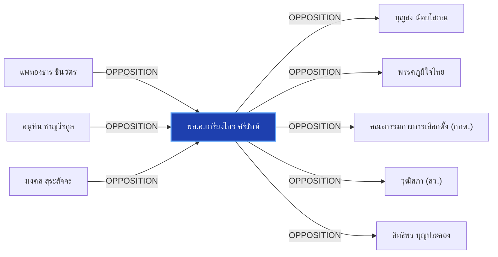

# พล.อ.เกรียงไกร ศรีรักษ์

> **สังกัด**: 🏛️🔵 วุฒิสภา (สายสีน้ำเงิน) | **บทบาท**: รองประธานวุฒิสภา คนที่ 1 / แกนนำ สว. สายสีน้ำเงิน | **ขั้วการเมือง**: Senate-Blue

## 📊 ข้อมูลสังเขป & สถิติ
- **การปรากฏในข่าว 30 วันล่าสุด**: 2 ครั้ง
- **สถานะทางการเมือง**: Senate-Blue
- **ชื่อเรียก/ฉายา**: เกรียงไกร ศรีรักษ์, พล.อ.เกรียงไกร, บิ๊กเกรียง, รองประธานวุฒิสภา คนที่ 1

## 🌐 แผนผังความสัมพันธ์ (Semantic Network)

## 🔗 โครงข่ายความสัมพันธ์และเหตุการณ์สำคัญ
- **OPPOSITION** ➔ [[entities/paetongtarn_shinawatra|แพทองธาร ชินวัตร]]: แพทองธาร ชินวัตร และ พล.อ.เกรียงไกร ศรีรักษ์ มีปฏิสัมพันธ์ในประเด็นการเมือง (เมื่อ 2026-08-29)
  > *"มงคล สุระสัจจะ และ เกรียงไกร ศรีรักษ์ เข้าแจง กกต. ยันเลือก สว. โปร่งใส ไร้จัดตั้ง"*
- **OPPOSITION** ➔ [[entities/anutin_charnvirakul|อนุทิน ชาญวีรกูล]]: อนุทิน ชาญวีรกูล และ พล.อ.เกรียงไกร ศรีรักษ์ มีปฏิสัมพันธ์ในประเด็นการเมือง (เมื่อ 2026-08-29)
  > *"tags: ["มงคล สุระสัจจะ", "เกรียงไกร ศรีรักษ์", "อนุทิน ชาญวีรกูล", "วุฒิสภา", "กกต"*
- **OPPOSITION** ➔ [[entities/mongkol_surasajja|มงคล สุระสัจจะ]]: มงคล สุระสัจจะ และ พล.อ.เกรียงไกร ศรีรักษ์ มีปฏิสัมพันธ์ในประเด็นการเมือง (เมื่อ 2026-08-29)
  > *"มงคล สุระสัจจะ และ เกรียงไกร ศรีรักษ์ เข้าแจง กกต"*
- **OPPOSITION** ➔ [[entities/boonsong_noisophon|บุญส่ง น้อยโสภณ]]: พล.อ.เกรียงไกร ศรีรักษ์ และ บุญส่ง น้อยโสภณ มีปฏิสัมพันธ์ในประเด็นการเมือง (เมื่อ 2026-08-29)
  > *"มงคล สุระสัจจะ และ เกรียงไกร ศรีรักษ์ เข้าแจง กกต. ยันเลือก สว. โปร่งใส ไร้จัดตั้ง"*
- **OPPOSITION** ➔ [[entities/bhumjaithai_party|พรรคภูมิใจไทย]]: พล.อ.เกรียงไกร ศรีรักษ์ และ พรรคภูมิใจไทย มีปฏิสัมพันธ์ในประเด็นการเมือง (เมื่อ 2026-08-29)
  > *"มงคล สุระสัจจะ และ เกรียงไกร ศรีรักษ์ เข้าแจง กกต. ยันเลือก สว. โปร่งใส ไร้จัดตั้ง"*
- **OPPOSITION** ➔ [[entities/election_commission|คณะกรรมการการเลือกตั้ง (กกต.)]]: พล.อ.เกรียงไกร ศรีรักษ์ และ คณะกรรมการการเลือกตั้ง (กกต.) มีปฏิสัมพันธ์ในประเด็นการเมือง (เมื่อ 2026-08-29)
  > *"มงคล สุระสัจจะ และ เกรียงไกร ศรีรักษ์ เข้าแจง กกต. ยันเลือก สว. โปร่งใส ไร้จัดตั้ง"*
- **OPPOSITION** ➔ [[entities/senate_thailand|วุฒิสภา (สว.)]]: พล.อ.เกรียงไกร ศรีรักษ์ และ วุฒิสภา (สว.) มีปฏิสัมพันธ์ในประเด็นการเมือง (เมื่อ 2026-08-29)
  > *"tags: ["มงคล สุระสัจจะ", "เกรียงไกร ศรีรักษ์", "อนุทิน ชาญวีรกูล", "วุฒิสภา", "กกต"*
- **OPPOSITION** ➔ [[entities/itthiporn_boonpracong|อิทธิพร บุญประคอง]]: พล.อ.เกรียงไกร ศรีรักษ์ และ อิทธิพร บุญประคอง มีปฏิสัมพันธ์ในประเด็นการเมือง (เมื่อ 2026-08-29)
  > *"", "มงคล สุระสัจจะ", "เกรียงไกร ศรีรักษ์", "แสวง บุญมี", "อิทธิพร บุญประคอง"]"*
- **OPPOSITION** ➔ [[entities/sawaeng_boonmee|แสวง บุญมี]]: พล.อ.เกรียงไกร ศรีรักษ์ และ แสวง บุญมี มีปฏิสัมพันธ์ในประเด็นการเมือง (เมื่อ 2026-08-29)
  > *"", "มงคล สุระสัจจะ", "เกรียงไกร ศรีรักษ์", "แสวง บุญมี", "อิทธิพร บุญประคอง"]"*

## 📑 เอกสารและข่าวที่เกี่ยวข้อง
- ดูสรุปข่าวรอบ 30 วันใน [[wiki/index#Source Summaries|Index Summaries]]
