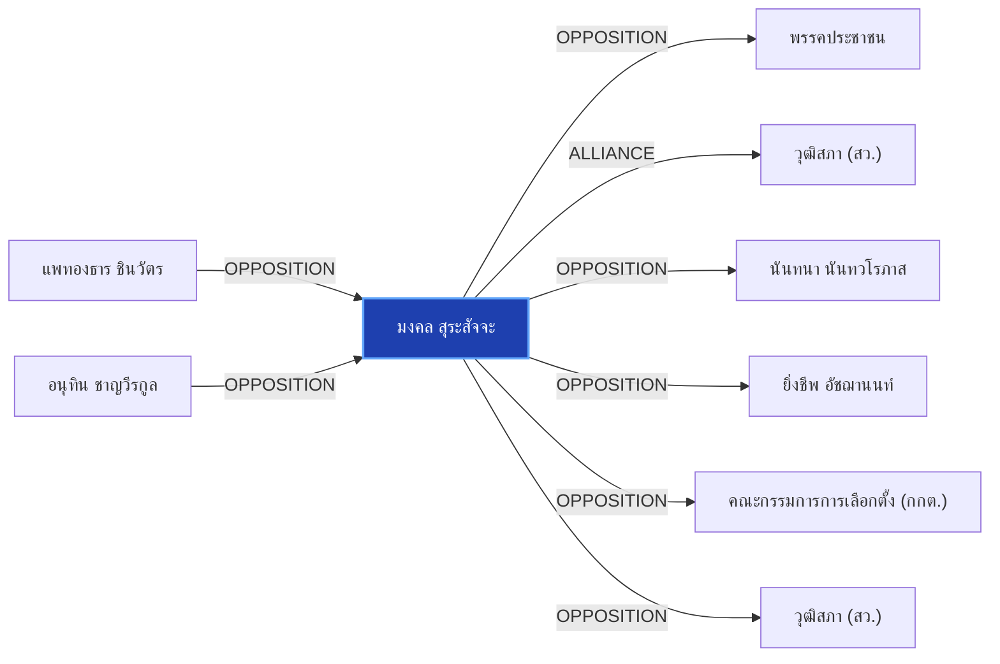

# มงคล สุระสัจจะ

> **สังกัด**: 🏛️🔵 วุฒิสภา (สายสีน้ำเงิน) | **บทบาท**: ประธานวุฒิสภา / ผู้ถูกกล่าวหาคดีฮั้ว สว. 229 ราย | **ขั้วการเมือง**: Senate-Blue

## 📊 ข้อมูลสังเขป & สถิติ
- **การปรากฏในข่าว 30 วันล่าสุด**: 8 ครั้ง
- **สถานะทางการเมือง**: Senate-Blue
- **ชื่อเรียก/ฉายา**: มงคล สุระสัจจะ, มงคล, ประธานวุฒิสภา, ประธาน สว.

## 🌐 แผนผังความสัมพันธ์ (Semantic Network)

## 🔗 โครงข่ายความสัมพันธ์และเหตุการณ์สำคัญ
- **OPPOSITION** ➔ [[entities/peoples_party|พรรคประชาชน]]: มงคล สุระสัจจะ และ พรรคประชาชน มีปฏิสัมพันธ์ในประเด็นการเมือง (เมื่อ 2026-08-29)
  > *"iLaw โดย ยิ่งชีพ อัชฌานนท์ เปิดรายงานสถิติบล็อกโหวต ชี้เครือข่ายฮั้วเลือก สว.67 คุมสภาสูง"*
- **ALLIANCE** ➔ [[entities/senate_thailand|วุฒิสภา (สว.)]]: มงคล สุระสัจจะ และ วุฒิสภา (สว.) ร่วมมือทางการเมือง/พรรคร่วมรัฐบาล (เมื่อ 2026-08-28)
  > *"ประธานวุฒิสภา ออกถ้อยแถลงโต้ข้อกล่าวหา ‘ฮุน เซน’ พร้อมเรียกร้องความจริงใจ จับมือแก้แก๊งคอล"*
- **OPPOSITION** ➔ [[entities/nanthana_nanthavaropas|นันทนา นันทวโรภาส]]: มงคล สุระสัจจะ และ นันทนา นันทวโรภาส มีปฏิสัมพันธ์ในประเด็นการเมือง (เมื่อ 2026-08-29)
  > *"tags: ["ยิ่งชีพ อัชฌานนท์", "iLaw", "มงคล สุระสัจจะ", "นันทนา นันทวโรภาส", "กกต"*
- **OPPOSITION** ➔ [[entities/yingcheep_atchanont|ยิ่งชีพ อัชฌานนท์]]: มงคล สุระสัจจะ และ ยิ่งชีพ อัชฌานนท์ มีปฏิสัมพันธ์ในประเด็นการเมือง (เมื่อ 2026-08-29)
  > *"tags: ["ยิ่งชีพ อัชฌานนท์", "iLaw", "มงคล สุระสัจจะ", "นันทนา นันทวโรภาส", "กกต"*
- **OPPOSITION** ➔ [[entities/election_commission|คณะกรรมการการเลือกตั้ง (กกต.)]]: มงคล สุระสัจจะ และ คณะกรรมการการเลือกตั้ง (กกต.) มีปฏิสัมพันธ์ในประเด็นการเมือง (เมื่อ 2026-08-29)
  > *"iLaw โดย ยิ่งชีพ อัชฌานนท์ เปิดรายงานสถิติบล็อกโหวต ชี้เครือข่ายฮั้วเลือก สว.67 คุมสภาสูง"*
- **OPPOSITION** ➔ [[entities/senate_thailand|วุฒิสภา (สว.)]]: มงคล สุระสัจจะ และ วุฒิสภา (สว.) มีปฏิสัมพันธ์ในประเด็นการเมือง (เมื่อ 2026-08-29)
  > *"iLaw โดย ยิ่งชีพ อัชฌานนท์ เปิดรายงานสถิติบล็อกโหวต ชี้เครือข่ายฮั้วเลือก สว.67 คุมสภาสูง"*
- **OPPOSITION** ➔ [[entities/paetongtarn_shinawatra|แพทองธาร ชินวัตร]]: แพทองธาร ชินวัตร และ มงคล สุระสัจจะ มีปฏิสัมพันธ์ในประเด็นการเมือง (เมื่อ 2026-08-29)
  > *"มงคล สุระสัจจะ และ เกรียงไกร ศรีรักษ์ เข้าแจง กกต. ยันเลือก สว. โปร่งใส ไร้จัดตั้ง"*
- **OPPOSITION** ➔ [[entities/anutin_charnvirakul|อนุทิน ชาญวีรกูล]]: อนุทิน ชาญวีรกูล และ มงคล สุระสัจจะ มีปฏิสัมพันธ์ในประเด็นการเมือง (เมื่อ 2026-08-29)
  > *"tags: ["มงคล สุระสัจจะ", "เกรียงไกร ศรีรักษ์", "อนุทิน ชาญวีรกูล", "วุฒิสภา", "กกต"*
- **OPPOSITION** ➔ [[entities/kriangkrai_srirak|พล.อ.เกรียงไกร ศรีรักษ์]]: มงคล สุระสัจจะ และ พล.อ.เกรียงไกร ศรีรักษ์ มีปฏิสัมพันธ์ในประเด็นการเมือง (เมื่อ 2026-08-29)
  > *"มงคล สุระสัจจะ และ เกรียงไกร ศรีรักษ์ เข้าแจง กกต"*
- **ALLIANCE** ➔ [[entities/boonsong_noisophon|บุญส่ง น้อยโสภณ]]: มงคล สุระสัจจะ และ บุญส่ง น้อยโสภณ ร่วมมือทางการเมือง/พรรคร่วมรัฐบาล (เมื่อ 2026-08-29)
  > *"ทุกท่านมีความเป็นอิสระตามรัฐธรรมนูญ ขณะที่นายบุญส่ง น้อยโสภณ รองประธานวุฒิสภา คนที่ 2 ระบุว่าวุฒิสภายังคงเดินหน้าทำหน้าที่พิจารณาร่างกฎหมายและเห็นชอบองค์กรอิสระตามปกติ"*
- **OPPOSITION** ➔ [[entities/bhumjaithai_party|พรรคภูมิใจไทย]]: มงคล สุระสัจจะ และ พรรคภูมิใจไทย มีปฏิสัมพันธ์ในประเด็นการเมือง (เมื่อ 2026-08-29)
  > *"มงคล สุระสัจจะ และ เกรียงไกร ศรีรักษ์ เข้าแจง กกต. ยันเลือก สว. โปร่งใส ไร้จัดตั้ง"*
- **OPPOSITION** ➔ [[entities/tewarit_maneechay|เทวฤทธิ์ มณีฉาย]]: มงคล สุระสัจจะ และ เทวฤทธิ์ มณีฉาย มีปฏิสัมพันธ์ในประเด็นการเมือง (เมื่อ 2026-08-29)
  > *"tags: ["นันทนา นันทวโรภาส", "เทวฤทธิ์ มณีฉาย", "มงคล สุระสัจจะ", "กกต"*
- **CRITICISM** ➔ [[entities/sawaeng_boonmee|แสวง บุญมี]]: มงคล สุระสัจจะ วิพากษ์วิจารณ์/ตรวจสอบท่าทีของ แสวง บุญมี (เมื่อ 2026-08-29)
  > *"นันทนา นันทวโรภาส และ สว.พันธุ์ใหม่ จี้ 229 สว. เอี่ยวคดีฮั้วหยุดปฏิบัติหน้าที่"*
- **CRITICISM** ➔ [[entities/constitutional_court|ศาลรัฐธรรมนูญ]]: มงคล สุระสัจจะ วิพากษ์วิจารณ์/ตรวจสอบท่าทีของ ศาลรัฐธรรมนูญ (เมื่อ 2026-08-29)
  > *"นันทนา นันทวโรภาส และ สว.พันธุ์ใหม่ จี้ 229 สว. เอี่ยวคดีฮั้วหยุดปฏิบัติหน้าที่"*
- **CRITICISM** ➔ [[entities/election_commission|คณะกรรมการการเลือกตั้ง (กกต.)]]: มงคล สุระสัจจะ วิพากษ์วิจารณ์/ตรวจสอบท่าทีของ คณะกรรมการการเลือกตั้ง (กกต.) (เมื่อ 2026-08-29)
  > *"นันทนา นันทวโรภาส และ สว.พันธุ์ใหม่ จี้ 229 สว. เอี่ยวคดีฮั้วหยุดปฏิบัติหน้าที่"*
- **CRITICISM** ➔ [[entities/nacc|คณะกรรมการ ป.ป.ช.]]: มงคล สุระสัจจะ วิพากษ์วิจารณ์/ตรวจสอบท่าทีของ คณะกรรมการ ป.ป.ช. (เมื่อ 2026-08-29)
  > *"นันทนา นันทวโรภาส และ สว.พันธุ์ใหม่ จี้ 229 สว. เอี่ยวคดีฮั้วหยุดปฏิบัติหน้าที่"*
- **OPPOSITION** ➔ [[entities/itthiporn_boonpracong|อิทธิพร บุญประคอง]]: มงคล สุระสัจจะ และ อิทธิพร บุญประคอง มีปฏิสัมพันธ์ในประเด็นการเมือง (เมื่อ 2026-08-29)
  > *"", "มงคล สุระสัจจะ", "เกรียงไกร ศรีรักษ์", "แสวง บุญมี", "อิทธิพร บุญประคอง"]"*
- **OPPOSITION** ➔ [[entities/sawaeng_boonmee|แสวง บุญมี]]: มงคล สุระสัจจะ และ แสวง บุญมี มีปฏิสัมพันธ์ในประเด็นการเมือง (เมื่อ 2026-08-29)
  > *"", "มงคล สุระสัจจะ", "เกรียงไกร ศรีรักษ์", "แสวง บุญมี", "อิทธิพร บุญประคอง"]"*
- **LEGAL_ACTION** ➔ [[entities/senate_thailand|วุฒิสภา (สว.)]]: กระบวนการทางกฎหมาย/ตรวจสอบระหว่าง มงคล สุระสัจจะ และ วุฒิสภา (สว.) (เมื่อ 2026-08-29)
  > *") ปี 2567 โดยคณะกรรมการสืบสวนและไต่สวนกลางได้รวบรวมพยานหลักฐานและรับฟังข้อเท็จจริงในสำนวนกลุ่มผู้ถูกกล่าวหาจำนวน 229 รายชื่อ ซึ่งรวมถึงนายมงคล สุระสัจจะ ประธานวุฒิสภา และ พล"*
- **OPPOSITION** ➔ [[entities/somchai_sawangkarn|สมชาย แสวงการ]]: มงคล สุระสัจจะ และ สมชาย แสวงการ มีปฏิสัมพันธ์ในประเด็นการเมือง (เมื่อ 2026-08-29)
  > *"สมชาย แสวงการ ส่งหลักฐานเส้นทางการเงิน-โพยจัดตั้ง ฮั้วเลือก สว. ให้ กกต. และ ป.ป.ช."*
- **OPPOSITION** ➔ [[entities/nacc|คณะกรรมการ ป.ป.ช.]]: มงคล สุระสัจจะ และ คณะกรรมการ ป.ป.ช. มีปฏิสัมพันธ์ในประเด็นการเมือง (เมื่อ 2026-08-29)
  > *"สมชาย แสวงการ ส่งหลักฐานเส้นทางการเงิน-โพยจัดตั้ง ฮั้วเลือก สว. ให้ กกต. และ ป.ป.ช."*

## 📑 เอกสารและข่าวที่เกี่ยวข้อง
- ดูสรุปข่าวรอบ 30 วันใน [[wiki/index#Source Summaries|Index Summaries]]
