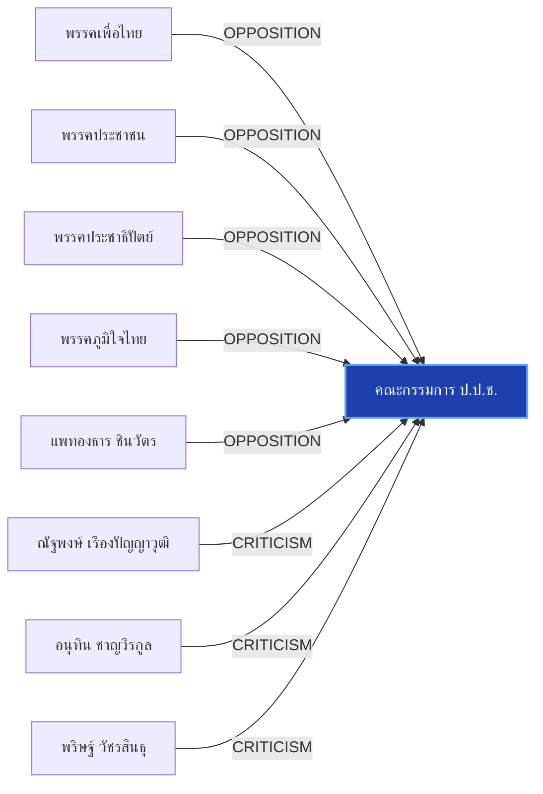

# คณะกรรมการ ป.ป.ช.

> **สังกัด**: 🛡️ องค์กรอิสระ | **บทบาท**: องค์กรป้องกันและปราบปรามการทุจริตแห่งชาติ | **ขั้วการเมือง**: Independent

## 📊 ข้อมูลสังเขป & สถิติ
- **การปรากฏในข่าว 30 วันล่าสุด**: 15 ครั้ง
- **สถานะทางการเมือง**: Independent
- **ชื่อเรียก/ฉายา**: ป.ป.ช., คณะกรรมการป้องกันและปราบปรามการทุจริตแห่งชาติ, สำนักงาน ป.ป.ช.

## 🌐 แผนผังความสัมพันธ์ (Semantic Network)

## 🔗 โครงข่ายความสัมพันธ์และเหตุการณ์สำคัญ
- **OPPOSITION** ➔ [[entities/pheu_thai_party|พรรคเพื่อไทย]]: พรรคเพื่อไทย และ คณะกรรมการ ป.ป.ช. มีปฏิสัมพันธ์ในประเด็นการเมือง (เมื่อ 2026-08-28)
  > *"อาสพลธ์ เผยแชตหลุดมัด ‘พ.ต.ท.’ผู้เชี่ยวชาญคดีพิเศษ ดีเอสไอ โยง คดีโกงสอบท้องถิ่น"*
- **OPPOSITION** ➔ [[entities/peoples_party|พรรคประชาชน]]: พรรคประชาชน และ คณะกรรมการ ป.ป.ช. มีปฏิสัมพันธ์ในประเด็นการเมือง (เมื่อ 2026-08-28)
  > *"ปชน. เปิดเวที NEWนนท์ ‘ปิยบุตร’ ย้ำไม่ใช่สงครามยึดจังหวัด ‘เดชรัต’ ชูฟื้นศก.ท่าน้ำนนท์"*
- **OPPOSITION** ➔ [[entities/democrat_party|พรรคประชาธิปัตย์]]: พรรคประชาธิปัตย์ และ คณะกรรมการ ป.ป.ช. มีปฏิสัมพันธ์ในประเด็นการเมือง (เมื่อ 2026-08-28)
  > *"อภิสิทธิ์ ชี้ องค์กรอิสระวิกฤต ถูกแทรกแซงครบวงจร มองแก้รธน. เป็นโอกาสทอง รื้อที่มา ‘องค์กรอิสระ-สว.’"*
- **OPPOSITION** ➔ [[entities/bhumjaithai_party|พรรคภูมิใจไทย]]: พรรคภูมิใจไทย และ คณะกรรมการ ป.ป.ช. มีปฏิสัมพันธ์ในประเด็นการเมือง (เมื่อ 2026-08-28)
  > *"กมธ.ตำรวจ ไม่รับเรื่อง เลขาฯพระปกเกล้ารีดเงินแลกเข้าเรียนปปร. พร้อมปลดคนแจ้งความพ้นกมธ."*
- **OPPOSITION** ➔ [[entities/paetongtarn_shinawatra|แพทองธาร ชินวัตร]]: แพทองธาร ชินวัตร และ คณะกรรมการ ป.ป.ช. มีปฏิสัมพันธ์ในประเด็นการเมือง (เมื่อ 2026-08-28)
  > *"อดีตกรรมการกฤษฎีกา และอดีตรองนายกรัฐมนตรี, นายวิชา มหาคุณ อดีตประธานคณะกรรมการป้องกันและปราบปรามการทุจริตแห่งชาติ (ป"*
- **CRITICISM** ➔ [[entities/natthaphong_ruengpanyawut|ณัฐพงษ์ เรืองปัญญาวุฒิ]]: ณัฐพงษ์ เรืองปัญญาวุฒิ วิพากษ์วิจารณ์/ตรวจสอบท่าทีของ คณะกรรมการ ป.ป.ช. (เมื่อ 2026-08-28)
  > *"บวรศักดิ์ ซัดองค์กรอิสระ ความเชื่อมั่นตกต่ำ หนุนแก้รธน. ชง 5 ข้อรื้อสรรหา-คืนสิทธิปชช.ถอดถอน"*
- **CRITICISM** ➔ [[entities/anutin_charnvirakul|อนุทิน ชาญวีรกูล]]: อนุทิน ชาญวีรกูล วิพากษ์วิจารณ์/ตรวจสอบท่าทีของ คณะกรรมการ ป.ป.ช. (เมื่อ 2026-08-28)
  > *"บวรศักดิ์ ซัดองค์กรอิสระ ความเชื่อมั่นตกต่ำ หนุนแก้รธน. ชง 5 ข้อรื้อสรรหา-คืนสิทธิปชช.ถอดถอน"*
- **CRITICISM** ➔ [[entities/parit_wacharasindhu|พริษฐ์ วัชรสินธุ]]: พริษฐ์ วัชรสินธุ วิพากษ์วิจารณ์/ตรวจสอบท่าทีของ คณะกรรมการ ป.ป.ช. (เมื่อ 2026-08-28)
  > *"บวรศักดิ์ ซัดองค์กรอิสระ ความเชื่อมั่นตกต่ำ หนุนแก้รธน. ชง 5 ข้อรื้อสรรหา-คืนสิทธิปชช.ถอดถอน"*
- **CRITICISM** ➔ [[entities/peoples_party|พรรคประชาชน]]: พรรคประชาชน วิพากษ์วิจารณ์/ตรวจสอบท่าทีของ คณะกรรมการ ป.ป.ช. (เมื่อ 2026-08-28)
  > *"บวรศักดิ์ ซัดองค์กรอิสระ ความเชื่อมั่นตกต่ำ หนุนแก้รธน. ชง 5 ข้อรื้อสรรหา-คืนสิทธิปชช.ถอดถอน"*
- **CRITICISM** ➔ [[entities/election_commission|คณะกรรมการการเลือกตั้ง (กกต.)]]: คณะกรรมการการเลือกตั้ง (กกต.) วิพากษ์วิจารณ์/ตรวจสอบท่าทีของ คณะกรรมการ ป.ป.ช. (เมื่อ 2026-08-29)
  > *"นันทนา นันทวโรภาส และ สว.พันธุ์ใหม่ จี้ 229 สว. เอี่ยวคดีฮั้วหยุดปฏิบัติหน้าที่"*
- **CRITICISM** ➔ [[entities/senate_thailand|วุฒิสภา (สว.)]]: คณะกรรมการ ป.ป.ช. วิพากษ์วิจารณ์/ตรวจสอบท่าทีของ วุฒิสภา (สว.) (เมื่อ 2026-08-29)
  > *"นันทนา นันทวโรภาส และ สว.พันธุ์ใหม่ จี้ 229 สว. เอี่ยวคดีฮั้วหยุดปฏิบัติหน้าที่"*
- **CRITICISM** ➔ [[entities/constitution_amendment|การแก้ไขรัฐธรรมนูญ]]: คณะกรรมการ ป.ป.ช. วิพากษ์วิจารณ์/ตรวจสอบท่าทีของ การแก้ไขรัฐธรรมนูญ (เมื่อ 2026-08-28)
  > *"บวรศักดิ์ ซัดองค์กรอิสระ ความเชื่อมั่นตกต่ำ หนุนแก้รธน. ชง 5 ข้อรื้อสรรหา-คืนสิทธิปชช.ถอดถอน"*
- **OPPOSITION** ➔ [[entities/anutin_charnvirakul|อนุทิน ชาญวีรกูล]]: อนุทิน ชาญวีรกูล และ คณะกรรมการ ป.ป.ช. มีปฏิสัมพันธ์ในประเด็นการเมือง (เมื่อ 2026-08-28)
  > *"ปชน. เปิดเวที NEWนนท์ ‘ปิยบุตร’ ย้ำไม่ใช่สงครามยึดจังหวัด ‘เดชรัต’ ชูฟื้นศก.ท่าน้ำนนท์"*
- **OPPOSITION** ➔ [[entities/election_commission|คณะกรรมการการเลือกตั้ง (กกต.)]]: คณะกรรมการการเลือกตั้ง (กกต.) และ คณะกรรมการ ป.ป.ช. มีปฏิสัมพันธ์ในประเด็นการเมือง (เมื่อ 2026-08-29)
  > *"สมชาย แสวงการ ส่งหลักฐานเส้นทางการเงิน-โพยจัดตั้ง ฮั้วเลือก สว. ให้ กกต. และ ป.ป.ช."*
- **OPPOSITION** ➔ [[entities/senate_thailand|วุฒิสภา (สว.)]]: คณะกรรมการ ป.ป.ช. และ วุฒิสภา (สว.) มีปฏิสัมพันธ์ในประเด็นการเมือง (เมื่อ 2026-08-29)
  > *"สมชาย แสวงการ ส่งหลักฐานเส้นทางการเงิน-โพยจัดตั้ง ฮั้วเลือก สว. ให้ กกต. และ ป.ป.ช."*
- **LEGAL_ACTION** ➔ [[entities/peoples_party|พรรคประชาชน]]: กระบวนการทางกฎหมาย/ตรวจสอบระหว่าง พรรคประชาชน และ คณะกรรมการ ป.ป.ช. (เมื่อ 2026-08-28)
  > *"นายภัณฑิล กล่าวต่อว่า พรรคประชาชนเตรียมยื่นร้องเรียนต่อคณะกรรมการป้องกันและปราบปรามการทุจริตแห่งชาติ (ป"*
- **LEGAL_ACTION** ➔ [[entities/yingcheep_atchanont|ยิ่งชีพ อัชฌานนท์]]: กระบวนการทางกฎหมาย/ตรวจสอบระหว่าง ยิ่งชีพ อัชฌานนท์ และ คณะกรรมการ ป.ป.ช. (เมื่อ 2026-08-28)
  > *"ยิ่งชีพ ปลุกบี้ #สั่งฟ้องสว. ยันไม่มีถ้า.. ชี้ 5 ซีนาริโอ กกต.ไม่ฟ้อง ระบอบสีน้ำเงินเฟื่องฟูแน่"*
- **LEGAL_ACTION** ➔ [[entities/bhumjaithai_party|พรรคภูมิใจไทย]]: กระบวนการทางกฎหมาย/ตรวจสอบระหว่าง พรรคภูมิใจไทย และ คณะกรรมการ ป.ป.ช. (เมื่อ 2026-08-28)
  > *"ยิ่งชีพ ปลุกบี้ #สั่งฟ้องสว. ยันไม่มีถ้า.. ชี้ 5 ซีนาริโอ กกต.ไม่ฟ้อง ระบอบสีน้ำเงินเฟื่องฟูแน่"*
- **LEGAL_ACTION** ➔ [[entities/constitutional_court|ศาลรัฐธรรมนูญ]]: กระบวนการทางกฎหมาย/ตรวจสอบระหว่าง ศาลรัฐธรรมนูญ และ คณะกรรมการ ป.ป.ช. (เมื่อ 2026-08-28)
  > *"ยิ่งชีพ ปลุกบี้ #สั่งฟ้องสว. ยันไม่มีถ้า.. ชี้ 5 ซีนาริโอ กกต.ไม่ฟ้อง ระบอบสีน้ำเงินเฟื่องฟูแน่"*
- **LEGAL_ACTION** ➔ [[entities/election_commission|คณะกรรมการการเลือกตั้ง (กกต.)]]: กระบวนการทางกฎหมาย/ตรวจสอบระหว่าง คณะกรรมการการเลือกตั้ง (กกต.) และ คณะกรรมการ ป.ป.ช. (เมื่อ 2026-08-28)
  > *"ยิ่งชีพ ปลุกบี้ #สั่งฟ้องสว. ยันไม่มีถ้า.. ชี้ 5 ซีนาริโอ กกต.ไม่ฟ้อง ระบอบสีน้ำเงินเฟื่องฟูแน่"*
- **LEGAL_ACTION** ➔ [[entities/senate_thailand|วุฒิสภา (สว.)]]: กระบวนการทางกฎหมาย/ตรวจสอบระหว่าง คณะกรรมการ ป.ป.ช. และ วุฒิสภา (สว.) (เมื่อ 2026-08-28)
  > *"ยิ่งชีพ ปลุกบี้ #สั่งฟ้องสว. ยันไม่มีถ้า.. ชี้ 5 ซีนาริโอ กกต.ไม่ฟ้อง ระบอบสีน้ำเงินเฟื่องฟูแน่"*
- **LEGAL_ACTION** ➔ [[entities/constitution_amendment|การแก้ไขรัฐธรรมนูญ]]: กระบวนการทางกฎหมาย/ตรวจสอบระหว่าง คณะกรรมการ ป.ป.ช. และ การแก้ไขรัฐธรรมนูญ (เมื่อ 2026-08-28)
  > *"ยิ่งชีพ ปลุกบี้ #สั่งฟ้องสว. ยันไม่มีถ้า.. ชี้ 5 ซีนาริโอ กกต.ไม่ฟ้อง ระบอบสีน้ำเงินเฟื่องฟูแน่"*
- **OPPOSITION** ➔ [[entities/yingcheep_atchanont|ยิ่งชีพ อัชฌานนท์]]: ยิ่งชีพ อัชฌานนท์ และ คณะกรรมการ ป.ป.ช. มีปฏิสัมพันธ์ในประเด็นการเมือง (เมื่อ 2026-08-28)
  > *"วิชา อัดองค์กรอิสระ ต้องยึดโยงประชาชน ชม ‘ยิ่งชีพ’ เปิดข้อมูลโกง ส.ว."*
- **OPPOSITION** ➔ [[entities/constitution_amendment|การแก้ไขรัฐธรรมนูญ]]: คณะกรรมการ ป.ป.ช. และ การแก้ไขรัฐธรรมนูญ มีปฏิสัมพันธ์ในประเด็นการเมือง (เมื่อ 2026-08-28)
  > *"วิชา อัดองค์กรอิสระ ต้องยึดโยงประชาชน ชม ‘ยิ่งชีพ’ เปิดข้อมูลโกง ส.ว."*
- **LEGAL_ACTION** ➔ [[entities/democrat_party|พรรคประชาธิปัตย์]]: กระบวนการทางกฎหมาย/ตรวจสอบระหว่าง พรรคประชาธิปัตย์ และ คณะกรรมการ ป.ป.ช. (เมื่อ 2026-08-28)
  > *"วัส ชี้ กกต.ต้องส่งศาลฟันฮั้ว สว. อย่างต่ำ 120 คน ท้าฟ้องพร้อมแฉหลักฐาน ‘อภิสิทธิ์’ เตือนฮั้ว สสร."*
- **OPPOSITION** ➔ [[entities/constitutional_court|ศาลรัฐธรรมนูญ]]: ศาลรัฐธรรมนูญ และ คณะกรรมการ ป.ป.ช. มีปฏิสัมพันธ์ในประเด็นการเมือง (เมื่อ 2026-08-28)
  > *"อภิสิทธิ์ ชี้ องค์กรอิสระวิกฤต ถูกแทรกแซงครบวงจร มองแก้รธน. เป็นโอกาสทอง รื้อที่มา ‘องค์กรอิสระ-สว.’"*
- **CRITICISM** ➔ [[entities/mongkol_surasajja|มงคล สุระสัจจะ]]: มงคล สุระสัจจะ วิพากษ์วิจารณ์/ตรวจสอบท่าทีของ คณะกรรมการ ป.ป.ช. (เมื่อ 2026-08-29)
  > *"นันทนา นันทวโรภาส และ สว.พันธุ์ใหม่ จี้ 229 สว. เอี่ยวคดีฮั้วหยุดปฏิบัติหน้าที่"*
- **CRITICISM** ➔ [[entities/nanthana_nanthavaropas|นันทนา นันทวโรภาส]]: นันทนา นันทวโรภาส วิพากษ์วิจารณ์/ตรวจสอบท่าทีของ คณะกรรมการ ป.ป.ช. (เมื่อ 2026-08-29)
  > *"นันทนา นันทวโรภาส และ สว.พันธุ์ใหม่ จี้ 229 สว. เอี่ยวคดีฮั้วหยุดปฏิบัติหน้าที่"*
- **CRITICISM** ➔ [[entities/tewarit_maneechay|เทวฤทธิ์ มณีฉาย]]: เทวฤทธิ์ มณีฉาย วิพากษ์วิจารณ์/ตรวจสอบท่าทีของ คณะกรรมการ ป.ป.ช. (เมื่อ 2026-08-29)
  > *"นันทนา นันทวโรภาส และ สว.พันธุ์ใหม่ จี้ 229 สว. เอี่ยวคดีฮั้วหยุดปฏิบัติหน้าที่"*
- **CRITICISM** ➔ [[entities/sawaeng_boonmee|แสวง บุญมี]]: แสวง บุญมี วิพากษ์วิจารณ์/ตรวจสอบท่าทีของ คณะกรรมการ ป.ป.ช. (เมื่อ 2026-08-29)
  > *"นันทนา นันทวโรภาส และ สว.พันธุ์ใหม่ จี้ 229 สว. เอี่ยวคดีฮั้วหยุดปฏิบัติหน้าที่"*
- **CRITICISM** ➔ [[entities/constitutional_court|ศาลรัฐธรรมนูญ]]: ศาลรัฐธรรมนูญ วิพากษ์วิจารณ์/ตรวจสอบท่าทีของ คณะกรรมการ ป.ป.ช. (เมื่อ 2026-08-29)
  > *"นันทนา นันทวโรภาส และ สว.พันธุ์ใหม่ จี้ 229 สว. เอี่ยวคดีฮั้วหยุดปฏิบัติหน้าที่"*
- **OPPOSITION** ➔ [[entities/mongkol_surasajja|มงคล สุระสัจจะ]]: มงคล สุระสัจจะ และ คณะกรรมการ ป.ป.ช. มีปฏิสัมพันธ์ในประเด็นการเมือง (เมื่อ 2026-08-29)
  > *"สมชาย แสวงการ ส่งหลักฐานเส้นทางการเงิน-โพยจัดตั้ง ฮั้วเลือก สว. ให้ กกต. และ ป.ป.ช."*
- **OPPOSITION** ➔ [[entities/itthiporn_boonpracong|อิทธิพร บุญประคอง]]: อิทธิพร บุญประคอง และ คณะกรรมการ ป.ป.ช. มีปฏิสัมพันธ์ในประเด็นการเมือง (เมื่อ 2026-08-29)
  > *"สมชาย แสวงการ ส่งหลักฐานเส้นทางการเงิน-โพยจัดตั้ง ฮั้วเลือก สว. ให้ กกต. และ ป.ป.ช."*
- **OPPOSITION** ➔ [[entities/sawaeng_boonmee|แสวง บุญมี]]: แสวง บุญมี และ คณะกรรมการ ป.ป.ช. มีปฏิสัมพันธ์ในประเด็นการเมือง (เมื่อ 2026-08-29)
  > *"สมชาย แสวงการ ส่งหลักฐานเส้นทางการเงิน-โพยจัดตั้ง ฮั้วเลือก สว. ให้ กกต. และ ป.ป.ช."*
- **OPPOSITION** ➔ [[entities/somchai_sawangkarn|สมชาย แสวงการ]]: สมชาย แสวงการ และ คณะกรรมการ ป.ป.ช. มีปฏิสัมพันธ์ในประเด็นการเมือง (เมื่อ 2026-08-29)
  > *"สมชาย แสวงการ ส่งหลักฐานเส้นทางการเงิน-โพยจัดตั้ง ฮั้วเลือก สว. ให้ กกต. และ ป.ป.ช."*

## 📑 เอกสารและข่าวที่เกี่ยวข้อง
- ดูสรุปข่าวรอบ 30 วันใน [[wiki/index#Source Summaries|Index Summaries]]
