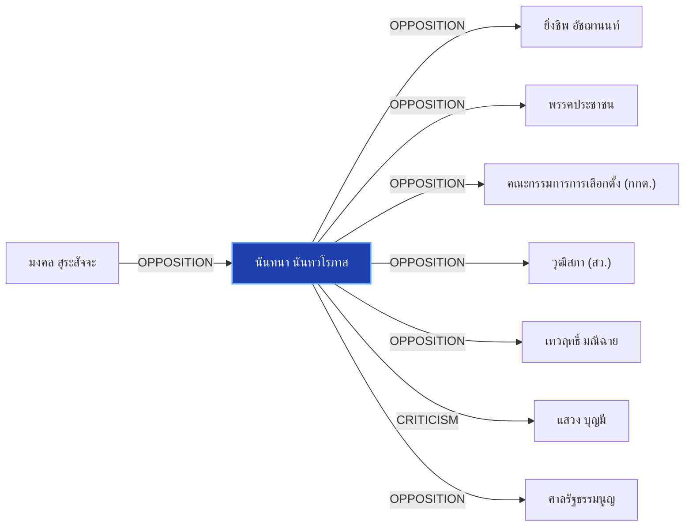

# นันทนา นันทวโรภาส

> **สังกัด**: 🏛️🌱 วุฒิสภา (กลุ่มพันธุ์ใหม่) | **บทบาท**: สมาชิกวุฒิสภา / แกนนำ สว. กลุ่มพันธุ์ใหม่ (ฝ่ายตรวจสอบ) | **ขั้วการเมือง**: Senate-NewBreed

## 📊 ข้อมูลสังเขป & สถิติ
- **การปรากฏในข่าว 30 วันล่าสุด**: 2 ครั้ง
- **สถานะทางการเมือง**: Senate-NewBreed
- **ชื่อเรียก/ฉายา**: นันทนา นันทวโรภาส, นันทนา, ดร.นันทนา, สว.นันทนา

## 🌐 แผนผังความสัมพันธ์ (Semantic Network)

## 🔗 โครงข่ายความสัมพันธ์และเหตุการณ์สำคัญ
- **OPPOSITION** ➔ [[entities/mongkol_surasajja|มงคล สุระสัจจะ]]: มงคล สุระสัจจะ และ นันทนา นันทวโรภาส มีปฏิสัมพันธ์ในประเด็นการเมือง (เมื่อ 2026-08-29)
  > *"tags: ["ยิ่งชีพ อัชฌานนท์", "iLaw", "มงคล สุระสัจจะ", "นันทนา นันทวโรภาส", "กกต"*
- **OPPOSITION** ➔ [[entities/yingcheep_atchanont|ยิ่งชีพ อัชฌานนท์]]: นันทนา นันทวโรภาส และ ยิ่งชีพ อัชฌานนท์ มีปฏิสัมพันธ์ในประเด็นการเมือง (เมื่อ 2026-08-29)
  > *"tags: ["ยิ่งชีพ อัชฌานนท์", "iLaw", "มงคล สุระสัจจะ", "นันทนา นันทวโรภาส", "กกต"*
- **OPPOSITION** ➔ [[entities/peoples_party|พรรคประชาชน]]: นันทนา นันทวโรภาส และ พรรคประชาชน มีปฏิสัมพันธ์ในประเด็นการเมือง (เมื่อ 2026-08-29)
  > *"iLaw โดย ยิ่งชีพ อัชฌานนท์ เปิดรายงานสถิติบล็อกโหวต ชี้เครือข่ายฮั้วเลือก สว.67 คุมสภาสูง"*
- **OPPOSITION** ➔ [[entities/election_commission|คณะกรรมการการเลือกตั้ง (กกต.)]]: นันทนา นันทวโรภาส และ คณะกรรมการการเลือกตั้ง (กกต.) มีปฏิสัมพันธ์ในประเด็นการเมือง (เมื่อ 2026-08-29)
  > *"iLaw โดย ยิ่งชีพ อัชฌานนท์ เปิดรายงานสถิติบล็อกโหวต ชี้เครือข่ายฮั้วเลือก สว.67 คุมสภาสูง"*
- **OPPOSITION** ➔ [[entities/senate_thailand|วุฒิสภา (สว.)]]: นันทนา นันทวโรภาส และ วุฒิสภา (สว.) มีปฏิสัมพันธ์ในประเด็นการเมือง (เมื่อ 2026-08-29)
  > *"iLaw โดย ยิ่งชีพ อัชฌานนท์ เปิดรายงานสถิติบล็อกโหวต ชี้เครือข่ายฮั้วเลือก สว.67 คุมสภาสูง"*
- **OPPOSITION** ➔ [[entities/tewarit_maneechay|เทวฤทธิ์ มณีฉาย]]: นันทนา นันทวโรภาส และ เทวฤทธิ์ มณีฉาย มีปฏิสัมพันธ์ในประเด็นการเมือง (เมื่อ 2026-08-29)
  > *"tags: ["นันทนา นันทวโรภาส", "เทวฤทธิ์ มณีฉาย", "มงคล สุระสัจจะ", "กกต"*
- **CRITICISM** ➔ [[entities/sawaeng_boonmee|แสวง บุญมี]]: นันทนา นันทวโรภาส วิพากษ์วิจารณ์/ตรวจสอบท่าทีของ แสวง บุญมี (เมื่อ 2026-08-29)
  > *"นันทนา นันทวโรภาส และ สว.พันธุ์ใหม่ จี้ 229 สว. เอี่ยวคดีฮั้วหยุดปฏิบัติหน้าที่"*
- **OPPOSITION** ➔ [[entities/constitutional_court|ศาลรัฐธรรมนูญ]]: นันทนา นันทวโรภาส และ ศาลรัฐธรรมนูญ มีปฏิสัมพันธ์ในประเด็นการเมือง (เมื่อ 2026-08-29)
  > *"นันทนา ระบุว่า การโหวตรับรองกรรมการองค์กรอิสระ อาทิ ตุลาการศาลรัฐธรรมนูญ และ ป"*
- **CRITICISM** ➔ [[entities/election_commission|คณะกรรมการการเลือกตั้ง (กกต.)]]: นันทนา นันทวโรภาส วิพากษ์วิจารณ์/ตรวจสอบท่าทีของ คณะกรรมการการเลือกตั้ง (กกต.) (เมื่อ 2026-08-29)
  > *"นันทนา นันทวโรภาส และ สว.พันธุ์ใหม่ จี้ 229 สว. เอี่ยวคดีฮั้วหยุดปฏิบัติหน้าที่"*
- **CRITICISM** ➔ [[entities/nacc|คณะกรรมการ ป.ป.ช.]]: นันทนา นันทวโรภาส วิพากษ์วิจารณ์/ตรวจสอบท่าทีของ คณะกรรมการ ป.ป.ช. (เมื่อ 2026-08-29)
  > *"นันทนา นันทวโรภาส และ สว.พันธุ์ใหม่ จี้ 229 สว. เอี่ยวคดีฮั้วหยุดปฏิบัติหน้าที่"*

## 📑 เอกสารและข่าวที่เกี่ยวข้อง
- ดูสรุปข่าวรอบ 30 วันใน [[wiki/index#Source Summaries|Index Summaries]]
