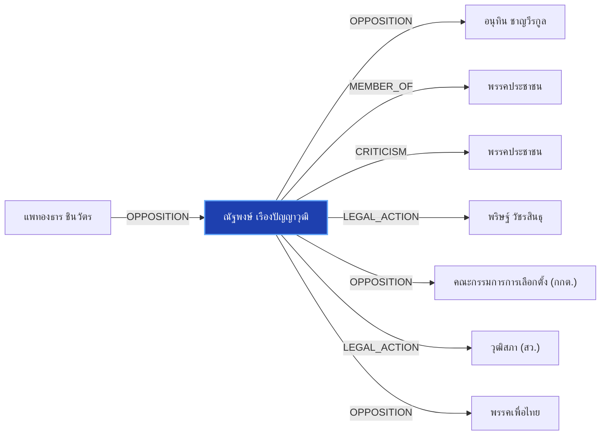

# ณัฐพงษ์ เรืองปัญญาวุฒิ

> **สังกัด**: พรรคประชาชน | **บทบาท**: ผู้นำฝ่ายค้านในสภาฯ / หัวหน้าพรรคประชาชน | **ขั้วการเมือง**: Opposition

## 📊 ข้อมูลสังเขป & สถิติ
- **การปรากฏในข่าว 30 วันล่าสุด**: 27 ครั้ง
- **สถานะทางการเมือง**: Opposition
- **ชื่อเรียก/ฉายา**: ณัฐพงษ์, เท้ง, หัวหน้าพรรคประชาชน, ผู้นำฝ่ายค้าน

## 🌐 แผนผังความสัมพันธ์ (Semantic Network)

## 🔗 โครงข่ายความสัมพันธ์และเหตุการณ์สำคัญ
- **OPPOSITION** ➔ [[entities/paetongtarn_shinawatra|แพทองธาร ชินวัตร]]: แพทองธาร ชินวัตร และ ณัฐพงษ์ เรืองปัญญาวุฒิ มีปฏิสัมพันธ์ในประเด็นการเมือง (เมื่อ 2026-08-28)
  > *"นายกฯ บอก ไม่รู้เรื่อง รร.พูลแมน ไม่ให้ฝ่ายค้านใช้จัด ย้อนถามสื่อ “เขาไม่ให้ใช้แล้วเหรอ”"*
- **OPPOSITION** ➔ [[entities/anutin_charnvirakul|อนุทิน ชาญวีรกูล]]: ณัฐพงษ์ เรืองปัญญาวุฒิ และ อนุทิน ชาญวีรกูล มีปฏิสัมพันธ์ในประเด็นการเมือง (เมื่อ 2026-08-28)
  > *"‘ชลน่าน’ ยันขึ้นเวทีฝ่ายค้าน ขอ พท.แล้ว ชี้ไม่กระทบสัมพันธ์ ‘ภูมิใจไทย’"*
- **MEMBER_OF** ➔ [[entities/peoples_party|พรรคประชาชน]]: ณัฐพงษ์ เรืองปัญญาวุฒิ สังกัด/ดำรงตำแหน่งใน พรรคประชาชน (เมื่อ 2026-08-28)
  > *") และอดีตผู้นำฝ่ายค้านฯ โดยตนจะร่วมเฉพาะวงเสวนาของอดีตผู้นำฝ่ายค้านในช่วงเช้าเท่านั้น ไม่ได้เข้าร่วมวงเสวนาช่วงอื่นที่เกี่ยวข้องกับประเด็นการเลือกสมาชิกวุฒิสภา หรือร่วมเวทีกับกลุ่มเคลื่อนไหวภาคประชาชน"*
- **CRITICISM** ➔ [[entities/peoples_party|พรรคประชาชน]]: ณัฐพงษ์ เรืองปัญญาวุฒิ วิพากษ์วิจารณ์/ตรวจสอบท่าทีของ พรรคประชาชน (เมื่อ 2026-08-26)
  > *"บัญชีรายชื่อ และหัวหน้าพรรคประชาชน ในฐานะผู้นำฝ่ายค้านในสภาผู้แทนราษฎร กล่าวถึงกรณีการอภิปราย - facebook"*
- **LEGAL_ACTION** ➔ [[entities/parit_wacharasindhu|พริษฐ์ วัชรสินธุ]]: กระบวนการทางกฎหมาย/ตรวจสอบระหว่าง ณัฐพงษ์ เรืองปัญญาวุฒิ และ พริษฐ์ วัชรสินธุ (เมื่อ 2026-08-25)
  > *"PARLIAMENT: 'พริษฐ์' จี้ กกต. ชัดเจนวันลงมติคดีฮั้ว สว. หวั่นตัดตอนช่วยเครือข่ายการเมือง ขู่ฟ้อง ม.157 หากยกคำร้อง วันนี้ (25 ส.ค. 69) นายพริษฐ์ วัชรสินธุ สส.บัญชีรายชื่อ และรองหัวหน้าพรรคประชาชน กล่าวถึงกรณีคณะกรรมการการเลือกตั้ง (กกต.) เตรียมลงมติส"*
- **OPPOSITION** ➔ [[entities/election_commission|คณะกรรมการการเลือกตั้ง (กกต.)]]: ณัฐพงษ์ เรืองปัญญาวุฒิ และ คณะกรรมการการเลือกตั้ง (กกต.) มีปฏิสัมพันธ์ในประเด็นการเมือง (เมื่อ 2026-08-25)
  > *"บัญชีรายชื่อ และรองหัวหน้าพรรคประชาชน กล่าวถึงกรณีคณะกรรมการการเลือกตั้ง (กกต"*
- **LEGAL_ACTION** ➔ [[entities/senate_thailand|วุฒิสภา (สว.)]]: กระบวนการทางกฎหมาย/ตรวจสอบระหว่าง ณัฐพงษ์ เรืองปัญญาวุฒิ และ วุฒิสภา (สว.) (เมื่อ 2026-08-25)
  > *"PARLIAMENT: 'พริษฐ์' จี้ กกต. ชัดเจนวันลงมติคดีฮั้ว สว. หวั่นตัดตอนช่วยเครือข่ายการเมือง ขู่ฟ้อง ม.157 หากยกคำร้อง วันนี้ (25 ส.ค. 69) นายพริษฐ์ วัชรสินธุ สส.บัญชีรายชื่อ และรองหัวหน้าพรรคประชาชน กล่าวถึงกรณีคณะกรรมการการเลือกตั้ง (กกต.) เตรียมลงมติส"*
- **OPPOSITION** ➔ [[entities/pheu_thai_party|พรรคเพื่อไทย]]: ณัฐพงษ์ เรืองปัญญาวุฒิ และ พรรคเพื่อไทย มีปฏิสัมพันธ์ในประเด็นการเมือง (เมื่อ 2026-08-28)
  > *"‘ชลน่าน’ ยันขึ้นเวทีฝ่ายค้าน ขอ พท.แล้ว ชี้ไม่กระทบสัมพันธ์ ‘ภูมิใจไทย’"*
- **OPPOSITION** ➔ [[entities/bhumjaithai_party|พรรคภูมิใจไทย]]: ณัฐพงษ์ เรืองปัญญาวุฒิ และ พรรคภูมิใจไทย มีปฏิสัมพันธ์ในประเด็นการเมือง (เมื่อ 2026-08-28)
  > *"‘ชลน่าน’ ยันขึ้นเวทีฝ่ายค้าน ขอ พท.แล้ว ชี้ไม่กระทบสัมพันธ์ ‘ภูมิใจไทย’"*
- **CRITICISM** ➔ [[entities/democrat_party|พรรคประชาธิปัตย์]]: ณัฐพงษ์ เรืองปัญญาวุฒิ วิพากษ์วิจารณ์/ตรวจสอบท่าทีของ พรรคประชาธิปัตย์ (เมื่อ 2026-08-28)
  > *"หัวข้อ “การเมืองไทยในวิกฤตความเชื่อมั่น และผลกระทบต่อกลไกตรวจสอบถ่วงดุล” ร่วมกับอดีตผู้นำฝ่ายค้านอีก 2 คน ได้แก่ นายอภิสิทธิ์ เวชชาชีวะ หัวหน้าพรรคประชาธิปัตย์ (ปชป"*
- **OPPOSITION** ➔ [[entities/senate_thailand|วุฒิสภา (สว.)]]: ณัฐพงษ์ เรืองปัญญาวุฒิ และ วุฒิสภา (สว.) มีปฏิสัมพันธ์ในประเด็นการเมือง (เมื่อ 2026-08-29)
  > *"THE STANDARD. . สด! เปิดเวทีผู้นำฝ่ายค้าน เจาะลึกหลักฐานคดีโกง สว. | THE STANDARD - facebook.com"*
- **CRITICISM** ➔ [[entities/paetongtarn_shinawatra|แพทองธาร ชินวัตร]]: แพทองธาร ชินวัตร วิพากษ์วิจารณ์/ตรวจสอบท่าทีของ ณัฐพงษ์ เรืองปัญญาวุฒิ (เมื่อ 2026-08-28)
  > *"บวรศักดิ์ ซัดองค์กรอิสระ ความเชื่อมั่นตกต่ำ หนุนแก้รธน. ชง 5 ข้อรื้อสรรหา-คืนสิทธิปชช.ถอดถอน"*
- **CRITICISM** ➔ [[entities/anutin_charnvirakul|อนุทิน ชาญวีรกูล]]: ณัฐพงษ์ เรืองปัญญาวุฒิ วิพากษ์วิจารณ์/ตรวจสอบท่าทีของ อนุทิน ชาญวีรกูล (เมื่อ 2026-08-28)
  > *"บวรศักดิ์ ซัดองค์กรอิสระ ความเชื่อมั่นตกต่ำ หนุนแก้รธน. ชง 5 ข้อรื้อสรรหา-คืนสิทธิปชช.ถอดถอน"*
- **CRITICISM** ➔ [[entities/parit_wacharasindhu|พริษฐ์ วัชรสินธุ]]: ณัฐพงษ์ เรืองปัญญาวุฒิ วิพากษ์วิจารณ์/ตรวจสอบท่าทีของ พริษฐ์ วัชรสินธุ (เมื่อ 2026-08-28)
  > *"บวรศักดิ์ ซัดองค์กรอิสระ ความเชื่อมั่นตกต่ำ หนุนแก้รธน. ชง 5 ข้อรื้อสรรหา-คืนสิทธิปชช.ถอดถอน"*
- **CRITICISM** ➔ [[entities/election_commission|คณะกรรมการการเลือกตั้ง (กกต.)]]: ณัฐพงษ์ เรืองปัญญาวุฒิ วิพากษ์วิจารณ์/ตรวจสอบท่าทีของ คณะกรรมการการเลือกตั้ง (กกต.) (เมื่อ 2026-08-28)
  > *"บวรศักดิ์ ซัดองค์กรอิสระ ความเชื่อมั่นตกต่ำ หนุนแก้รธน. ชง 5 ข้อรื้อสรรหา-คืนสิทธิปชช.ถอดถอน"*
- **CRITICISM** ➔ [[entities/nacc|คณะกรรมการ ป.ป.ช.]]: ณัฐพงษ์ เรืองปัญญาวุฒิ วิพากษ์วิจารณ์/ตรวจสอบท่าทีของ คณะกรรมการ ป.ป.ช. (เมื่อ 2026-08-28)
  > *"บวรศักดิ์ ซัดองค์กรอิสระ ความเชื่อมั่นตกต่ำ หนุนแก้รธน. ชง 5 ข้อรื้อสรรหา-คืนสิทธิปชช.ถอดถอน"*
- **CRITICISM** ➔ [[entities/senate_thailand|วุฒิสภา (สว.)]]: ณัฐพงษ์ เรืองปัญญาวุฒิ วิพากษ์วิจารณ์/ตรวจสอบท่าทีของ วุฒิสภา (สว.) (เมื่อ 2026-08-28)
  > *"บวรศักดิ์ ซัดองค์กรอิสระ ความเชื่อมั่นตกต่ำ หนุนแก้รธน. ชง 5 ข้อรื้อสรรหา-คืนสิทธิปชช.ถอดถอน"*
- **CRITICISM** ➔ [[entities/constitution_amendment|การแก้ไขรัฐธรรมนูญ]]: ณัฐพงษ์ เรืองปัญญาวุฒิ วิพากษ์วิจารณ์/ตรวจสอบท่าทีของ การแก้ไขรัฐธรรมนูญ (เมื่อ 2026-08-28)
  > *"บวรศักดิ์ ซัดองค์กรอิสระ ความเชื่อมั่นตกต่ำ หนุนแก้รธน. ชง 5 ข้อรื้อสรรหา-คืนสิทธิปชช.ถอดถอน"*
- **OPPOSITION** ➔ [[entities/democrat_party|พรรคประชาธิปัตย์]]: ณัฐพงษ์ เรืองปัญญาวุฒิ และ พรรคประชาธิปัตย์ มีปฏิสัมพันธ์ในประเด็นการเมือง (เมื่อ 2026-08-28)
  > *"นอกจากนี้ยังมีนายอภิสิทธิ์ เวชชาชีวะ หัวหน้าพรรคประชาธิปัตย์ และอีกหลายคนที่เป็นอดีตผู้นำฝ่ายค้าน ที่ไปร่วมงานเช่นเดียวกัน ส่วนประเด็นที่ไปพูดไม่ได้เกี่ยวกับรัฐบาล แต่ไปพูดในเรื่องของการสร้างความมั่นใจของสังคมต่อระบบการเมือง จึงไม่มีประเด็นที่ต้องห่ว"*

## 📑 เอกสารและข่าวที่เกี่ยวข้อง
- ดูสรุปข่าวรอบ 30 วันใน [[wiki/index#Source Summaries|Index Summaries]]
