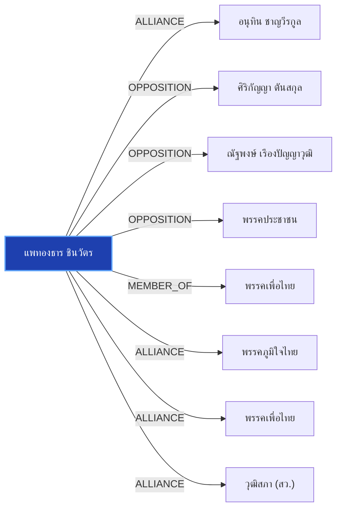

# แพทองธาร ชินวัตร

> **สังกัด**: พรรคเพื่อไทย | **บทบาท**: นายกรัฐมนตรี | **ขั้วการเมือง**: Government

## 📊 ข้อมูลสังเขป & สถิติ
- **การปรากฏในข่าว 30 วันล่าสุด**: 40 ครั้ง
- **สถานะทางการเมือง**: Government
- **ชื่อเรียก/ฉายา**: แพทองธาร, อิ๊งค์, อุ๊งอิ๊งค์, นายกรัฐมนตรี, นายกฯ

## 🌐 แผนผังความสัมพันธ์ (Semantic Network)

## 🔗 โครงข่ายความสัมพันธ์และเหตุการณ์สำคัญ
- **ALLIANCE** ➔ [[entities/anutin_charnvirakul|อนุทิน ชาญวีรกูล]]: แพทองธาร ชินวัตร และ อนุทิน ชาญวีรกูล ในขั้วการเมืองเดียวกัน (Government) (เมื่อ 2026-08-28)
  > *"นภินทร เปิดทำเนียบ แจงโกงเลือกส.ว. ลั่นไม่โง่ทำผิดกฎหมาย ฝากถึง เป๋า-ยิ่งชีพ เจอกันในศาล"*
- **OPPOSITION** ➔ [[entities/sirikanya_tansakun|ศิริกัญญา ตันสกุล]]: แพทองธาร ชินวัตร และ ศิริกัญญา ตันสกุล มีปฏิสัมพันธ์ในประเด็นการเมือง (เมื่อ 2026-08-09)
  > *"POLITICS: ‘อนุทิน’ โพสต์ “ถ้ายังวิ่งชนกำแพงอยู่ มันก็เจ็บหัวอีก” หลัง ‘ศิริกัญญา’ เปิดใจสู้ปัญหาในพรรคเหมือนสู้กับกำแพง วันนี้ (9 ส.ค. 69) นายอนุทิน ชาญวีรกูล นายกรัฐมนตรี และรัฐมนตรีว่าการกระทรวงมหาดไทย โพสต์ข้อความผ่านเฟสบุ๊คระบุว่า “วิ่งหัวชนกำแพง"*
- **OPPOSITION** ➔ [[entities/natthaphong_ruengpanyawut|ณัฐพงษ์ เรืองปัญญาวุฒิ]]: แพทองธาร ชินวัตร และ ณัฐพงษ์ เรืองปัญญาวุฒิ มีปฏิสัมพันธ์ในประเด็นการเมือง (เมื่อ 2026-08-28)
  > *"นายกฯ บอก ไม่รู้เรื่อง รร.พูลแมน ไม่ให้ฝ่ายค้านใช้จัด ย้อนถามสื่อ “เขาไม่ให้ใช้แล้วเหรอ”"*
- **OPPOSITION** ➔ [[entities/peoples_party|พรรคประชาชน]]: แพทองธาร ชินวัตร และ พรรคประชาชน มีปฏิสัมพันธ์ในประเด็นการเมือง (เมื่อ 2026-08-28)
  > *"“ขอเสนอให้นายกรัฐมนตรีพิจารณาออกระเบียบหรือแนวทางที่เปิดทางให้ธนาคารแห่งประเทศไทยสามารถใช้มาตรการพักรายการโอนเงินตั้งแต่ 50,000 บาทขึ้นไปเป็นเวลา 6 ชั่วโมง เพื่อเป็นอีกหนึ่งกลไกในการป้องกันและลดความเสียหายจากอาชญากรรมทางการเงินที่กำลังสร้างผลกระทบต่อ"*
- **MEMBER_OF** ➔ [[entities/pheu_thai_party|พรรคเพื่อไทย]]: แพทองธาร ชินวัตร สังกัด/ดำรงตำแหน่งใน พรรคเพื่อไทย (เมื่อ 2026-08-28)
  > *"เพื่อไทย ไฟเขียว ชลน่าน ร่วมเวทีฝ่ายค้าน ชี้สัมพันธ์รัฐบาลแน่นปึ้ก พร้อมเดินตามแนวอนุทิน"*
- **ALLIANCE** ➔ [[entities/bhumjaithai_party|พรรคภูมิใจไทย]]: แพทองธาร ชินวัตร และ พรรคภูมิใจไทย ในขั้วการเมืองเดียวกัน (Government) (เมื่อ 2026-08-28)
  > *"ธนกร หนุนนายกฯช่วยลดค่าไฟฟ้า ชูโซลาร์รูฟท็อป เหน็บฝ่ายค้านดีแต่พูด"*
- **ALLIANCE** ➔ [[entities/pheu_thai_party|พรรคเพื่อไทย]]: แพทองธาร ชินวัตร และ พรรคเพื่อไทย ร่วมมือทางการเมือง/พรรคร่วมรัฐบาล (เมื่อ 2026-08-28)
  > *"นายกฯ นัดครม.พรรคร่วมกินข้าวสัปดาห์หน้า ยังไม่เคาะวัน-สถานที่ ยิ้มไม่ตอบปมปรับครม."*
- **ALLIANCE** ➔ [[entities/senate_thailand|วุฒิสภา (สว.)]]: แพทองธาร ชินวัตร และ วุฒิสภา (สว.) ร่วมมือทางการเมือง/พรรคร่วมรัฐบาล (เมื่อ 2026-08-27)
  > *"POLITICS: ’อนุทิน‘ โยนถาม ‘ชลน่าน’ ตอบ หลังมีชื่อขึ้นเวทีฝ่ายค้าน บอก พรรคใครพรรคมัน ชี้ พรรคร่วมรัฐบาลมีกฎกติกามารยาทอยู่แล้ว ไม่หวั่น เกมวัดใจ ‘เพื่อไทย‘ โหวตปม ฮั้ว สว. มั่นใจเสถียรภาพรัฐบาล - คะแนนโหวตชัดเจน วันนี้ (27 ส.ค. 69) นายอนุทิน ชาญวีรกู"*
- **CRITICISM** ➔ [[entities/democrat_party|พรรคประชาธิปัตย์]]: แพทองธาร ชินวัตร วิพากษ์วิจารณ์/ตรวจสอบท่าทีของ พรรคประชาธิปัตย์ (เมื่อ 2026-08-28)
  > *"‘ชัยชนะ’ เสนอ ธปท. พักการโอนเงินเกิน 5 หมื่น รอตรวจสอบก่อน 6 ชั่วโมง สกัดแก๊งสแกมเมอร์"*
- **CRITICISM** ➔ [[entities/anutin_charnvirakul|อนุทิน ชาญวีรกูล]]: แพทองธาร ชินวัตร วิพากษ์วิจารณ์/ตรวจสอบท่าทีของ อนุทิน ชาญวีรกูล (เมื่อ 2026-08-28)
  > *"2569 วงเงินไม่เกิน 400,000 ล้านบาท โดยเฉพาะในส่วนของแผนงานที่ 2 กรอบวงเงิน 200,000 ล้านบาท เพื่อปรับโครงสร้างและสร้างการเปลี่ยนผ่านด้านพลังงานของประเทศว่า ยืนยันว่ารัฐบาลภายใต้การนำของนายอนุทิน ชาญวีรกูล นายกรัฐมนตรี พร้อมเดินหน้าตามกรอบกฎหมาย รัฐบาล"*
- **CRITICISM** ➔ [[entities/peoples_party|พรรคประชาชน]]: แพทองธาร ชินวัตร วิพากษ์วิจารณ์/ตรวจสอบท่าทีของ พรรคประชาชน (เมื่อ 2026-08-28)
  > *"2569 วงเงินไม่เกิน 400,000 ล้านบาท โดยเฉพาะในส่วนของแผนงานที่ 2 กรอบวงเงิน 200,000 ล้านบาท เพื่อปรับโครงสร้างและสร้างการเปลี่ยนผ่านด้านพลังงานของประเทศว่า ยืนยันว่ารัฐบาลภายใต้การนำของนายอนุทิน ชาญวีรกูล นายกรัฐมนตรี พร้อมเดินหน้าตามกรอบกฎหมาย รัฐบาล"*
- **OPPOSITION** ➔ [[entities/parit_wacharasindhu|พริษฐ์ วัชรสินธุ]]: แพทองธาร ชินวัตร และ พริษฐ์ วัชรสินธุ มีปฏิสัมพันธ์ในประเด็นการเมือง (เมื่อ 2026-08-28)
  > *"นภินทร เปิดทำเนียบ แจงโกงเลือกส.ว. ลั่นไม่โง่ทำผิดกฎหมาย ฝากถึง เป๋า-ยิ่งชีพ เจอกันในศาล"*
- **OPPOSITION** ➔ [[entities/election_commission|คณะกรรมการการเลือกตั้ง (กกต.)]]: แพทองธาร ชินวัตร และ คณะกรรมการการเลือกตั้ง (กกต.) มีปฏิสัมพันธ์ในประเด็นการเมือง (เมื่อ 2026-08-28)
  > *"นภินทร เปิดทำเนียบ แจงโกงเลือกส.ว. ลั่นไม่โง่ทำผิดกฎหมาย ฝากถึง เป๋า-ยิ่งชีพ เจอกันในศาล"*
- **OPPOSITION** ➔ [[entities/senate_thailand|วุฒิสภา (สว.)]]: แพทองธาร ชินวัตร และ วุฒิสภา (สว.) มีปฏิสัมพันธ์ในประเด็นการเมือง (เมื่อ 2026-08-28)
  > *"นภินทร เปิดทำเนียบ แจงโกงเลือกส.ว. ลั่นไม่โง่ทำผิดกฎหมาย ฝากถึง เป๋า-ยิ่งชีพ เจอกันในศาล"*
- **CRITICISM** ➔ [[entities/natthaphong_ruengpanyawut|ณัฐพงษ์ เรืองปัญญาวุฒิ]]: แพทองธาร ชินวัตร วิพากษ์วิจารณ์/ตรวจสอบท่าทีของ ณัฐพงษ์ เรืองปัญญาวุฒิ (เมื่อ 2026-08-28)
  > *"บวรศักดิ์ ซัดองค์กรอิสระ ความเชื่อมั่นตกต่ำ หนุนแก้รธน. ชง 5 ข้อรื้อสรรหา-คืนสิทธิปชช.ถอดถอน"*
- **CRITICISM** ➔ [[entities/parit_wacharasindhu|พริษฐ์ วัชรสินธุ]]: แพทองธาร ชินวัตร วิพากษ์วิจารณ์/ตรวจสอบท่าทีของ พริษฐ์ วัชรสินธุ (เมื่อ 2026-08-28)
  > *"บวรศักดิ์ ซัดองค์กรอิสระ ความเชื่อมั่นตกต่ำ หนุนแก้รธน. ชง 5 ข้อรื้อสรรหา-คืนสิทธิปชช.ถอดถอน"*
- **CRITICISM** ➔ [[entities/election_commission|คณะกรรมการการเลือกตั้ง (กกต.)]]: แพทองธาร ชินวัตร วิพากษ์วิจารณ์/ตรวจสอบท่าทีของ คณะกรรมการการเลือกตั้ง (กกต.) (เมื่อ 2026-08-28)
  > *"บวรศักดิ์ ซัดองค์กรอิสระ ความเชื่อมั่นตกต่ำ หนุนแก้รธน. ชง 5 ข้อรื้อสรรหา-คืนสิทธิปชช.ถอดถอน"*
- **OPPOSITION** ➔ [[entities/nacc|คณะกรรมการ ป.ป.ช.]]: แพทองธาร ชินวัตร และ คณะกรรมการ ป.ป.ช. มีปฏิสัมพันธ์ในประเด็นการเมือง (เมื่อ 2026-08-28)
  > *"อดีตกรรมการกฤษฎีกา และอดีตรองนายกรัฐมนตรี, นายวิชา มหาคุณ อดีตประธานคณะกรรมการป้องกันและปราบปรามการทุจริตแห่งชาติ (ป"*
- **CRITICISM** ➔ [[entities/senate_thailand|วุฒิสภา (สว.)]]: แพทองธาร ชินวัตร วิพากษ์วิจารณ์/ตรวจสอบท่าทีของ วุฒิสภา (สว.) (เมื่อ 2026-08-28)
  > *"บวรศักดิ์ ซัดองค์กรอิสระ ความเชื่อมั่นตกต่ำ หนุนแก้รธน. ชง 5 ข้อรื้อสรรหา-คืนสิทธิปชช.ถอดถอน"*
- **CRITICISM** ➔ [[entities/constitution_amendment|การแก้ไขรัฐธรรมนูญ]]: แพทองธาร ชินวัตร วิพากษ์วิจารณ์/ตรวจสอบท่าทีของ การแก้ไขรัฐธรรมนูญ (เมื่อ 2026-08-28)
  > *"บวรศักดิ์ ซัดองค์กรอิสระ ความเชื่อมั่นตกต่ำ หนุนแก้รธน. ชง 5 ข้อรื้อสรรหา-คืนสิทธิปชช.ถอดถอน"*
- **ALLIANCE** ➔ [[entities/peoples_party|พรรคประชาชน]]: แพทองธาร ชินวัตร และ พรรคประชาชน ร่วมมือทางการเมือง/พรรคร่วมรัฐบาล (เมื่อ 2026-08-28)
  > *"รัฐบาลจับมือ OpenAI ปั้น 10 สตาร์ทอัพการแพทย์-การศึกษา ต่อยอดงานวิจัยสู่การใช้งานจริง ดันไทยขึ้นแท่น AI Hub อาเซียน"*
- **OPPOSITION** ➔ [[entities/constitution_amendment|การแก้ไขรัฐธรรมนูญ]]: แพทองธาร ชินวัตร และ การแก้ไขรัฐธรรมนูญ มีปฏิสัมพันธ์ในประเด็นการเมือง (เมื่อ 2026-08-28)
  > *"วิชา อัดองค์กรอิสระ ต้องยึดโยงประชาชน ชม ‘ยิ่งชีพ’ เปิดข้อมูลโกง ส.ว."*
- **LEGAL_ACTION** ➔ [[entities/democrat_party|พรรคประชาธิปัตย์]]: กระบวนการทางกฎหมาย/ตรวจสอบระหว่าง แพทองธาร ชินวัตร และ พรรคประชาธิปัตย์ (เมื่อ 2026-08-28)
  > *"วัส ชี้ กกต.ต้องส่งศาลฟันฮั้ว สว. อย่างต่ำ 120 คน ท้าฟ้องพร้อมแฉหลักฐาน ‘อภิสิทธิ์’ เตือนฮั้ว สสร."*
- **LEGAL_ACTION** ➔ [[entities/election_commission|คณะกรรมการการเลือกตั้ง (กกต.)]]: กระบวนการทางกฎหมาย/ตรวจสอบระหว่าง แพทองธาร ชินวัตร และ คณะกรรมการการเลือกตั้ง (กกต.) (เมื่อ 2026-08-28)
  > *"วัส ชี้ กกต.ต้องส่งศาลฟันฮั้ว สว. อย่างต่ำ 120 คน ท้าฟ้องพร้อมแฉหลักฐาน ‘อภิสิทธิ์’ เตือนฮั้ว สสร."*
- **LEGAL_ACTION** ➔ [[entities/senate_thailand|วุฒิสภา (สว.)]]: กระบวนการทางกฎหมาย/ตรวจสอบระหว่าง แพทองธาร ชินวัตร และ วุฒิสภา (สว.) (เมื่อ 2026-08-28)
  > *"วัส ชี้ กกต.ต้องส่งศาลฟันฮั้ว สว. อย่างต่ำ 120 คน ท้าฟ้องพร้อมแฉหลักฐาน ‘อภิสิทธิ์’ เตือนฮั้ว สสร."*
- **ALLIANCE** ➔ [[entities/democrat_party|พรรคประชาธิปัตย์]]: แพทองธาร ชินวัตร และ พรรคประชาธิปัตย์ ในขั้วการเมืองเดียวกัน (Government) (เมื่อ 2026-08-28)
  > *"อภิสิทธิ์ ชี้ องค์กรอิสระวิกฤต ถูกแทรกแซงครบวงจร มองแก้รธน. เป็นโอกาสทอง รื้อที่มา ‘องค์กรอิสระ-สว.’"*
- **OPPOSITION** ➔ [[entities/constitutional_court|ศาลรัฐธรรมนูญ]]: แพทองธาร ชินวัตร และ ศาลรัฐธรรมนูญ มีปฏิสัมพันธ์ในประเด็นการเมือง (เมื่อ 2026-08-28)
  > *"อภิสิทธิ์ ชี้ องค์กรอิสระวิกฤต ถูกแทรกแซงครบวงจร มองแก้รธน. เป็นโอกาสทอง รื้อที่มา ‘องค์กรอิสระ-สว.’"*

## 📑 เอกสารและข่าวที่เกี่ยวข้อง
- ดูสรุปข่าวรอบ 30 วันใน [[wiki/index#Source Summaries|Index Summaries]]
