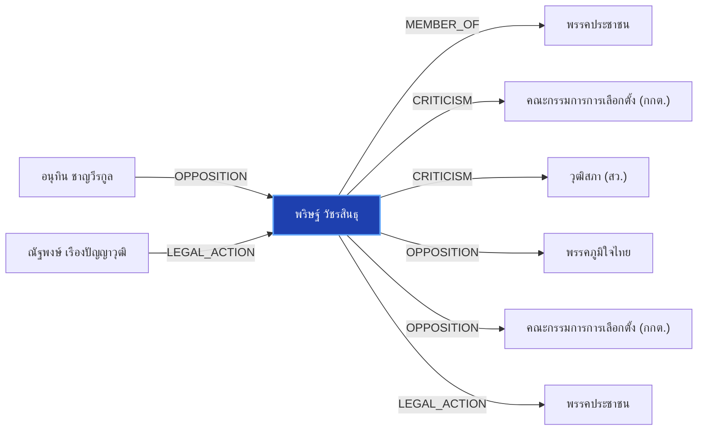

# พริษฐ์ วัชรสินธุ

> **สังกัด**: 🟠 พรรคประชาชน | **บทบาท**: โฆษกพรรคประชาชน | **ขั้วการเมือง**: Opposition

## 📊 ข้อมูลสังเขป & สถิติ
- **การปรากฏในข่าว 30 วันล่าสุด**: 8 ครั้ง
- **สถานะทางการเมือง**: Opposition
- **ชื่อเรียก/ฉายา**: พริษฐ์, ไอติม พริษฐ์, พริษฐ์ วัชรสินธุ

## 🌐 แผนผังความสัมพันธ์ (Semantic Network)

## 🔗 โครงข่ายความสัมพันธ์และเหตุการณ์สำคัญ
- **MEMBER_OF** ➔ [[entities/peoples_party|พรรคประชาชน]]: พริษฐ์ วัชรสินธุ สังกัด/ดำรงตำแหน่งใน พรรคประชาชน (เมื่อ 2026-08-28)
  > *"นภินทร เปิดทำเนียบ แจงโกงเลือกส.ว. ลั่นไม่โง่ทำผิดกฎหมาย ฝากถึง เป๋า-ยิ่งชีพ เจอกันในศาล"*
- **CRITICISM** ➔ [[entities/election_commission|คณะกรรมการการเลือกตั้ง (กกต.)]]: พริษฐ์ วัชรสินธุ วิพากษ์วิจารณ์/ตรวจสอบท่าทีของ คณะกรรมการการเลือกตั้ง (กกต.) (เมื่อ 2026-08-28)
  > *"บวรศักดิ์ ซัดองค์กรอิสระ ความเชื่อมั่นตกต่ำ หนุนแก้รธน. ชง 5 ข้อรื้อสรรหา-คืนสิทธิปชช.ถอดถอน"*
- **CRITICISM** ➔ [[entities/senate_thailand|วุฒิสภา (สว.)]]: พริษฐ์ วัชรสินธุ วิพากษ์วิจารณ์/ตรวจสอบท่าทีของ วุฒิสภา (สว.) (เมื่อ 2026-08-28)
  > *"บวรศักดิ์ ซัดองค์กรอิสระ ความเชื่อมั่นตกต่ำ หนุนแก้รธน. ชง 5 ข้อรื้อสรรหา-คืนสิทธิปชช.ถอดถอน"*
- **OPPOSITION** ➔ [[entities/anutin_charnvirakul|อนุทิน ชาญวีรกูล]]: อนุทิน ชาญวีรกูล และ พริษฐ์ วัชรสินธุ มีปฏิสัมพันธ์ในประเด็นการเมือง (เมื่อ 2026-08-28)
  > *"นภินทร เปิดทำเนียบ แจงโกงเลือกส.ว. ลั่นไม่โง่ทำผิดกฎหมาย ฝากถึง เป๋า-ยิ่งชีพ เจอกันในศาล"*
- **OPPOSITION** ➔ [[entities/bhumjaithai_party|พรรคภูมิใจไทย]]: พริษฐ์ วัชรสินธุ และ พรรคภูมิใจไทย มีปฏิสัมพันธ์ในประเด็นการเมือง (เมื่อ 2026-08-28)
  > *"นภินทร เปิดทำเนียบ แจงโกงเลือกส.ว. ลั่นไม่โง่ทำผิดกฎหมาย ฝากถึง เป๋า-ยิ่งชีพ เจอกันในศาล"*
- **OPPOSITION** ➔ [[entities/election_commission|คณะกรรมการการเลือกตั้ง (กกต.)]]: พริษฐ์ วัชรสินธุ และ คณะกรรมการการเลือกตั้ง (กกต.) มีปฏิสัมพันธ์ในประเด็นการเมือง (เมื่อ 2026-08-28)
  > *"นภินทร เปิดทำเนียบ แจงโกงเลือกส.ว. ลั่นไม่โง่ทำผิดกฎหมาย ฝากถึง เป๋า-ยิ่งชีพ เจอกันในศาล"*
- **LEGAL_ACTION** ➔ [[entities/natthaphong_ruengpanyawut|ณัฐพงษ์ เรืองปัญญาวุฒิ]]: กระบวนการทางกฎหมาย/ตรวจสอบระหว่าง ณัฐพงษ์ เรืองปัญญาวุฒิ และ พริษฐ์ วัชรสินธุ (เมื่อ 2026-08-25)
  > *"PARLIAMENT: 'พริษฐ์' จี้ กกต. ชัดเจนวันลงมติคดีฮั้ว สว. หวั่นตัดตอนช่วยเครือข่ายการเมือง ขู่ฟ้อง ม.157 หากยกคำร้อง วันนี้ (25 ส.ค. 69) นายพริษฐ์ วัชรสินธุ สส.บัญชีรายชื่อ และรองหัวหน้าพรรคประชาชน กล่าวถึงกรณีคณะกรรมการการเลือกตั้ง (กกต.) เตรียมลงมติส"*
- **LEGAL_ACTION** ➔ [[entities/peoples_party|พรรคประชาชน]]: กระบวนการทางกฎหมาย/ตรวจสอบระหว่าง พริษฐ์ วัชรสินธุ และ พรรคประชาชน (เมื่อ 2026-08-25)
  > *"PARLIAMENT: 'พริษฐ์' จี้ กกต. ชัดเจนวันลงมติคดีฮั้ว สว. หวั่นตัดตอนช่วยเครือข่ายการเมือง ขู่ฟ้อง ม.157 หากยกคำร้อง วันนี้ (25 ส.ค. 69) นายพริษฐ์ วัชรสินธุ สส.บัญชีรายชื่อ และรองหัวหน้าพรรคประชาชน กล่าวถึงกรณีคณะกรรมการการเลือกตั้ง (กกต.) เตรียมลงมติส"*
- **LEGAL_ACTION** ➔ [[entities/election_commission|คณะกรรมการการเลือกตั้ง (กกต.)]]: กระบวนการทางกฎหมาย/ตรวจสอบระหว่าง พริษฐ์ วัชรสินธุ และ คณะกรรมการการเลือกตั้ง (กกต.) (เมื่อ 2026-08-25)
  > *"PARLIAMENT: 'พริษฐ์' จี้ กกต. ชัดเจนวันลงมติคดีฮั้ว สว. หวั่นตัดตอนช่วยเครือข่ายการเมือง ขู่ฟ้อง ม.157 หากยกคำร้อง วันนี้ (25 ส.ค. 69) นายพริษฐ์ วัชรสินธุ สส.บัญชีรายชื่อ และรองหัวหน้าพรรคประชาชน กล่าวถึงกรณีคณะกรรมการการเลือกตั้ง (กกต.) เตรียมลงมติส"*
- **LEGAL_ACTION** ➔ [[entities/senate_thailand|วุฒิสภา (สว.)]]: กระบวนการทางกฎหมาย/ตรวจสอบระหว่าง พริษฐ์ วัชรสินธุ และ วุฒิสภา (สว.) (เมื่อ 2026-08-25)
  > *"PARLIAMENT: 'พริษฐ์' จี้ กกต. ชัดเจนวันลงมติคดีฮั้ว สว. หวั่นตัดตอนช่วยเครือข่ายการเมือง ขู่ฟ้อง ม.157 หากยกคำร้อง วันนี้ (25 ส.ค. 69) นายพริษฐ์ วัชรสินธุ สส.บัญชีรายชื่อ และรองหัวหน้าพรรคประชาชน กล่าวถึงกรณีคณะกรรมการการเลือกตั้ง (กกต.) เตรียมลงมติส"*
- **OPPOSITION** ➔ [[entities/senate_thailand|วุฒิสภา (สว.)]]: พริษฐ์ วัชรสินธุ และ วุฒิสภา (สว.) มีปฏิสัมพันธ์ในประเด็นการเมือง (เมื่อ 2026-08-28)
  > *"นภินทร เปิดทำเนียบ แจงโกงเลือกส.ว. ลั่นไม่โง่ทำผิดกฎหมาย ฝากถึง เป๋า-ยิ่งชีพ เจอกันในศาล"*
- **OPPOSITION** ➔ [[entities/paetongtarn_shinawatra|แพทองธาร ชินวัตร]]: แพทองธาร ชินวัตร และ พริษฐ์ วัชรสินธุ มีปฏิสัมพันธ์ในประเด็นการเมือง (เมื่อ 2026-08-28)
  > *"นภินทร เปิดทำเนียบ แจงโกงเลือกส.ว. ลั่นไม่โง่ทำผิดกฎหมาย ฝากถึง เป๋า-ยิ่งชีพ เจอกันในศาล"*
- **OPPOSITION** ➔ [[entities/yingcheep_atchanont|ยิ่งชีพ อัชฌานนท์]]: พริษฐ์ วัชรสินธุ และ ยิ่งชีพ อัชฌานนท์ มีปฏิสัมพันธ์ในประเด็นการเมือง (เมื่อ 2026-08-28)
  > *"ต่อหน้าคนทั้งหมดเหล่านี้หรือ และหลักฐานได้ส่งคณะอนุกรรมการชุดที่ 26 ไปเรียบร้อยแล้ว แต่นายยิ่งชีพหรือนายพริษฐ์ นำข้อมูลที่ผมชี้แจงว่ามีพยานตรงนี้มาเปิดเผยด้วยหรือไม่”"*
- **CRITICISM** ➔ [[entities/paetongtarn_shinawatra|แพทองธาร ชินวัตร]]: แพทองธาร ชินวัตร วิพากษ์วิจารณ์/ตรวจสอบท่าทีของ พริษฐ์ วัชรสินธุ (เมื่อ 2026-08-28)
  > *"บวรศักดิ์ ซัดองค์กรอิสระ ความเชื่อมั่นตกต่ำ หนุนแก้รธน. ชง 5 ข้อรื้อสรรหา-คืนสิทธิปชช.ถอดถอน"*
- **CRITICISM** ➔ [[entities/natthaphong_ruengpanyawut|ณัฐพงษ์ เรืองปัญญาวุฒิ]]: ณัฐพงษ์ เรืองปัญญาวุฒิ วิพากษ์วิจารณ์/ตรวจสอบท่าทีของ พริษฐ์ วัชรสินธุ (เมื่อ 2026-08-28)
  > *"บวรศักดิ์ ซัดองค์กรอิสระ ความเชื่อมั่นตกต่ำ หนุนแก้รธน. ชง 5 ข้อรื้อสรรหา-คืนสิทธิปชช.ถอดถอน"*
- **CRITICISM** ➔ [[entities/anutin_charnvirakul|อนุทิน ชาญวีรกูล]]: อนุทิน ชาญวีรกูล วิพากษ์วิจารณ์/ตรวจสอบท่าทีของ พริษฐ์ วัชรสินธุ (เมื่อ 2026-08-28)
  > *"บวรศักดิ์ ซัดองค์กรอิสระ ความเชื่อมั่นตกต่ำ หนุนแก้รธน. ชง 5 ข้อรื้อสรรหา-คืนสิทธิปชช.ถอดถอน"*
- **CRITICISM** ➔ [[entities/peoples_party|พรรคประชาชน]]: พริษฐ์ วัชรสินธุ วิพากษ์วิจารณ์/ตรวจสอบท่าทีของ พรรคประชาชน (เมื่อ 2026-08-28)
  > *"บวรศักดิ์ ซัดองค์กรอิสระ ความเชื่อมั่นตกต่ำ หนุนแก้รธน. ชง 5 ข้อรื้อสรรหา-คืนสิทธิปชช.ถอดถอน"*
- **CRITICISM** ➔ [[entities/nacc|คณะกรรมการ ป.ป.ช.]]: พริษฐ์ วัชรสินธุ วิพากษ์วิจารณ์/ตรวจสอบท่าทีของ คณะกรรมการ ป.ป.ช. (เมื่อ 2026-08-28)
  > *"บวรศักดิ์ ซัดองค์กรอิสระ ความเชื่อมั่นตกต่ำ หนุนแก้รธน. ชง 5 ข้อรื้อสรรหา-คืนสิทธิปชช.ถอดถอน"*
- **CRITICISM** ➔ [[entities/constitution_amendment|การแก้ไขรัฐธรรมนูญ]]: พริษฐ์ วัชรสินธุ วิพากษ์วิจารณ์/ตรวจสอบท่าทีของ การแก้ไขรัฐธรรมนูญ (เมื่อ 2026-08-28)
  > *"บวรศักดิ์ ซัดองค์กรอิสระ ความเชื่อมั่นตกต่ำ หนุนแก้รธน. ชง 5 ข้อรื้อสรรหา-คืนสิทธิปชช.ถอดถอน"*

## 📑 เอกสารและข่าวที่เกี่ยวข้อง
- ดูสรุปข่าวรอบ 30 วันใน [[wiki/index#Source Summaries|Index Summaries]]
