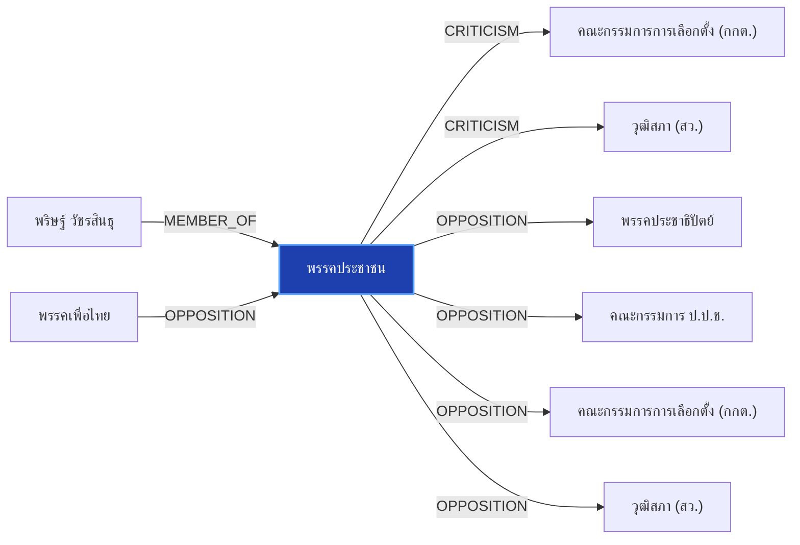

# พรรคประชาชน

> **สังกัด**: 🟠 พรรคประชาชน | **บทบาท**: พรรคแกนนำฝ่ายค้าน | **ขั้วการเมือง**: Opposition

## 📊 ข้อมูลสังเขป & สถิติ
- **การปรากฏในข่าว 30 วันล่าสุด**: 126 ครั้ง
- **สถานะทางการเมือง**: Opposition
- **ชื่อเรียก/ฉายา**: พรรคประชาชน, ประชาชน, พรรคส้ม, ค่ายส้ม

## 🌐 แผนผังความสัมพันธ์ (Semantic Network)

## 🔗 โครงข่ายความสัมพันธ์และเหตุการณ์สำคัญ
- **MEMBER_OF** ➔ [[entities/parit_wacharasindhu|พริษฐ์ วัชรสินธุ]]: พริษฐ์ วัชรสินธุ สังกัด/ดำรงตำแหน่งใน พรรคประชาชน (เมื่อ 2026-08-28)
  > *"นภินทร เปิดทำเนียบ แจงโกงเลือกส.ว. ลั่นไม่โง่ทำผิดกฎหมาย ฝากถึง เป๋า-ยิ่งชีพ เจอกันในศาล"*
- **CRITICISM** ➔ [[entities/election_commission|คณะกรรมการการเลือกตั้ง (กกต.)]]: พรรคประชาชน วิพากษ์วิจารณ์/ตรวจสอบท่าทีของ คณะกรรมการการเลือกตั้ง (กกต.) (เมื่อ 2026-08-28)
  > *"บวรศักดิ์ ซัดองค์กรอิสระ ความเชื่อมั่นตกต่ำ หนุนแก้รธน. ชง 5 ข้อรื้อสรรหา-คืนสิทธิปชช.ถอดถอน"*
- **CRITICISM** ➔ [[entities/senate_thailand|วุฒิสภา (สว.)]]: พรรคประชาชน วิพากษ์วิจารณ์/ตรวจสอบท่าทีของ วุฒิสภา (สว.) (เมื่อ 2026-08-28)
  > *"บวรศักดิ์ ซัดองค์กรอิสระ ความเชื่อมั่นตกต่ำ หนุนแก้รธน. ชง 5 ข้อรื้อสรรหา-คืนสิทธิปชช.ถอดถอน"*
- **OPPOSITION** ➔ [[entities/pheu_thai_party|พรรคเพื่อไทย]]: พรรคเพื่อไทย และ พรรคประชาชน มีปฏิสัมพันธ์ในประเด็นการเมือง (เมื่อ 2026-08-28)
  > *"‘ชลน่าน’ ยันขึ้นเวทีฝ่ายค้าน ขอ พท.แล้ว ชี้ไม่กระทบสัมพันธ์ ‘ภูมิใจไทย’"*
- **OPPOSITION** ➔ [[entities/democrat_party|พรรคประชาธิปัตย์]]: พรรคประชาชน และ พรรคประชาธิปัตย์ มีปฏิสัมพันธ์ในประเด็นการเมือง (เมื่อ 2026-08-28)
  > *"บัญชีรายชื่อ พรรคประชาธิปัตย์ กล่าวถึงสถานการณ์การหลอกลวงประชาชนผ่านขบวนการสแกมเมอร์ ที่ยังคงเกิดขึ้นอย่างต่อเนื่อง โดยเห็นว่ามาตรการป้องกันที่สำนักงานตำรวจแห่งชาติและธนาคารแห่งประเทศไทยดำเนินการอยู่ในปัจจุบัน โดยเฉพาะการสแกนใบหน้า อาจยังไม่เพียงพอต่"*
- **OPPOSITION** ➔ [[entities/nacc|คณะกรรมการ ป.ป.ช.]]: พรรคประชาชน และ คณะกรรมการ ป.ป.ช. มีปฏิสัมพันธ์ในประเด็นการเมือง (เมื่อ 2026-08-28)
  > *"ปชน. เปิดเวที NEWนนท์ ‘ปิยบุตร’ ย้ำไม่ใช่สงครามยึดจังหวัด ‘เดชรัต’ ชูฟื้นศก.ท่าน้ำนนท์"*
- **OPPOSITION** ➔ [[entities/election_commission|คณะกรรมการการเลือกตั้ง (กกต.)]]: พรรคประชาชน และ คณะกรรมการการเลือกตั้ง (กกต.) มีปฏิสัมพันธ์ในประเด็นการเมือง (เมื่อ 2026-08-29)
  > *"iLaw โดย ยิ่งชีพ อัชฌานนท์ เปิดรายงานสถิติบล็อกโหวต ชี้เครือข่ายฮั้วเลือก สว.67 คุมสภาสูง"*
- **OPPOSITION** ➔ [[entities/senate_thailand|วุฒิสภา (สว.)]]: พรรคประชาชน และ วุฒิสภา (สว.) มีปฏิสัมพันธ์ในประเด็นการเมือง (เมื่อ 2026-08-29)
  > *"iLaw โดย ยิ่งชีพ อัชฌานนท์ เปิดรายงานสถิติบล็อกโหวต ชี้เครือข่ายฮั้วเลือก สว.67 คุมสภาสูง"*
- **OPPOSITION** ➔ [[entities/paetongtarn_shinawatra|แพทองธาร ชินวัตร]]: แพทองธาร ชินวัตร และ พรรคประชาชน มีปฏิสัมพันธ์ในประเด็นการเมือง (เมื่อ 2026-08-28)
  > *"“ขอเสนอให้นายกรัฐมนตรีพิจารณาออกระเบียบหรือแนวทางที่เปิดทางให้ธนาคารแห่งประเทศไทยสามารถใช้มาตรการพักรายการโอนเงินตั้งแต่ 50,000 บาทขึ้นไปเป็นเวลา 6 ชั่วโมง เพื่อเป็นอีกหนึ่งกลไกในการป้องกันและลดความเสียหายจากอาชญากรรมทางการเงินที่กำลังสร้างผลกระทบต่อ"*
- **MEMBER_OF** ➔ [[entities/natthaphong_ruengpanyawut|ณัฐพงษ์ เรืองปัญญาวุฒิ]]: ณัฐพงษ์ เรืองปัญญาวุฒิ สังกัด/ดำรงตำแหน่งใน พรรคประชาชน (เมื่อ 2026-08-28)
  > *") และอดีตผู้นำฝ่ายค้านฯ โดยตนจะร่วมเฉพาะวงเสวนาของอดีตผู้นำฝ่ายค้านในช่วงเช้าเท่านั้น ไม่ได้เข้าร่วมวงเสวนาช่วงอื่นที่เกี่ยวข้องกับประเด็นการเลือกสมาชิกวุฒิสภา หรือร่วมเวทีกับกลุ่มเคลื่อนไหวภาคประชาชน"*
- **OPPOSITION** ➔ [[entities/anutin_charnvirakul|อนุทิน ชาญวีรกูล]]: อนุทิน ชาญวีรกูล และ พรรคประชาชน มีปฏิสัมพันธ์ในประเด็นการเมือง (เมื่อ 2026-08-28)
  > *"‘ชลน่าน’ ยันขึ้นเวทีฝ่ายค้าน ขอ พท.แล้ว ชี้ไม่กระทบสัมพันธ์ ‘ภูมิใจไทย’"*
- **CRITICISM** ➔ [[entities/anutin_charnvirakul|อนุทิน ชาญวีรกูล]]: อนุทิน ชาญวีรกูล วิพากษ์วิจารณ์/ตรวจสอบท่าทีของ พรรคประชาชน (เมื่อ 2026-08-28)
  > *"2569 วงเงินไม่เกิน 400,000 ล้านบาท โดยเฉพาะในส่วนของแผนงานที่ 2 กรอบวงเงิน 200,000 ล้านบาท เพื่อปรับโครงสร้างและสร้างการเปลี่ยนผ่านด้านพลังงานของประเทศว่า ยืนยันว่ารัฐบาลภายใต้การนำของนายอนุทิน ชาญวีรกูล นายกรัฐมนตรี พร้อมเดินหน้าตามกรอบกฎหมาย รัฐบาล"*
- **CRITICISM** ➔ [[entities/bhumjaithai_party|พรรคภูมิใจไทย]]: พรรคประชาชน วิพากษ์วิจารณ์/ตรวจสอบท่าทีของ พรรคภูมิใจไทย (เมื่อ 2026-08-28)
  > *"กมธ.ศาสนา จี้รัฐสกัดคลิป ขบวนแห่ล้อเลียนนวดไทยเชิงลามก ห่วงกระทบภาพลักษณ์มรดกภูมิปัญญาโลก"*
- **LEGAL_ACTION** ➔ [[entities/democrat_party|พรรคประชาธิปัตย์]]: กระบวนการทางกฎหมาย/ตรวจสอบระหว่าง พรรคประชาชน และ พรรคประชาธิปัตย์ (เมื่อ 2026-08-13)
  > *"เรื่องมันมีอยู่ว่า โอกาสทองของพรรค‘ประชาชน’ การเมืองท้องถิ่นที่‘ส้ม’ถวิลหา , ‘ใครจะเชื่อ?’และ‘จะเชื่อใคร?’ ปชป.กับจริยธรรมนักการเมือง - spacebar.th"*
- **OPPOSITION** ➔ [[entities/bhumjaithai_party|พรรคภูมิใจไทย]]: พรรคประชาชน และ พรรคภูมิใจไทย มีปฏิสัมพันธ์ในประเด็นการเมือง (เมื่อ 2026-08-28)
  > *"กมธ.งบ 70 เตรียมชงสภาฯ ถกวาระ 2-3 วันที่ 7-9 ก.ย. ย้ำทุกบาทต้องคุ้มค่า"*
- **CRITICISM** ➔ [[entities/natthaphong_ruengpanyawut|ณัฐพงษ์ เรืองปัญญาวุฒิ]]: ณัฐพงษ์ เรืองปัญญาวุฒิ วิพากษ์วิจารณ์/ตรวจสอบท่าทีของ พรรคประชาชน (เมื่อ 2026-08-26)
  > *"บัญชีรายชื่อ และหัวหน้าพรรคประชาชน ในฐานะผู้นำฝ่ายค้านในสภาผู้แทนราษฎร กล่าวถึงกรณีการอภิปราย - facebook"*
- **LEGAL_ACTION** ➔ [[entities/senate_thailand|วุฒิสภา (สว.)]]: กระบวนการทางกฎหมาย/ตรวจสอบระหว่าง พรรคประชาชน และ วุฒิสภา (สว.) (เมื่อ 2026-08-28)
  > *"ยิ่งชีพ ปลุกบี้ #สั่งฟ้องสว. ยันไม่มีถ้า.. ชี้ 5 ซีนาริโอ กกต.ไม่ฟ้อง ระบอบสีน้ำเงินเฟื่องฟูแน่"*
- **LEGAL_ACTION** ➔ [[entities/parit_wacharasindhu|พริษฐ์ วัชรสินธุ]]: กระบวนการทางกฎหมาย/ตรวจสอบระหว่าง พริษฐ์ วัชรสินธุ และ พรรคประชาชน (เมื่อ 2026-08-25)
  > *"PARLIAMENT: 'พริษฐ์' จี้ กกต. ชัดเจนวันลงมติคดีฮั้ว สว. หวั่นตัดตอนช่วยเครือข่ายการเมือง ขู่ฟ้อง ม.157 หากยกคำร้อง วันนี้ (25 ส.ค. 69) นายพริษฐ์ วัชรสินธุ สส.บัญชีรายชื่อ และรองหัวหน้าพรรคประชาชน กล่าวถึงกรณีคณะกรรมการการเลือกตั้ง (กกต.) เตรียมลงมติส"*
- **MEMBER_OF** ➔ [[entities/raknok_srinork|รักชนก ศรีนอก]]: รักชนก ศรีนอก สังกัด/ดำรงตำแหน่งใน พรรคประชาชน (เมื่อ 2026-08-27)
  > *"รักชนก พรรคประชาชน ถาม ศุภชัย พรรคภูมิใจไทย ทำไมไม่เรียกประชุมสักที"*
- **CRITICISM** ➔ [[entities/raknok_srinork|รักชนก ศรีนอก]]: รักชนก ศรีนอก วิพากษ์วิจารณ์/ตรวจสอบท่าทีของ พรรคประชาชน (เมื่อ 2026-08-26)
  > *"รักชนก ศรีนอก สส. แบบบัญชีรายชื่อ พรรคประชาชน อภิปรายในวาระพิจารณา พ.ร.ก. ให้อำนาจกระทรวงการคลังกู้เงิน 4 แสนล้าน ในการประชุมสภาผู้แทนราษฎร 26 สิงหาคม 2569 #TheStandardNews - facebook.com"*
- **OPPOSITION** ➔ [[entities/mongkol_surasajja|มงคล สุระสัจจะ]]: มงคล สุระสัจจะ และ พรรคประชาชน มีปฏิสัมพันธ์ในประเด็นการเมือง (เมื่อ 2026-08-29)
  > *"iLaw โดย ยิ่งชีพ อัชฌานนท์ เปิดรายงานสถิติบล็อกโหวต ชี้เครือข่ายฮั้วเลือก สว.67 คุมสภาสูง"*
- **CRITICISM** ➔ [[entities/paetongtarn_shinawatra|แพทองธาร ชินวัตร]]: แพทองธาร ชินวัตร วิพากษ์วิจารณ์/ตรวจสอบท่าทีของ พรรคประชาชน (เมื่อ 2026-08-28)
  > *"2569 วงเงินไม่เกิน 400,000 ล้านบาท โดยเฉพาะในส่วนของแผนงานที่ 2 กรอบวงเงิน 200,000 ล้านบาท เพื่อปรับโครงสร้างและสร้างการเปลี่ยนผ่านด้านพลังงานของประเทศว่า ยืนยันว่ารัฐบาลภายใต้การนำของนายอนุทิน ชาญวีรกูล นายกรัฐมนตรี พร้อมเดินหน้าตามกรอบกฎหมาย รัฐบาล"*
- **OPPOSITION** ➔ [[entities/yingcheep_atchanont|ยิ่งชีพ อัชฌานนท์]]: ยิ่งชีพ อัชฌานนท์ และ พรรคประชาชน มีปฏิสัมพันธ์ในประเด็นการเมือง (เมื่อ 2026-08-29)
  > *"นายยิ่งชีพ อัชฌานนท์ ผู้จัดการโครงการอินเทอร์เน็ตเพื่อกฎหมายประชาชน (iLaw) และทีมงาน Senate67 Watch ได้เผยแพร่รายงานวิเคราะห์ทางสถิติผลคะแนนการเลือก สว"*
- **CRITICISM** ➔ [[entities/parit_wacharasindhu|พริษฐ์ วัชรสินธุ]]: พริษฐ์ วัชรสินธุ วิพากษ์วิจารณ์/ตรวจสอบท่าทีของ พรรคประชาชน (เมื่อ 2026-08-28)
  > *"บวรศักดิ์ ซัดองค์กรอิสระ ความเชื่อมั่นตกต่ำ หนุนแก้รธน. ชง 5 ข้อรื้อสรรหา-คืนสิทธิปชช.ถอดถอน"*
- **CRITICISM** ➔ [[entities/nacc|คณะกรรมการ ป.ป.ช.]]: พรรคประชาชน วิพากษ์วิจารณ์/ตรวจสอบท่าทีของ คณะกรรมการ ป.ป.ช. (เมื่อ 2026-08-28)
  > *"บวรศักดิ์ ซัดองค์กรอิสระ ความเชื่อมั่นตกต่ำ หนุนแก้รธน. ชง 5 ข้อรื้อสรรหา-คืนสิทธิปชช.ถอดถอน"*
- **CRITICISM** ➔ [[entities/constitution_amendment|การแก้ไขรัฐธรรมนูญ]]: พรรคประชาชน วิพากษ์วิจารณ์/ตรวจสอบท่าทีของ การแก้ไขรัฐธรรมนูญ (เมื่อ 2026-08-28)
  > *"บวรศักดิ์ ซัดองค์กรอิสระ ความเชื่อมั่นตกต่ำ หนุนแก้รธน. ชง 5 ข้อรื้อสรรหา-คืนสิทธิปชช.ถอดถอน"*
- **LEGAL_ACTION** ➔ [[entities/nacc|คณะกรรมการ ป.ป.ช.]]: กระบวนการทางกฎหมาย/ตรวจสอบระหว่าง พรรคประชาชน และ คณะกรรมการ ป.ป.ช. (เมื่อ 2026-08-28)
  > *"นายภัณฑิล กล่าวต่อว่า พรรคประชาชนเตรียมยื่นร้องเรียนต่อคณะกรรมการป้องกันและปราบปรามการทุจริตแห่งชาติ (ป"*
- **LEGAL_ACTION** ➔ [[entities/yingcheep_atchanont|ยิ่งชีพ อัชฌานนท์]]: กระบวนการทางกฎหมาย/ตรวจสอบระหว่าง ยิ่งชีพ อัชฌานนท์ และ พรรคประชาชน (เมื่อ 2026-08-28)
  > *"ยิ่งชีพ ปลุกบี้ #สั่งฟ้องสว. ยันไม่มีถ้า.. ชี้ 5 ซีนาริโอ กกต.ไม่ฟ้อง ระบอบสีน้ำเงินเฟื่องฟูแน่"*
- **LEGAL_ACTION** ➔ [[entities/bhumjaithai_party|พรรคภูมิใจไทย]]: กระบวนการทางกฎหมาย/ตรวจสอบระหว่าง พรรคประชาชน และ พรรคภูมิใจไทย (เมื่อ 2026-08-28)
  > *"ยิ่งชีพ ปลุกบี้ #สั่งฟ้องสว. ยันไม่มีถ้า.. ชี้ 5 ซีนาริโอ กกต.ไม่ฟ้อง ระบอบสีน้ำเงินเฟื่องฟูแน่"*
- **LEGAL_ACTION** ➔ [[entities/constitutional_court|ศาลรัฐธรรมนูญ]]: กระบวนการทางกฎหมาย/ตรวจสอบระหว่าง พรรคประชาชน และ ศาลรัฐธรรมนูญ (เมื่อ 2026-08-28)
  > *"ยิ่งชีพ ปลุกบี้ #สั่งฟ้องสว. ยันไม่มีถ้า.. ชี้ 5 ซีนาริโอ กกต.ไม่ฟ้อง ระบอบสีน้ำเงินเฟื่องฟูแน่"*
- **LEGAL_ACTION** ➔ [[entities/election_commission|คณะกรรมการการเลือกตั้ง (กกต.)]]: กระบวนการทางกฎหมาย/ตรวจสอบระหว่าง พรรคประชาชน และ คณะกรรมการการเลือกตั้ง (กกต.) (เมื่อ 2026-08-28)
  > *"ยิ่งชีพ ปลุกบี้ #สั่งฟ้องสว. ยันไม่มีถ้า.. ชี้ 5 ซีนาริโอ กกต.ไม่ฟ้อง ระบอบสีน้ำเงินเฟื่องฟูแน่"*
- **OPPOSITION** ➔ [[entities/constitution_amendment|การแก้ไขรัฐธรรมนูญ]]: พรรคประชาชน และ การแก้ไขรัฐธรรมนูญ มีปฏิสัมพันธ์ในประเด็นการเมือง (เมื่อ 2026-08-28)
  > *"ยิ่งชีพ ปลุกบี้ #สั่งฟ้องสว. ยันไม่มีถ้า.. ชี้ 5 ซีนาริโอ กกต.ไม่ฟ้อง ระบอบสีน้ำเงินเฟื่องฟูแน่"*
- **ALLIANCE** ➔ [[entities/paetongtarn_shinawatra|แพทองธาร ชินวัตร]]: แพทองธาร ชินวัตร และ พรรคประชาชน ร่วมมือทางการเมือง/พรรคร่วมรัฐบาล (เมื่อ 2026-08-28)
  > *"รัฐบาลจับมือ OpenAI ปั้น 10 สตาร์ทอัพการแพทย์-การศึกษา ต่อยอดงานวิจัยสู่การใช้งานจริง ดันไทยขึ้นแท่น AI Hub อาเซียน"*
- **LEGAL_ACTION** ➔ [[entities/sawaeng_boonmee|แสวง บุญมี]]: กระบวนการทางกฎหมาย/ตรวจสอบระหว่าง แสวง บุญมี และ พรรคประชาชน (เมื่อ 2026-08-28)
  > *"สว.สำรอง ยื่นยธ.จี้ ‘รัฐมนตรี’ หยุดฟ้องปิดปาก ล่าคนปล่อยสำนวนลับ บี้เร่งรัดคดีฮั้วสว.ค้างเติ่ง 2 ปีแล้ว"*
- **OPPOSITION** ➔ [[entities/constitutional_court|ศาลรัฐธรรมนูญ]]: พรรคประชาชน และ ศาลรัฐธรรมนูญ มีปฏิสัมพันธ์ในประเด็นการเมือง (เมื่อ 2026-08-28)
  > *"อภิสิทธิ์ ชี้ องค์กรอิสระวิกฤต ถูกแทรกแซงครบวงจร มองแก้รธน. เป็นโอกาสทอง รื้อที่มา ‘องค์กรอิสระ-สว.’"*
- **OPPOSITION** ➔ [[entities/sawaeng_boonmee|แสวง บุญมี]]: แสวง บุญมี และ พรรคประชาชน มีปฏิสัมพันธ์ในประเด็นการเมือง (เมื่อ 2026-08-29)
  > *"ด้านสำนักข่าว BBC ไทย รายงานสถานการณ์ล่าสุดเมื่อวันที่ 28 สิงหาคมว่า ยอดผู้เสียชีวิตจากเหตุการณ์นี้ในฝั่งเนปาลและทิเบตพุ่งสูงกว่า 400 คนแล้ว ขณะที่ยอดผู้สูญหายรวมกันทะลุ 1,000 คน ซึ่งในจำนวนผู้เคราะห์ร้ายมีทั้งประชาชนในพื้นที่ รวมถึงนักท่องเที่ยวและผ"*
- **OPPOSITION** ➔ [[entities/nanthana_nanthavaropas|นันทนา นันทวโรภาส]]: นันทนา นันทวโรภาส และ พรรคประชาชน มีปฏิสัมพันธ์ในประเด็นการเมือง (เมื่อ 2026-08-29)
  > *"iLaw โดย ยิ่งชีพ อัชฌานนท์ เปิดรายงานสถิติบล็อกโหวต ชี้เครือข่ายฮั้วเลือก สว.67 คุมสภาสูง"*

## 📑 เอกสารและข่าวที่เกี่ยวข้อง
- ดูสรุปข่าวรอบ 30 วันใน [[wiki/index#Source Summaries|Index Summaries]]
