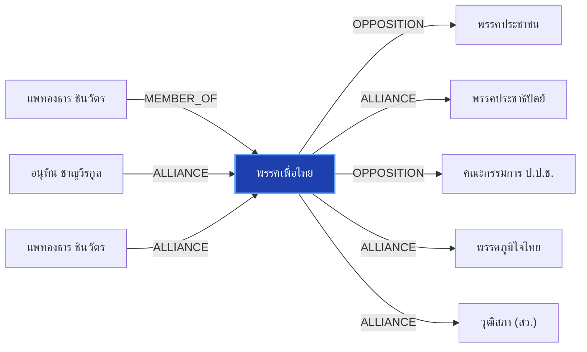

# พรรคเพื่อไทย

> **สังกัด**: 🔴 พรรคเพื่อไทย | **บทบาท**: แกนนำพรรคร่วมรัฐบาล | **ขั้วการเมือง**: Government

## 📊 ข้อมูลสังเขป & สถิติ
- **การปรากฏในข่าว 30 วันล่าสุด**: 15 ครั้ง
- **สถานะทางการเมือง**: Government
- **ชื่อเรียก/ฉายา**: พรรคเพื่อไทย, เพื่อไทย, พท.

## 🌐 แผนผังความสัมพันธ์ (Semantic Network)

## 🔗 โครงข่ายความสัมพันธ์และเหตุการณ์สำคัญ
- **OPPOSITION** ➔ [[entities/peoples_party|พรรคประชาชน]]: พรรคเพื่อไทย และ พรรคประชาชน มีปฏิสัมพันธ์ในประเด็นการเมือง (เมื่อ 2026-08-28)
  > *"‘ชลน่าน’ ยันขึ้นเวทีฝ่ายค้าน ขอ พท.แล้ว ชี้ไม่กระทบสัมพันธ์ ‘ภูมิใจไทย’"*
- **ALLIANCE** ➔ [[entities/democrat_party|พรรคประชาธิปัตย์]]: พรรคเพื่อไทย และ พรรคประชาธิปัตย์ ในขั้วการเมืองเดียวกัน (Government) (เมื่อ 2026-08-28)
  > *"‘ชลน่าน’ ยันขึ้นเวทีฝ่ายค้าน ขอ พท.แล้ว ชี้ไม่กระทบสัมพันธ์ ‘ภูมิใจไทย’"*
- **OPPOSITION** ➔ [[entities/nacc|คณะกรรมการ ป.ป.ช.]]: พรรคเพื่อไทย และ คณะกรรมการ ป.ป.ช. มีปฏิสัมพันธ์ในประเด็นการเมือง (เมื่อ 2026-08-28)
  > *"อาสพลธ์ เผยแชตหลุดมัด ‘พ.ต.ท.’ผู้เชี่ยวชาญคดีพิเศษ ดีเอสไอ โยง คดีโกงสอบท้องถิ่น"*
- **MEMBER_OF** ➔ [[entities/paetongtarn_shinawatra|แพทองธาร ชินวัตร]]: แพทองธาร ชินวัตร สังกัด/ดำรงตำแหน่งใน พรรคเพื่อไทย (เมื่อ 2026-08-28)
  > *"เพื่อไทย ไฟเขียว ชลน่าน ร่วมเวทีฝ่ายค้าน ชี้สัมพันธ์รัฐบาลแน่นปึ้ก พร้อมเดินตามแนวอนุทิน"*
- **ALLIANCE** ➔ [[entities/anutin_charnvirakul|อนุทิน ชาญวีรกูล]]: อนุทิน ชาญวีรกูล และ พรรคเพื่อไทย ในขั้วการเมืองเดียวกัน (Government) (เมื่อ 2026-08-28)
  > *"เพื่อไทย ไฟเขียว ชลน่าน ร่วมเวทีฝ่ายค้าน ชี้สัมพันธ์รัฐบาลแน่นปึ้ก พร้อมเดินตามแนวอนุทิน"*
- **ALLIANCE** ➔ [[entities/bhumjaithai_party|พรรคภูมิใจไทย]]: พรรคเพื่อไทย และ พรรคภูมิใจไทย ในขั้วการเมืองเดียวกัน (Government) (เมื่อ 2026-08-29)
  > *"เกาะประเด็นการเมือง ท่าทีพรรคร่วมรัฐบาล รอวันร้าว ‘ภูมิใจไทย-เพื่อไทย’ - เดลินิวส์"*
- **ALLIANCE** ➔ [[entities/paetongtarn_shinawatra|แพทองธาร ชินวัตร]]: แพทองธาร ชินวัตร และ พรรคเพื่อไทย ร่วมมือทางการเมือง/พรรคร่วมรัฐบาล (เมื่อ 2026-08-28)
  > *"นายกฯ นัดครม.พรรคร่วมกินข้าวสัปดาห์หน้า ยังไม่เคาะวัน-สถานที่ ยิ้มไม่ตอบปมปรับครม."*
- **ALLIANCE** ➔ [[entities/senate_thailand|วุฒิสภา (สว.)]]: พรรคเพื่อไทย และ วุฒิสภา (สว.) ร่วมมือทางการเมือง/พรรคร่วมรัฐบาล (เมื่อ 2026-08-27)
  > *"POLITICS: ’อนุทิน‘ โยนถาม ‘ชลน่าน’ ตอบ หลังมีชื่อขึ้นเวทีฝ่ายค้าน บอก พรรคใครพรรคมัน ชี้ พรรคร่วมรัฐบาลมีกฎกติกามารยาทอยู่แล้ว ไม่หวั่น เกมวัดใจ ‘เพื่อไทย‘ โหวตปม ฮั้ว สว. มั่นใจเสถียรภาพรัฐบาล - คะแนนโหวตชัดเจน วันนี้ (27 ส.ค. 69) นายอนุทิน ชาญวีรกู"*
- **OPPOSITION** ➔ [[entities/natthaphong_ruengpanyawut|ณัฐพงษ์ เรืองปัญญาวุฒิ]]: ณัฐพงษ์ เรืองปัญญาวุฒิ และ พรรคเพื่อไทย มีปฏิสัมพันธ์ในประเด็นการเมือง (เมื่อ 2026-08-28)
  > *"‘ชลน่าน’ ยันขึ้นเวทีฝ่ายค้าน ขอ พท.แล้ว ชี้ไม่กระทบสัมพันธ์ ‘ภูมิใจไทย’"*
- **OPPOSITION** ➔ [[entities/senate_thailand|วุฒิสภา (สว.)]]: พรรคเพื่อไทย และ วุฒิสภา (สว.) มีปฏิสัมพันธ์ในประเด็นการเมือง (เมื่อ 2026-08-28)
  > *"‘ชลน่าน’ ยันขึ้นเวทีฝ่ายค้าน ขอ พท.แล้ว ชี้ไม่กระทบสัมพันธ์ ‘ภูมิใจไทย’"*

## 📑 เอกสารและข่าวที่เกี่ยวข้อง
- ดูสรุปข่าวรอบ 30 วันใน [[wiki/index#Source Summaries|Index Summaries]]
