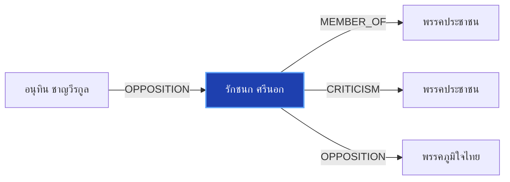

# รักชนก ศรีนอก

> **สังกัด**: 🟠 พรรคประชาชน | **บทบาท**: สส.กทม. พรรคประชาชน | **ขั้วการเมือง**: Opposition

## 📊 ข้อมูลสังเขป & สถิติ
- **การปรากฏในข่าว 30 วันล่าสุด**: 5 ครั้ง
- **สถานะทางการเมือง**: Opposition
- **ชื่อเรียก/ฉายา**: รักชนก, ไอซ์ รักชนก

## 🌐 แผนผังความสัมพันธ์ (Semantic Network)

## 🔗 โครงข่ายความสัมพันธ์และเหตุการณ์สำคัญ
- **OPPOSITION** ➔ [[entities/anutin_charnvirakul|อนุทิน ชาญวีรกูล]]: อนุทิน ชาญวีรกูล และ รักชนก ศรีนอก มีปฏิสัมพันธ์ในประเด็นการเมือง (เมื่อ 2026-08-02)
  > *"69 “อนุทิน-รักชนก” คว้าแชมป์โดดเด่นประจำเดือน - Thairath"*
- **MEMBER_OF** ➔ [[entities/peoples_party|พรรคประชาชน]]: รักชนก ศรีนอก สังกัด/ดำรงตำแหน่งใน พรรคประชาชน (เมื่อ 2026-08-27)
  > *"รักชนก พรรคประชาชน ถาม ศุภชัย พรรคภูมิใจไทย ทำไมไม่เรียกประชุมสักที"*
- **CRITICISM** ➔ [[entities/peoples_party|พรรคประชาชน]]: รักชนก ศรีนอก วิพากษ์วิจารณ์/ตรวจสอบท่าทีของ พรรคประชาชน (เมื่อ 2026-08-26)
  > *"รักชนก ศรีนอก สส. แบบบัญชีรายชื่อ พรรคประชาชน อภิปรายในวาระพิจารณา พ.ร.ก. ให้อำนาจกระทรวงการคลังกู้เงิน 4 แสนล้าน ในการประชุมสภาผู้แทนราษฎร 26 สิงหาคม 2569 #TheStandardNews - facebook.com"*
- **OPPOSITION** ➔ [[entities/bhumjaithai_party|พรรคภูมิใจไทย]]: รักชนก ศรีนอก และ พรรคภูมิใจไทย มีปฏิสัมพันธ์ในประเด็นการเมือง (เมื่อ 2026-08-27)
  > *"รักชนก พรรคประชาชน ถาม ศุภชัย พรรคภูมิใจไทย ทำไมไม่เรียกประชุมสักที"*

## 📑 เอกสารและข่าวที่เกี่ยวข้อง
- ดูสรุปข่าวรอบ 30 วันใน [[wiki/index#Source Summaries|Index Summaries]]
