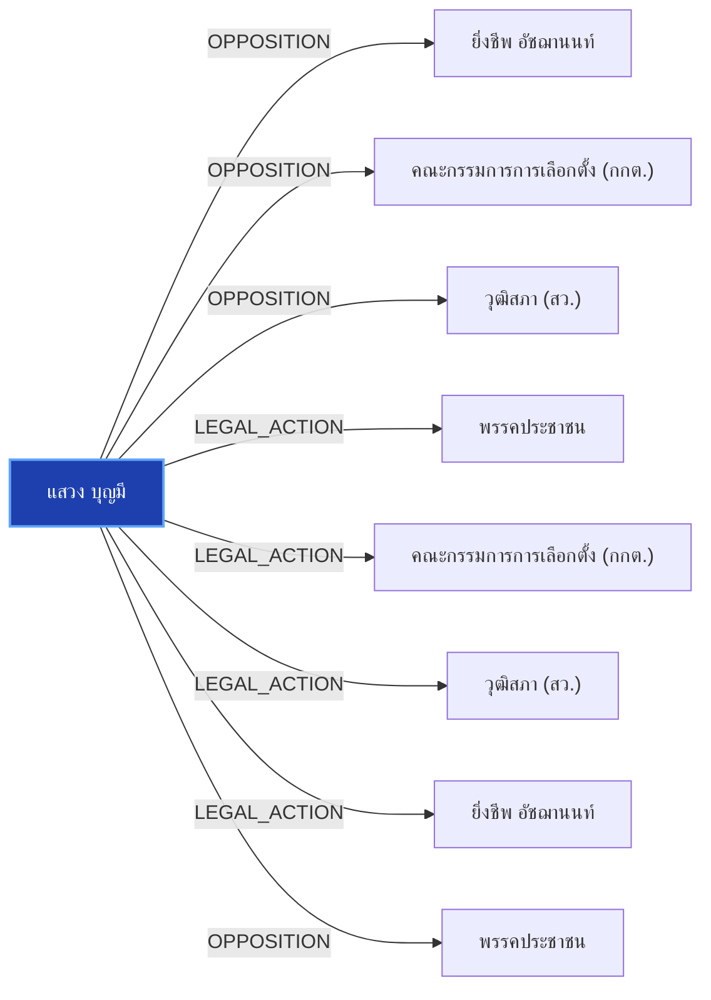

# แสวง บุญมี

> **สังกัด**: 🛡️ องค์กรอิสระ (กกต.) | **บทบาท**: เลขาธิการ กกต. (ผู้รับผิดชอบสำนวนคดีฮั้ว สว.) | **ขั้วการเมือง**: Independent

## 📊 ข้อมูลสังเขป & สถิติ
- **การปรากฏในข่าว 30 วันล่าสุด**: 7 ครั้ง
- **สถานะทางการเมือง**: Independent
- **ชื่อเรียก/ฉายา**: แสวง บุญมี, แสวง, เลขาธิการ กกต.

## 🌐 แผนผังความสัมพันธ์ (Semantic Network)

## 🔗 โครงข่ายความสัมพันธ์และเหตุการณ์สำคัญ
- **OPPOSITION** ➔ [[entities/yingcheep_atchanont|ยิ่งชีพ อัชฌานนท์]]: แสวง บุญมี และ ยิ่งชีพ อัชฌานนท์ มีปฏิสัมพันธ์ในประเด็นการเมือง (เมื่อ 2026-08-28)
  > *"โดยเนื้อหาระบุว่า นายครรชิต เจริญอินทร์ รองเลขาธิการคณะกรรมการการเลือกตั้ง เข้าแจ้งความ ณ กองบังคับการปราบปราม กองบัญชาการตำรวจสอบสวนกลาง เพื่อดำเนินการตามกฎหมาย กรณี iLaw เผยแพร่เอกสารความเห็นของนายครรชิต เจริญอินทร์ รองเลขาธิการคณะกรรมการการเลือกตั"*
- **OPPOSITION** ➔ [[entities/election_commission|คณะกรรมการการเลือกตั้ง (กกต.)]]: แสวง บุญมี และ คณะกรรมการการเลือกตั้ง (กกต.) มีปฏิสัมพันธ์ในประเด็นการเมือง (เมื่อ 2026-08-29)
  > *"กกต. เดินหน้าสอบคดีฮั้ว สว. 229 รายชื่อ นัดลงมติชี้ชะตาสอย สว. สายสีน้ำเงิน"*
- **OPPOSITION** ➔ [[entities/senate_thailand|วุฒิสภา (สว.)]]: แสวง บุญมี และ วุฒิสภา (สว.) มีปฏิสัมพันธ์ในประเด็นการเมือง (เมื่อ 2026-08-29)
  > *"กกต. เดินหน้าสอบคดีฮั้ว สว. 229 รายชื่อ นัดลงมติชี้ชะตาสอย สว. สายสีน้ำเงิน"*
- **LEGAL_ACTION** ➔ [[entities/peoples_party|พรรคประชาชน]]: กระบวนการทางกฎหมาย/ตรวจสอบระหว่าง แสวง บุญมี และ พรรคประชาชน (เมื่อ 2026-08-28)
  > *"สว.สำรอง ยื่นยธ.จี้ ‘รัฐมนตรี’ หยุดฟ้องปิดปาก ล่าคนปล่อยสำนวนลับ บี้เร่งรัดคดีฮั้วสว.ค้างเติ่ง 2 ปีแล้ว"*
- **LEGAL_ACTION** ➔ [[entities/election_commission|คณะกรรมการการเลือกตั้ง (กกต.)]]: กระบวนการทางกฎหมาย/ตรวจสอบระหว่าง แสวง บุญมี และ คณะกรรมการการเลือกตั้ง (กกต.) (เมื่อ 2026-08-28)
  > *"สว.สำรอง ยื่นยธ.จี้ ‘รัฐมนตรี’ หยุดฟ้องปิดปาก ล่าคนปล่อยสำนวนลับ บี้เร่งรัดคดีฮั้วสว.ค้างเติ่ง 2 ปีแล้ว"*
- **LEGAL_ACTION** ➔ [[entities/senate_thailand|วุฒิสภา (สว.)]]: กระบวนการทางกฎหมาย/ตรวจสอบระหว่าง แสวง บุญมี และ วุฒิสภา (สว.) (เมื่อ 2026-08-28)
  > *"สว.สำรอง ยื่นยธ.จี้ ‘รัฐมนตรี’ หยุดฟ้องปิดปาก ล่าคนปล่อยสำนวนลับ บี้เร่งรัดคดีฮั้วสว.ค้างเติ่ง 2 ปีแล้ว"*
- **LEGAL_ACTION** ➔ [[entities/yingcheep_atchanont|ยิ่งชีพ อัชฌานนท์]]: กระบวนการทางกฎหมาย/ตรวจสอบระหว่าง แสวง บุญมี และ ยิ่งชีพ อัชฌานนท์ (เมื่อ 2026-08-28)
  > *"อ.มุนินทร์ งง เหตุผลกกต.ฟ้องไอลอว์ คือไม่มั่นใจตัวเองโปร่งใส เลยให้ตำรวจสอบอีกชั้น?"*
- **OPPOSITION** ➔ [[entities/peoples_party|พรรคประชาชน]]: แสวง บุญมี และ พรรคประชาชน มีปฏิสัมพันธ์ในประเด็นการเมือง (เมื่อ 2026-08-29)
  > *"ด้านสำนักข่าว BBC ไทย รายงานสถานการณ์ล่าสุดเมื่อวันที่ 28 สิงหาคมว่า ยอดผู้เสียชีวิตจากเหตุการณ์นี้ในฝั่งเนปาลและทิเบตพุ่งสูงกว่า 400 คนแล้ว ขณะที่ยอดผู้สูญหายรวมกันทะลุ 1,000 คน ซึ่งในจำนวนผู้เคราะห์ร้ายมีทั้งประชาชนในพื้นที่ รวมถึงนักท่องเที่ยวและผ"*
- **CRITICISM** ➔ [[entities/mongkol_surasajja|มงคล สุระสัจจะ]]: มงคล สุระสัจจะ วิพากษ์วิจารณ์/ตรวจสอบท่าทีของ แสวง บุญมี (เมื่อ 2026-08-29)
  > *"นันทนา นันทวโรภาส และ สว.พันธุ์ใหม่ จี้ 229 สว. เอี่ยวคดีฮั้วหยุดปฏิบัติหน้าที่"*
- **CRITICISM** ➔ [[entities/nanthana_nanthavaropas|นันทนา นันทวโรภาส]]: นันทนา นันทวโรภาส วิพากษ์วิจารณ์/ตรวจสอบท่าทีของ แสวง บุญมี (เมื่อ 2026-08-29)
  > *"นันทนา นันทวโรภาส และ สว.พันธุ์ใหม่ จี้ 229 สว. เอี่ยวคดีฮั้วหยุดปฏิบัติหน้าที่"*
- **CRITICISM** ➔ [[entities/tewarit_maneechay|เทวฤทธิ์ มณีฉาย]]: เทวฤทธิ์ มณีฉาย วิพากษ์วิจารณ์/ตรวจสอบท่าทีของ แสวง บุญมี (เมื่อ 2026-08-29)
  > *"นันทนา นันทวโรภาส และ สว.พันธุ์ใหม่ จี้ 229 สว. เอี่ยวคดีฮั้วหยุดปฏิบัติหน้าที่"*
- **CRITICISM** ➔ [[entities/constitutional_court|ศาลรัฐธรรมนูญ]]: แสวง บุญมี วิพากษ์วิจารณ์/ตรวจสอบท่าทีของ ศาลรัฐธรรมนูญ (เมื่อ 2026-08-29)
  > *"นันทนา นันทวโรภาส และ สว.พันธุ์ใหม่ จี้ 229 สว. เอี่ยวคดีฮั้วหยุดปฏิบัติหน้าที่"*
- **CRITICISM** ➔ [[entities/election_commission|คณะกรรมการการเลือกตั้ง (กกต.)]]: แสวง บุญมี วิพากษ์วิจารณ์/ตรวจสอบท่าทีของ คณะกรรมการการเลือกตั้ง (กกต.) (เมื่อ 2026-08-29)
  > *"นันทนา นันทวโรภาส และ สว.พันธุ์ใหม่ จี้ 229 สว. เอี่ยวคดีฮั้วหยุดปฏิบัติหน้าที่"*
- **CRITICISM** ➔ [[entities/nacc|คณะกรรมการ ป.ป.ช.]]: แสวง บุญมี วิพากษ์วิจารณ์/ตรวจสอบท่าทีของ คณะกรรมการ ป.ป.ช. (เมื่อ 2026-08-29)
  > *"นันทนา นันทวโรภาส และ สว.พันธุ์ใหม่ จี้ 229 สว. เอี่ยวคดีฮั้วหยุดปฏิบัติหน้าที่"*
- **CRITICISM** ➔ [[entities/senate_thailand|วุฒิสภา (สว.)]]: แสวง บุญมี วิพากษ์วิจารณ์/ตรวจสอบท่าทีของ วุฒิสภา (สว.) (เมื่อ 2026-08-29)
  > *"นันทนา นันทวโรภาส และ สว.พันธุ์ใหม่ จี้ 229 สว. เอี่ยวคดีฮั้วหยุดปฏิบัติหน้าที่"*
- **OPPOSITION** ➔ [[entities/mongkol_surasajja|มงคล สุระสัจจะ]]: มงคล สุระสัจจะ และ แสวง บุญมี มีปฏิสัมพันธ์ในประเด็นการเมือง (เมื่อ 2026-08-29)
  > *"", "มงคล สุระสัจจะ", "เกรียงไกร ศรีรักษ์", "แสวง บุญมี", "อิทธิพร บุญประคอง"]"*
- **OPPOSITION** ➔ [[entities/kriangkrai_srirak|พล.อ.เกรียงไกร ศรีรักษ์]]: พล.อ.เกรียงไกร ศรีรักษ์ และ แสวง บุญมี มีปฏิสัมพันธ์ในประเด็นการเมือง (เมื่อ 2026-08-29)
  > *"", "มงคล สุระสัจจะ", "เกรียงไกร ศรีรักษ์", "แสวง บุญมี", "อิทธิพร บุญประคอง"]"*
- **OPPOSITION** ➔ [[entities/itthiporn_boonpracong|อิทธิพร บุญประคอง]]: อิทธิพร บุญประคอง และ แสวง บุญมี มีปฏิสัมพันธ์ในประเด็นการเมือง (เมื่อ 2026-08-29)
  > *"", "มงคล สุระสัจจะ", "เกรียงไกร ศรีรักษ์", "แสวง บุญมี", "อิทธิพร บุญประคอง"]"*
- **OPPOSITION** ➔ [[entities/somchai_sawangkarn|สมชาย แสวงการ]]: แสวง บุญมี และ สมชาย แสวงการ มีปฏิสัมพันธ์ในประเด็นการเมือง (เมื่อ 2026-08-29)
  > *"สมชาย แสวงการ ส่งหลักฐานเส้นทางการเงิน-โพยจัดตั้ง ฮั้วเลือก สว"*
- **OPPOSITION** ➔ [[entities/nacc|คณะกรรมการ ป.ป.ช.]]: แสวง บุญมี และ คณะกรรมการ ป.ป.ช. มีปฏิสัมพันธ์ในประเด็นการเมือง (เมื่อ 2026-08-29)
  > *"สมชาย แสวงการ ส่งหลักฐานเส้นทางการเงิน-โพยจัดตั้ง ฮั้วเลือก สว. ให้ กกต. และ ป.ป.ช."*

## 📑 เอกสารและข่าวที่เกี่ยวข้อง
- ดูสรุปข่าวรอบ 30 วันใน [[wiki/index#Source Summaries|Index Summaries]]
