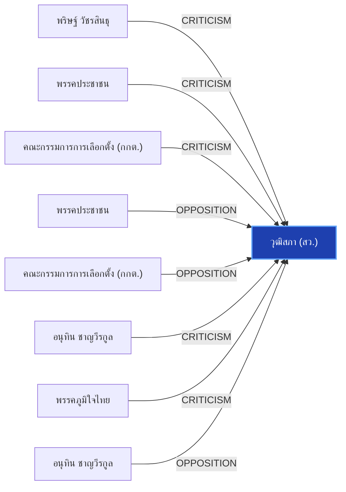

# วุฒิสภา (สว.)

> **สังกัด**: สถาบันนิติบัญญัติ | **บทบาท**: สภาสูง / กลั่นกรองกฎหมายและแต่งตั้งองค์กรอิสระ | **ขั้วการเมือง**: Independent

## 📊 ข้อมูลสังเขป & สถิติ
- **การปรากฏในข่าว 30 วันล่าสุด**: 34 ครั้ง
- **สถานะทางการเมือง**: Independent
- **ชื่อเรียก/ฉายา**: วุฒิสภา, สว., สมาชิกวุฒิสภา, สภาสูง

## 🌐 แผนผังความสัมพันธ์ (Semantic Network)

## 🔗 โครงข่ายความสัมพันธ์และเหตุการณ์สำคัญ
- **CRITICISM** ➔ [[entities/parit_wacharasindhu|พริษฐ์ วัชรสินธุ]]: พริษฐ์ วัชรสินธุ วิพากษ์วิจารณ์/ตรวจสอบท่าทีของ วุฒิสภา (สว.) (เมื่อ 2026-08-28)
  > *"บวรศักดิ์ ซัดองค์กรอิสระ ความเชื่อมั่นตกต่ำ หนุนแก้รธน. ชง 5 ข้อรื้อสรรหา-คืนสิทธิปชช.ถอดถอน"*
- **CRITICISM** ➔ [[entities/peoples_party|พรรคประชาชน]]: พรรคประชาชน วิพากษ์วิจารณ์/ตรวจสอบท่าทีของ วุฒิสภา (สว.) (เมื่อ 2026-08-28)
  > *"บวรศักดิ์ ซัดองค์กรอิสระ ความเชื่อมั่นตกต่ำ หนุนแก้รธน. ชง 5 ข้อรื้อสรรหา-คืนสิทธิปชช.ถอดถอน"*
- **CRITICISM** ➔ [[entities/election_commission|คณะกรรมการการเลือกตั้ง (กกต.)]]: คณะกรรมการการเลือกตั้ง (กกต.) วิพากษ์วิจารณ์/ตรวจสอบท่าทีของ วุฒิสภา (สว.) (เมื่อ 2026-08-28)
  > *"บวรศักดิ์ ซัดองค์กรอิสระ ความเชื่อมั่นตกต่ำ หนุนแก้รธน. ชง 5 ข้อรื้อสรรหา-คืนสิทธิปชช.ถอดถอน"*
- **OPPOSITION** ➔ [[entities/peoples_party|พรรคประชาชน]]: พรรคประชาชน และ วุฒิสภา (สว.) มีปฏิสัมพันธ์ในประเด็นการเมือง (เมื่อ 2026-08-28)
  > *") และอดีตผู้นำฝ่ายค้านฯ โดยตนจะร่วมเฉพาะวงเสวนาของอดีตผู้นำฝ่ายค้านในช่วงเช้าเท่านั้น ไม่ได้เข้าร่วมวงเสวนาช่วงอื่นที่เกี่ยวข้องกับประเด็นการเลือกสมาชิกวุฒิสภา หรือร่วมเวทีกับกลุ่มเคลื่อนไหวภาคประชาชน"*
- **OPPOSITION** ➔ [[entities/election_commission|คณะกรรมการการเลือกตั้ง (กกต.)]]: คณะกรรมการการเลือกตั้ง (กกต.) และ วุฒิสภา (สว.) มีปฏิสัมพันธ์ในประเด็นการเมือง (เมื่อ 2026-08-28)
  > *"ด่วน! กกต.ร่อนเอกสาร นัดแล้ว 14 ก.ย.นี้ ลงมติสำนวน คดีฮั้วส.ว."*
- **CRITICISM** ➔ [[entities/anutin_charnvirakul|อนุทิน ชาญวีรกูล]]: อนุทิน ชาญวีรกูล วิพากษ์วิจารณ์/ตรวจสอบท่าทีของ วุฒิสภา (สว.) (เมื่อ 2026-08-28)
  > *"บวรศักดิ์ ซัดองค์กรอิสระ ความเชื่อมั่นตกต่ำ หนุนแก้รธน. ชง 5 ข้อรื้อสรรหา-คืนสิทธิปชช.ถอดถอน"*
- **CRITICISM** ➔ [[entities/bhumjaithai_party|พรรคภูมิใจไทย]]: พรรคภูมิใจไทย วิพากษ์วิจารณ์/ตรวจสอบท่าทีของ วุฒิสภา (สว.) (เมื่อ 2026-08-17)
  > *"THE STANDARD. . ไอติมซัดอนุทิน ปมซักฟอกรัฐบาล “อภิปรายฮั้ว สว. นอกเกมยังไง” #พรรคประชาชน #ฮั้วสว #กกต #อนุทิน #ภูมิใจไทย #การเมือง #TheStandardNews #TheStandardNow - facebook.com"*
- **OPPOSITION** ➔ [[entities/anutin_charnvirakul|อนุทิน ชาญวีรกูล]]: อนุทิน ชาญวีรกูล และ วุฒิสภา (สว.) มีปฏิสัมพันธ์ในประเด็นการเมือง (เมื่อ 2026-08-28)
  > *"‘ชลน่าน’ ยันขึ้นเวทีฝ่ายค้าน ขอ พท.แล้ว ชี้ไม่กระทบสัมพันธ์ ‘ภูมิใจไทย’"*
- **OPPOSITION** ➔ [[entities/bhumjaithai_party|พรรคภูมิใจไทย]]: พรรคภูมิใจไทย และ วุฒิสภา (สว.) มีปฏิสัมพันธ์ในประเด็นการเมือง (เมื่อ 2026-08-28)
  > *"‘ชลน่าน’ ยันขึ้นเวทีฝ่ายค้าน ขอ พท.แล้ว ชี้ไม่กระทบสัมพันธ์ ‘ภูมิใจไทย’"*
- **LEGAL_ACTION** ➔ [[entities/peoples_party|พรรคประชาชน]]: กระบวนการทางกฎหมาย/ตรวจสอบระหว่าง พรรคประชาชน และ วุฒิสภา (สว.) (เมื่อ 2026-08-28)
  > *"ยิ่งชีพ ปลุกบี้ #สั่งฟ้องสว. ยันไม่มีถ้า.. ชี้ 5 ซีนาริโอ กกต.ไม่ฟ้อง ระบอบสีน้ำเงินเฟื่องฟูแน่"*
- **LEGAL_ACTION** ➔ [[entities/natthaphong_ruengpanyawut|ณัฐพงษ์ เรืองปัญญาวุฒิ]]: กระบวนการทางกฎหมาย/ตรวจสอบระหว่าง ณัฐพงษ์ เรืองปัญญาวุฒิ และ วุฒิสภา (สว.) (เมื่อ 2026-08-25)
  > *"PARLIAMENT: 'พริษฐ์' จี้ กกต. ชัดเจนวันลงมติคดีฮั้ว สว. หวั่นตัดตอนช่วยเครือข่ายการเมือง ขู่ฟ้อง ม.157 หากยกคำร้อง วันนี้ (25 ส.ค. 69) นายพริษฐ์ วัชรสินธุ สส.บัญชีรายชื่อ และรองหัวหน้าพรรคประชาชน กล่าวถึงกรณีคณะกรรมการการเลือกตั้ง (กกต.) เตรียมลงมติส"*
- **LEGAL_ACTION** ➔ [[entities/parit_wacharasindhu|พริษฐ์ วัชรสินธุ]]: กระบวนการทางกฎหมาย/ตรวจสอบระหว่าง พริษฐ์ วัชรสินธุ และ วุฒิสภา (สว.) (เมื่อ 2026-08-25)
  > *"PARLIAMENT: 'พริษฐ์' จี้ กกต. ชัดเจนวันลงมติคดีฮั้ว สว. หวั่นตัดตอนช่วยเครือข่ายการเมือง ขู่ฟ้อง ม.157 หากยกคำร้อง วันนี้ (25 ส.ค. 69) นายพริษฐ์ วัชรสินธุ สส.บัญชีรายชื่อ และรองหัวหน้าพรรคประชาชน กล่าวถึงกรณีคณะกรรมการการเลือกตั้ง (กกต.) เตรียมลงมติส"*
- **LEGAL_ACTION** ➔ [[entities/election_commission|คณะกรรมการการเลือกตั้ง (กกต.)]]: กระบวนการทางกฎหมาย/ตรวจสอบระหว่าง คณะกรรมการการเลือกตั้ง (กกต.) และ วุฒิสภา (สว.) (เมื่อ 2026-08-28)
  > *"ยิ่งชีพ ปลุกบี้ #สั่งฟ้องสว. ยันไม่มีถ้า.. ชี้ 5 ซีนาริโอ กกต.ไม่ฟ้อง ระบอบสีน้ำเงินเฟื่องฟูแน่"*
- **ALLIANCE** ➔ [[entities/paetongtarn_shinawatra|แพทองธาร ชินวัตร]]: แพทองธาร ชินวัตร และ วุฒิสภา (สว.) ร่วมมือทางการเมือง/พรรคร่วมรัฐบาล (เมื่อ 2026-08-27)
  > *"POLITICS: ’อนุทิน‘ โยนถาม ‘ชลน่าน’ ตอบ หลังมีชื่อขึ้นเวทีฝ่ายค้าน บอก พรรคใครพรรคมัน ชี้ พรรคร่วมรัฐบาลมีกฎกติกามารยาทอยู่แล้ว ไม่หวั่น เกมวัดใจ ‘เพื่อไทย‘ โหวตปม ฮั้ว สว. มั่นใจเสถียรภาพรัฐบาล - คะแนนโหวตชัดเจน วันนี้ (27 ส.ค. 69) นายอนุทิน ชาญวีรกู"*
- **ALLIANCE** ➔ [[entities/anutin_charnvirakul|อนุทิน ชาญวีรกูล]]: อนุทิน ชาญวีรกูล และ วุฒิสภา (สว.) ร่วมมือทางการเมือง/พรรคร่วมรัฐบาล (เมื่อ 2026-08-27)
  > *"POLITICS: ’อนุทิน‘ โยนถาม ‘ชลน่าน’ ตอบ หลังมีชื่อขึ้นเวทีฝ่ายค้าน บอก พรรคใครพรรคมัน ชี้ พรรคร่วมรัฐบาลมีกฎกติกามารยาทอยู่แล้ว ไม่หวั่น เกมวัดใจ ‘เพื่อไทย‘ โหวตปม ฮั้ว สว. มั่นใจเสถียรภาพรัฐบาล - คะแนนโหวตชัดเจน วันนี้ (27 ส.ค. 69) นายอนุทิน ชาญวีรกู"*
- **ALLIANCE** ➔ [[entities/pheu_thai_party|พรรคเพื่อไทย]]: พรรคเพื่อไทย และ วุฒิสภา (สว.) ร่วมมือทางการเมือง/พรรคร่วมรัฐบาล (เมื่อ 2026-08-27)
  > *"POLITICS: ’อนุทิน‘ โยนถาม ‘ชลน่าน’ ตอบ หลังมีชื่อขึ้นเวทีฝ่ายค้าน บอก พรรคใครพรรคมัน ชี้ พรรคร่วมรัฐบาลมีกฎกติกามารยาทอยู่แล้ว ไม่หวั่น เกมวัดใจ ‘เพื่อไทย‘ โหวตปม ฮั้ว สว. มั่นใจเสถียรภาพรัฐบาล - คะแนนโหวตชัดเจน วันนี้ (27 ส.ค. 69) นายอนุทิน ชาญวีรกู"*
- **OPPOSITION** ➔ [[entities/parit_wacharasindhu|พริษฐ์ วัชรสินธุ]]: พริษฐ์ วัชรสินธุ และ วุฒิสภา (สว.) มีปฏิสัมพันธ์ในประเด็นการเมือง (เมื่อ 2026-08-28)
  > *"นภินทร เปิดทำเนียบ แจงโกงเลือกส.ว. ลั่นไม่โง่ทำผิดกฎหมาย ฝากถึง เป๋า-ยิ่งชีพ เจอกันในศาล"*
- **OPPOSITION** ➔ [[entities/natthaphong_ruengpanyawut|ณัฐพงษ์ เรืองปัญญาวุฒิ]]: ณัฐพงษ์ เรืองปัญญาวุฒิ และ วุฒิสภา (สว.) มีปฏิสัมพันธ์ในประเด็นการเมือง (เมื่อ 2026-08-29)
  > *"THE STANDARD. . สด! เปิดเวทีผู้นำฝ่ายค้าน เจาะลึกหลักฐานคดีโกง สว. | THE STANDARD - facebook.com"*
- **OPPOSITION** ➔ [[entities/pheu_thai_party|พรรคเพื่อไทย]]: พรรคเพื่อไทย และ วุฒิสภา (สว.) มีปฏิสัมพันธ์ในประเด็นการเมือง (เมื่อ 2026-08-28)
  > *"‘ชลน่าน’ ยันขึ้นเวทีฝ่ายค้าน ขอ พท.แล้ว ชี้ไม่กระทบสัมพันธ์ ‘ภูมิใจไทย’"*
- **OPPOSITION** ➔ [[entities/democrat_party|พรรคประชาธิปัตย์]]: พรรคประชาธิปัตย์ และ วุฒิสภา (สว.) มีปฏิสัมพันธ์ในประเด็นการเมือง (เมื่อ 2026-08-28)
  > *"‘ชลน่าน’ ยันขึ้นเวทีฝ่ายค้าน ขอ พท.แล้ว ชี้ไม่กระทบสัมพันธ์ ‘ภูมิใจไทย’"*
- **OPPOSITION** ➔ [[entities/paetongtarn_shinawatra|แพทองธาร ชินวัตร]]: แพทองธาร ชินวัตร และ วุฒิสภา (สว.) มีปฏิสัมพันธ์ในประเด็นการเมือง (เมื่อ 2026-08-28)
  > *"นภินทร เปิดทำเนียบ แจงโกงเลือกส.ว. ลั่นไม่โง่ทำผิดกฎหมาย ฝากถึง เป๋า-ยิ่งชีพ เจอกันในศาล"*
- **CRITICISM** ➔ [[entities/paetongtarn_shinawatra|แพทองธาร ชินวัตร]]: แพทองธาร ชินวัตร วิพากษ์วิจารณ์/ตรวจสอบท่าทีของ วุฒิสภา (สว.) (เมื่อ 2026-08-28)
  > *"บวรศักดิ์ ซัดองค์กรอิสระ ความเชื่อมั่นตกต่ำ หนุนแก้รธน. ชง 5 ข้อรื้อสรรหา-คืนสิทธิปชช.ถอดถอน"*
- **CRITICISM** ➔ [[entities/natthaphong_ruengpanyawut|ณัฐพงษ์ เรืองปัญญาวุฒิ]]: ณัฐพงษ์ เรืองปัญญาวุฒิ วิพากษ์วิจารณ์/ตรวจสอบท่าทีของ วุฒิสภา (สว.) (เมื่อ 2026-08-28)
  > *"บวรศักดิ์ ซัดองค์กรอิสระ ความเชื่อมั่นตกต่ำ หนุนแก้รธน. ชง 5 ข้อรื้อสรรหา-คืนสิทธิปชช.ถอดถอน"*
- **CRITICISM** ➔ [[entities/nacc|คณะกรรมการ ป.ป.ช.]]: คณะกรรมการ ป.ป.ช. วิพากษ์วิจารณ์/ตรวจสอบท่าทีของ วุฒิสภา (สว.) (เมื่อ 2026-08-28)
  > *"บวรศักดิ์ ซัดองค์กรอิสระ ความเชื่อมั่นตกต่ำ หนุนแก้รธน. ชง 5 ข้อรื้อสรรหา-คืนสิทธิปชช.ถอดถอน"*
- **CRITICISM** ➔ [[entities/constitution_amendment|การแก้ไขรัฐธรรมนูญ]]: วุฒิสภา (สว.) วิพากษ์วิจารณ์/ตรวจสอบท่าทีของ การแก้ไขรัฐธรรมนูญ (เมื่อ 2026-08-28)
  > *"บวรศักดิ์ ซัดองค์กรอิสระ ความเชื่อมั่นตกต่ำ หนุนแก้รธน. ชง 5 ข้อรื้อสรรหา-คืนสิทธิปชช.ถอดถอน"*
- **OPPOSITION** ➔ [[entities/nacc|คณะกรรมการ ป.ป.ช.]]: คณะกรรมการ ป.ป.ช. และ วุฒิสภา (สว.) มีปฏิสัมพันธ์ในประเด็นการเมือง (เมื่อ 2026-08-28)
  > *"พรรคประชาชน เตรียมร้อง ป.ป.ช. ฟัน กกต.ซื้อเวลาคดีฮั้ว สว. - nationtv.tv"*
- **LEGAL_ACTION** ➔ [[entities/bhumjaithai_party|พรรคภูมิใจไทย]]: กระบวนการทางกฎหมาย/ตรวจสอบระหว่าง พรรคภูมิใจไทย และ วุฒิสภา (สว.) (เมื่อ 2026-08-28)
  > *"ยิ่งชีพ ปลุกบี้ #สั่งฟ้องสว. ยันไม่มีถ้า.. ชี้ 5 ซีนาริโอ กกต.ไม่ฟ้อง ระบอบสีน้ำเงินเฟื่องฟูแน่"*
- **LEGAL_ACTION** ➔ [[entities/constitutional_court|ศาลรัฐธรรมนูญ]]: กระบวนการทางกฎหมาย/ตรวจสอบระหว่าง ศาลรัฐธรรมนูญ และ วุฒิสภา (สว.) (เมื่อ 2026-08-28)
  > *"ยิ่งชีพ ปลุกบี้ #สั่งฟ้องสว. ยันไม่มีถ้า.. ชี้ 5 ซีนาริโอ กกต.ไม่ฟ้อง ระบอบสีน้ำเงินเฟื่องฟูแน่"*
- **LEGAL_ACTION** ➔ [[entities/nacc|คณะกรรมการ ป.ป.ช.]]: กระบวนการทางกฎหมาย/ตรวจสอบระหว่าง คณะกรรมการ ป.ป.ช. และ วุฒิสภา (สว.) (เมื่อ 2026-08-28)
  > *"ยิ่งชีพ ปลุกบี้ #สั่งฟ้องสว. ยันไม่มีถ้า.. ชี้ 5 ซีนาริโอ กกต.ไม่ฟ้อง ระบอบสีน้ำเงินเฟื่องฟูแน่"*
- **LEGAL_ACTION** ➔ [[entities/constitution_amendment|การแก้ไขรัฐธรรมนูญ]]: กระบวนการทางกฎหมาย/ตรวจสอบระหว่าง วุฒิสภา (สว.) และ การแก้ไขรัฐธรรมนูญ (เมื่อ 2026-08-28)
  > *"ยิ่งชีพ ปลุกบี้ #สั่งฟ้องสว. ยันไม่มีถ้า.. ชี้ 5 ซีนาริโอ กกต.ไม่ฟ้อง ระบอบสีน้ำเงินเฟื่องฟูแน่"*
- **OPPOSITION** ➔ [[entities/constitution_amendment|การแก้ไขรัฐธรรมนูญ]]: วุฒิสภา (สว.) และ การแก้ไขรัฐธรรมนูญ มีปฏิสัมพันธ์ในประเด็นการเมือง (เมื่อ 2026-08-28)
  > *"วิชา อัดองค์กรอิสระ ต้องยึดโยงประชาชน ชม ‘ยิ่งชีพ’ เปิดข้อมูลโกง ส.ว."*
- **LEGAL_ACTION** ➔ [[entities/paetongtarn_shinawatra|แพทองธาร ชินวัตร]]: กระบวนการทางกฎหมาย/ตรวจสอบระหว่าง แพทองธาร ชินวัตร และ วุฒิสภา (สว.) (เมื่อ 2026-08-28)
  > *"วัส ชี้ กกต.ต้องส่งศาลฟันฮั้ว สว. อย่างต่ำ 120 คน ท้าฟ้องพร้อมแฉหลักฐาน ‘อภิสิทธิ์’ เตือนฮั้ว สสร."*
- **LEGAL_ACTION** ➔ [[entities/democrat_party|พรรคประชาธิปัตย์]]: กระบวนการทางกฎหมาย/ตรวจสอบระหว่าง พรรคประชาธิปัตย์ และ วุฒิสภา (สว.) (เมื่อ 2026-08-28)
  > *"วัส ชี้ กกต.ต้องส่งศาลฟันฮั้ว สว. อย่างต่ำ 120 คน ท้าฟ้องพร้อมแฉหลักฐาน ‘อภิสิทธิ์’ เตือนฮั้ว สสร."*
- **ALLIANCE** ➔ [[entities/election_commission|คณะกรรมการการเลือกตั้ง (กกต.)]]: คณะกรรมการการเลือกตั้ง (กกต.) และ วุฒิสภา (สว.) ร่วมมือทางการเมือง/พรรคร่วมรัฐบาล (เมื่อ 2026-08-28)
  > *"โดย นายวัสกล่าวว่า เวลานี้องค์กรอิสระ โดยรัฐธรรมนูญ 2560 เลือกองค์กรอิสระแบบวิบัติหรือไม่ ขึ้นอยู่กับการให้ความเห็นชอบของวุฒิสภา มีข่าวว่าคณะกรรมการการเลือกตั้ง (กกต"*
- **OPPOSITION** ➔ [[entities/constitutional_court|ศาลรัฐธรรมนูญ]]: ศาลรัฐธรรมนูญ และ วุฒิสภา (สว.) มีปฏิสัมพันธ์ในประเด็นการเมือง (เมื่อ 2026-08-28)
  > *"อภิสิทธิ์ ชี้ องค์กรอิสระวิกฤต ถูกแทรกแซงครบวงจร มองแก้รธน. เป็นโอกาสทอง รื้อที่มา ‘องค์กรอิสระ-สว.’"*

## 📑 เอกสารและข่าวที่เกี่ยวข้อง
- ดูสรุปข่าวรอบ 30 วันใน [[wiki/index#Source Summaries|Index Summaries]]
