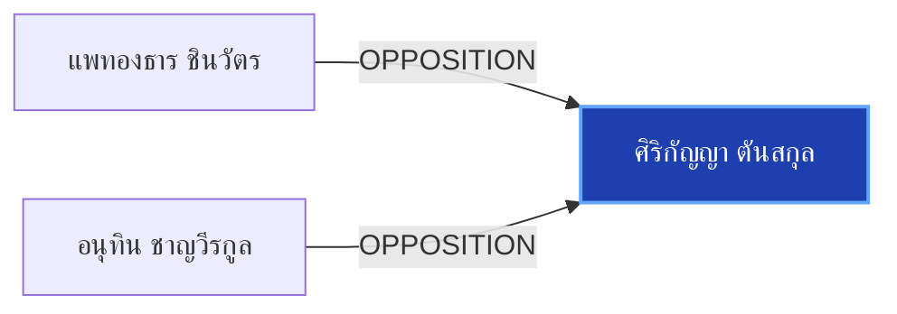

# ศิริกัญญา ตันสกุล

> **สังกัด**: พรรคประชาชน | **บทบาท**: รองหัวหน้าพรรคประชาชน | **ขั้วการเมือง**: Opposition

## 📊 ข้อมูลสังเขป & สถิติ
- **การปรากฏในข่าว 30 วันล่าสุด**: 1 ครั้ง
- **สถานะทางการเมือง**: Opposition
- **ชื่อเรียก/ฉายา**: ศิริกัญญา, ไหม ศิริกัญญา

## 🌐 แผนผังความสัมพันธ์ (Semantic Network)

## 🔗 โครงข่ายความสัมพันธ์และเหตุการณ์สำคัญ
- **OPPOSITION** ➔ [[entities/paetongtarn_shinawatra|แพทองธาร ชินวัตร]]: แพทองธาร ชินวัตร และ ศิริกัญญา ตันสกุล มีปฏิสัมพันธ์ในประเด็นการเมือง (เมื่อ 2026-08-09)
  > *"POLITICS: ‘อนุทิน’ โพสต์ “ถ้ายังวิ่งชนกำแพงอยู่ มันก็เจ็บหัวอีก” หลัง ‘ศิริกัญญา’ เปิดใจสู้ปัญหาในพรรคเหมือนสู้กับกำแพง วันนี้ (9 ส.ค. 69) นายอนุทิน ชาญวีรกูล นายกรัฐมนตรี และรัฐมนตรีว่าการกระทรวงมหาดไทย โพสต์ข้อความผ่านเฟสบุ๊คระบุว่า “วิ่งหัวชนกำแพง"*
- **OPPOSITION** ➔ [[entities/anutin_charnvirakul|อนุทิน ชาญวีรกูล]]: อนุทิน ชาญวีรกูล และ ศิริกัญญา ตันสกุล มีปฏิสัมพันธ์ในประเด็นการเมือง (เมื่อ 2026-08-09)
  > *"POLITICS: ‘อนุทิน’ โพสต์ “ถ้ายังวิ่งชนกำแพงอยู่ มันก็เจ็บหัวอีก” หลัง ‘ศิริกัญญา’ เปิดใจสู้ปัญหาในพรรคเหมือนสู้กับกำแพง วันนี้ (9 ส"*

## 📑 เอกสารและข่าวที่เกี่ยวข้อง
- ดูสรุปข่าวรอบ 30 วันใน [[wiki/index#Source Summaries|Index Summaries]]
