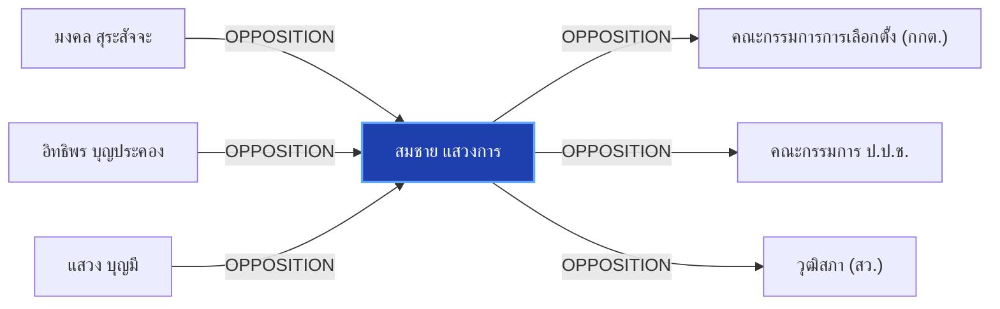

# สมชาย แสวงการ

> **สังกัด**: 🔍 อดีตวุฒิสภา / ผู้ร้องเรียน | **บทบาท**: อดีต สว. / ผู้ยื่นหลักฐานเส้นทางการเงินและโพยฮั้ว สว. | **ขั้วการเมือง**: Independent

## 📊 ข้อมูลสังเขป & สถิติ
- **การปรากฏในข่าว 30 วันล่าสุด**: 1 ครั้ง
- **สถานะทางการเมือง**: Independent
- **ชื่อเรียก/ฉายา**: สมชาย แสวงการ, สมชาย

## 🌐 แผนผังความสัมพันธ์ (Semantic Network)

## 🔗 โครงข่ายความสัมพันธ์และเหตุการณ์สำคัญ
- **OPPOSITION** ➔ [[entities/mongkol_surasajja|มงคล สุระสัจจะ]]: มงคล สุระสัจจะ และ สมชาย แสวงการ มีปฏิสัมพันธ์ในประเด็นการเมือง (เมื่อ 2026-08-29)
  > *"สมชาย แสวงการ ส่งหลักฐานเส้นทางการเงิน-โพยจัดตั้ง ฮั้วเลือก สว. ให้ กกต. และ ป.ป.ช."*
- **OPPOSITION** ➔ [[entities/itthiporn_boonpracong|อิทธิพร บุญประคอง]]: อิทธิพร บุญประคอง และ สมชาย แสวงการ มีปฏิสัมพันธ์ในประเด็นการเมือง (เมื่อ 2026-08-29)
  > *"นายสมชาย แสวงการ อดีตสมาชิกวุฒิสภา ได้นำเอกสารหลักฐานชุดใหม่เข้ายื่นต่อนายอิทธิพร บุญประคอง ประธาน กกต"*
- **OPPOSITION** ➔ [[entities/sawaeng_boonmee|แสวง บุญมี]]: แสวง บุญมี และ สมชาย แสวงการ มีปฏิสัมพันธ์ในประเด็นการเมือง (เมื่อ 2026-08-29)
  > *"สมชาย แสวงการ ส่งหลักฐานเส้นทางการเงิน-โพยจัดตั้ง ฮั้วเลือก สว"*
- **OPPOSITION** ➔ [[entities/election_commission|คณะกรรมการการเลือกตั้ง (กกต.)]]: สมชาย แสวงการ และ คณะกรรมการการเลือกตั้ง (กกต.) มีปฏิสัมพันธ์ในประเด็นการเมือง (เมื่อ 2026-08-29)
  > *"สมชาย แสวงการ ส่งหลักฐานเส้นทางการเงิน-โพยจัดตั้ง ฮั้วเลือก สว. ให้ กกต. และ ป.ป.ช."*
- **OPPOSITION** ➔ [[entities/nacc|คณะกรรมการ ป.ป.ช.]]: สมชาย แสวงการ และ คณะกรรมการ ป.ป.ช. มีปฏิสัมพันธ์ในประเด็นการเมือง (เมื่อ 2026-08-29)
  > *"สมชาย แสวงการ ส่งหลักฐานเส้นทางการเงิน-โพยจัดตั้ง ฮั้วเลือก สว. ให้ กกต. และ ป.ป.ช."*
- **OPPOSITION** ➔ [[entities/senate_thailand|วุฒิสภา (สว.)]]: สมชาย แสวงการ และ วุฒิสภา (สว.) มีปฏิสัมพันธ์ในประเด็นการเมือง (เมื่อ 2026-08-29)
  > *"นายสมชาย แสวงการ อดีตสมาชิกวุฒิสภา ได้นำเอกสารหลักฐานชุดใหม่เข้ายื่นต่อนายอิทธิพร บุญประคอง ประธาน กกต"*

## 📑 เอกสารและข่าวที่เกี่ยวข้อง
- ดูสรุปข่าวรอบ 30 วันใน [[wiki/index#Source Summaries|Index Summaries]]
