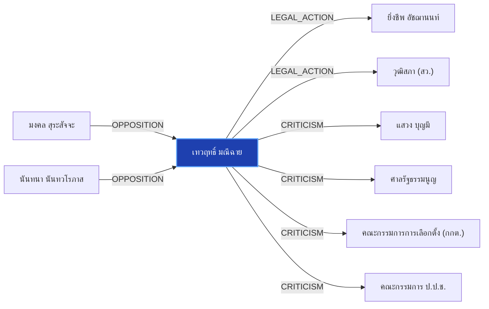

# เทวฤทธิ์ มณีฉาย

> **สังกัด**: 🏛️🌱 วุฒิสภา (กลุ่มพันธุ์ใหม่) | **บทบาท**: สมาชิกวุฒิสภา / โฆษก สว. กลุ่มพันธุ์ใหม่ | **ขั้วการเมือง**: Senate-NewBreed

## 📊 ข้อมูลสังเขป & สถิติ
- **การปรากฏในข่าว 30 วันล่าสุด**: 2 ครั้ง
- **สถานะทางการเมือง**: Senate-NewBreed
- **ชื่อเรียก/ฉายา**: เทวฤทธิ์ มณีฉาย, เทวฤทธิ์, สว.เทวฤทธิ์

## 🌐 แผนผังความสัมพันธ์ (Semantic Network)

## 🔗 โครงข่ายความสัมพันธ์และเหตุการณ์สำคัญ
- **LEGAL_ACTION** ➔ [[entities/yingcheep_atchanont|ยิ่งชีพ อัชฌานนท์]]: กระบวนการทางกฎหมาย/ตรวจสอบระหว่าง เทวฤทธิ์ มณีฉาย และ ยิ่งชีพ อัชฌานนท์ (เมื่อ 2026-07-31)
  > *"ฟ้อง iLaw: การเมืองไทยในวิกฤตความเชื่อใจ กับ เทวฤทธิ์ มณีฉาย - The101"*
- **LEGAL_ACTION** ➔ [[entities/senate_thailand|วุฒิสภา (สว.)]]: กระบวนการทางกฎหมาย/ตรวจสอบระหว่าง เทวฤทธิ์ มณีฉาย และ วุฒิสภา (สว.) (เมื่อ 2026-07-31)
  > *"101 One-on-One EP.417: โกง สว. ฟ้อง iLaw: การเมืองไทยในวิกฤตความเชื่อใจ กับ เทวฤทธิ์ มณีฉาย - The101.world"*
- **OPPOSITION** ➔ [[entities/mongkol_surasajja|มงคล สุระสัจจะ]]: มงคล สุระสัจจะ และ เทวฤทธิ์ มณีฉาย มีปฏิสัมพันธ์ในประเด็นการเมือง (เมื่อ 2026-08-29)
  > *"tags: ["นันทนา นันทวโรภาส", "เทวฤทธิ์ มณีฉาย", "มงคล สุระสัจจะ", "กกต"*
- **OPPOSITION** ➔ [[entities/nanthana_nanthavaropas|นันทนา นันทวโรภาส]]: นันทนา นันทวโรภาส และ เทวฤทธิ์ มณีฉาย มีปฏิสัมพันธ์ในประเด็นการเมือง (เมื่อ 2026-08-29)
  > *"tags: ["นันทนา นันทวโรภาส", "เทวฤทธิ์ มณีฉาย", "มงคล สุระสัจจะ", "กกต"*
- **CRITICISM** ➔ [[entities/sawaeng_boonmee|แสวง บุญมี]]: เทวฤทธิ์ มณีฉาย วิพากษ์วิจารณ์/ตรวจสอบท่าทีของ แสวง บุญมี (เมื่อ 2026-08-29)
  > *"นันทนา นันทวโรภาส และ สว.พันธุ์ใหม่ จี้ 229 สว. เอี่ยวคดีฮั้วหยุดปฏิบัติหน้าที่"*
- **CRITICISM** ➔ [[entities/constitutional_court|ศาลรัฐธรรมนูญ]]: เทวฤทธิ์ มณีฉาย วิพากษ์วิจารณ์/ตรวจสอบท่าทีของ ศาลรัฐธรรมนูญ (เมื่อ 2026-08-29)
  > *"นันทนา นันทวโรภาส และ สว.พันธุ์ใหม่ จี้ 229 สว. เอี่ยวคดีฮั้วหยุดปฏิบัติหน้าที่"*
- **CRITICISM** ➔ [[entities/election_commission|คณะกรรมการการเลือกตั้ง (กกต.)]]: เทวฤทธิ์ มณีฉาย วิพากษ์วิจารณ์/ตรวจสอบท่าทีของ คณะกรรมการการเลือกตั้ง (กกต.) (เมื่อ 2026-08-29)
  > *"นันทนา นันทวโรภาส และ สว.พันธุ์ใหม่ จี้ 229 สว. เอี่ยวคดีฮั้วหยุดปฏิบัติหน้าที่"*
- **CRITICISM** ➔ [[entities/nacc|คณะกรรมการ ป.ป.ช.]]: เทวฤทธิ์ มณีฉาย วิพากษ์วิจารณ์/ตรวจสอบท่าทีของ คณะกรรมการ ป.ป.ช. (เมื่อ 2026-08-29)
  > *"นันทนา นันทวโรภาส และ สว.พันธุ์ใหม่ จี้ 229 สว. เอี่ยวคดีฮั้วหยุดปฏิบัติหน้าที่"*
- **OPPOSITION** ➔ [[entities/senate_thailand|วุฒิสภา (สว.)]]: เทวฤทธิ์ มณีฉาย และ วุฒิสภา (สว.) มีปฏิสัมพันธ์ในประเด็นการเมือง (เมื่อ 2026-08-29)
  > *"นันทนา นันทวโรภาส สมาชิกวุฒิสภา พร้อมด้วยนายเทวฤทธิ์ มณีฉาย แกนนำกลุ่ม สว"*

## 📑 เอกสารและข่าวที่เกี่ยวข้อง
- ดูสรุปข่าวรอบ 30 วันใน [[wiki/index#Source Summaries|Index Summaries]]
