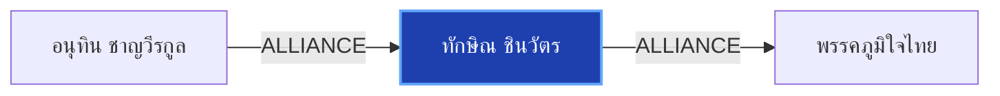

# ทักษิณ ชินวัตร

> **สังกัด**: 🔴 พรรคเพื่อไทย | **บทบาท**: อดีตนายกรัฐมนตรี | **ขั้วการเมือง**: Government

## 📊 ข้อมูลสังเขป & สถิติ
- **การปรากฏในข่าว 30 วันล่าสุด**: 1 ครั้ง
- **สถานะทางการเมือง**: Government
- **ชื่อเรียก/ฉายา**: ทักษิณ, อดีตนายกฯ ทักษิณ, ทักษิณ ชินวัตร

## 🌐 แผนผังความสัมพันธ์ (Semantic Network)

## 🔗 โครงข่ายความสัมพันธ์และเหตุการณ์สำคัญ
- **ALLIANCE** ➔ [[entities/anutin_charnvirakul|อนุทิน ชาญวีรกูล]]: อนุทิน ชาญวีรกูล และ ทักษิณ ชินวัตร ในขั้วการเมืองเดียวกัน (Government) (เมื่อ 2026-08-15)
  > *"วิเคราะห์ภาพบินเข้าทัพฟ้า-ไหว้ทักษิณ ธนพร มอง 'อนุทิน-ภูมิใจไทย' ขยับจากตัวแปร สู่ 'ผู้กำหนดเกม' การเมืองไทย - แนวหน้า"*
- **ALLIANCE** ➔ [[entities/bhumjaithai_party|พรรคภูมิใจไทย]]: ทักษิณ ชินวัตร และ พรรคภูมิใจไทย ในขั้วการเมืองเดียวกัน (Government) (เมื่อ 2026-08-15)
  > *"วิเคราะห์ภาพบินเข้าทัพฟ้า-ไหว้ทักษิณ ธนพร มอง 'อนุทิน-ภูมิใจไทย' ขยับจากตัวแปร สู่ 'ผู้กำหนดเกม' การเมืองไทย - แนวหน้า"*

## 📑 เอกสารและข่าวที่เกี่ยวข้อง
- ดูสรุปข่าวรอบ 30 วันใน [[wiki/index#Source Summaries|Index Summaries]]
