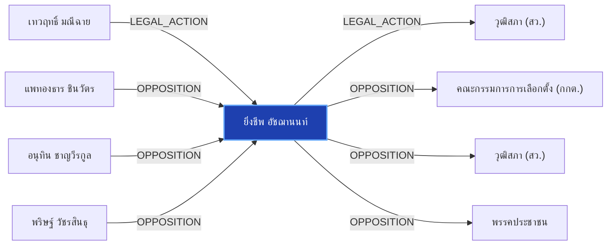

# ยิ่งชีพ อัชฌานนท์

> **สังกัด**: 👁️ ภาคประชาสังคม (iLaw) | **บทบาท**: ผู้จัดการ iLaw / ผู้เปิดโปงสถิติบล็อกโหวต สว.67 | **ขั้วการเมือง**: Independent

## 📊 ข้อมูลสังเขป & สถิติ
- **การปรากฏในข่าว 30 วันล่าสุด**: 8 ครั้ง
- **สถานะทางการเมือง**: Independent
- **ชื่อเรียก/ฉายา**: ยิ่งชีพ อัชฌานนท์, ยิ่งชีพ, เป๋า ยิ่งชีพ, iLaw

## 🌐 แผนผังความสัมพันธ์ (Semantic Network)

## 🔗 โครงข่ายความสัมพันธ์และเหตุการณ์สำคัญ
- **LEGAL_ACTION** ➔ [[entities/tewarit_maneechay|เทวฤทธิ์ มณีฉาย]]: กระบวนการทางกฎหมาย/ตรวจสอบระหว่าง เทวฤทธิ์ มณีฉาย และ ยิ่งชีพ อัชฌานนท์ (เมื่อ 2026-07-31)
  > *"ฟ้อง iLaw: การเมืองไทยในวิกฤตความเชื่อใจ กับ เทวฤทธิ์ มณีฉาย - The101"*
- **LEGAL_ACTION** ➔ [[entities/senate_thailand|วุฒิสภา (สว.)]]: กระบวนการทางกฎหมาย/ตรวจสอบระหว่าง ยิ่งชีพ อัชฌานนท์ และ วุฒิสภา (สว.) (เมื่อ 2026-08-28)
  > *"ยิ่งชีพ ปลุกบี้ #สั่งฟ้องสว. ยันไม่มีถ้า.. ชี้ 5 ซีนาริโอ กกต.ไม่ฟ้อง ระบอบสีน้ำเงินเฟื่องฟูแน่"*
- **OPPOSITION** ➔ [[entities/election_commission|คณะกรรมการการเลือกตั้ง (กกต.)]]: ยิ่งชีพ อัชฌานนท์ และ คณะกรรมการการเลือกตั้ง (กกต.) มีปฏิสัมพันธ์ในประเด็นการเมือง (เมื่อ 2026-08-29)
  > *"iLaw โดย ยิ่งชีพ อัชฌานนท์ เปิดรายงานสถิติบล็อกโหวต ชี้เครือข่ายฮั้วเลือก สว.67 คุมสภาสูง"*
- **OPPOSITION** ➔ [[entities/senate_thailand|วุฒิสภา (สว.)]]: ยิ่งชีพ อัชฌานนท์ และ วุฒิสภา (สว.) มีปฏิสัมพันธ์ในประเด็นการเมือง (เมื่อ 2026-08-29)
  > *"iLaw โดย ยิ่งชีพ อัชฌานนท์ เปิดรายงานสถิติบล็อกโหวต ชี้เครือข่ายฮั้วเลือก สว.67 คุมสภาสูง"*
- **OPPOSITION** ➔ [[entities/paetongtarn_shinawatra|แพทองธาร ชินวัตร]]: แพทองธาร ชินวัตร และ ยิ่งชีพ อัชฌานนท์ มีปฏิสัมพันธ์ในประเด็นการเมือง (เมื่อ 2026-08-28)
  > *"นภินทร เปิดทำเนียบ แจงโกงเลือกส.ว. ลั่นไม่โง่ทำผิดกฎหมาย ฝากถึง เป๋า-ยิ่งชีพ เจอกันในศาล"*
- **OPPOSITION** ➔ [[entities/anutin_charnvirakul|อนุทิน ชาญวีรกูล]]: อนุทิน ชาญวีรกูล และ ยิ่งชีพ อัชฌานนท์ มีปฏิสัมพันธ์ในประเด็นการเมือง (เมื่อ 2026-08-28)
  > *"นภินทร เปิดทำเนียบ แจงโกงเลือกส.ว. ลั่นไม่โง่ทำผิดกฎหมาย ฝากถึง เป๋า-ยิ่งชีพ เจอกันในศาล"*
- **OPPOSITION** ➔ [[entities/parit_wacharasindhu|พริษฐ์ วัชรสินธุ]]: พริษฐ์ วัชรสินธุ และ ยิ่งชีพ อัชฌานนท์ มีปฏิสัมพันธ์ในประเด็นการเมือง (เมื่อ 2026-08-28)
  > *"ต่อหน้าคนทั้งหมดเหล่านี้หรือ และหลักฐานได้ส่งคณะอนุกรรมการชุดที่ 26 ไปเรียบร้อยแล้ว แต่นายยิ่งชีพหรือนายพริษฐ์ นำข้อมูลที่ผมชี้แจงว่ามีพยานตรงนี้มาเปิดเผยด้วยหรือไม่”"*
- **OPPOSITION** ➔ [[entities/peoples_party|พรรคประชาชน]]: ยิ่งชีพ อัชฌานนท์ และ พรรคประชาชน มีปฏิสัมพันธ์ในประเด็นการเมือง (เมื่อ 2026-08-29)
  > *"นายยิ่งชีพ อัชฌานนท์ ผู้จัดการโครงการอินเทอร์เน็ตเพื่อกฎหมายประชาชน (iLaw) และทีมงาน Senate67 Watch ได้เผยแพร่รายงานวิเคราะห์ทางสถิติผลคะแนนการเลือก สว"*
- **OPPOSITION** ➔ [[entities/bhumjaithai_party|พรรคภูมิใจไทย]]: ยิ่งชีพ อัชฌานนท์ และ พรรคภูมิใจไทย มีปฏิสัมพันธ์ในประเด็นการเมือง (เมื่อ 2026-08-28)
  > *"นภินทร เปิดทำเนียบ แจงโกงเลือกส.ว. ลั่นไม่โง่ทำผิดกฎหมาย ฝากถึง เป๋า-ยิ่งชีพ เจอกันในศาล"*
- **OPPOSITION** ➔ [[entities/sawaeng_boonmee|แสวง บุญมี]]: แสวง บุญมี และ ยิ่งชีพ อัชฌานนท์ มีปฏิสัมพันธ์ในประเด็นการเมือง (เมื่อ 2026-08-28)
  > *"โดยเนื้อหาระบุว่า นายครรชิต เจริญอินทร์ รองเลขาธิการคณะกรรมการการเลือกตั้ง เข้าแจ้งความ ณ กองบังคับการปราบปราม กองบัญชาการตำรวจสอบสวนกลาง เพื่อดำเนินการตามกฎหมาย กรณี iLaw เผยแพร่เอกสารความเห็นของนายครรชิต เจริญอินทร์ รองเลขาธิการคณะกรรมการการเลือกตั"*
- **LEGAL_ACTION** ➔ [[entities/peoples_party|พรรคประชาชน]]: กระบวนการทางกฎหมาย/ตรวจสอบระหว่าง ยิ่งชีพ อัชฌานนท์ และ พรรคประชาชน (เมื่อ 2026-08-28)
  > *"ยิ่งชีพ ปลุกบี้ #สั่งฟ้องสว. ยันไม่มีถ้า.. ชี้ 5 ซีนาริโอ กกต.ไม่ฟ้อง ระบอบสีน้ำเงินเฟื่องฟูแน่"*
- **LEGAL_ACTION** ➔ [[entities/bhumjaithai_party|พรรคภูมิใจไทย]]: กระบวนการทางกฎหมาย/ตรวจสอบระหว่าง ยิ่งชีพ อัชฌานนท์ และ พรรคภูมิใจไทย (เมื่อ 2026-08-28)
  > *"ยิ่งชีพ ปลุกบี้ #สั่งฟ้องสว. ยันไม่มีถ้า.. ชี้ 5 ซีนาริโอ กกต.ไม่ฟ้อง ระบอบสีน้ำเงินเฟื่องฟูแน่"*
- **LEGAL_ACTION** ➔ [[entities/constitutional_court|ศาลรัฐธรรมนูญ]]: กระบวนการทางกฎหมาย/ตรวจสอบระหว่าง ยิ่งชีพ อัชฌานนท์ และ ศาลรัฐธรรมนูญ (เมื่อ 2026-08-28)
  > *"ยิ่งชีพ ปลุกบี้ #สั่งฟ้องสว. ยันไม่มีถ้า.. ชี้ 5 ซีนาริโอ กกต.ไม่ฟ้อง ระบอบสีน้ำเงินเฟื่องฟูแน่"*
- **LEGAL_ACTION** ➔ [[entities/election_commission|คณะกรรมการการเลือกตั้ง (กกต.)]]: กระบวนการทางกฎหมาย/ตรวจสอบระหว่าง ยิ่งชีพ อัชฌานนท์ และ คณะกรรมการการเลือกตั้ง (กกต.) (เมื่อ 2026-08-28)
  > *"ยิ่งชีพ ปลุกบี้ #สั่งฟ้องสว. ยันไม่มีถ้า.. ชี้ 5 ซีนาริโอ กกต.ไม่ฟ้อง ระบอบสีน้ำเงินเฟื่องฟูแน่"*
- **LEGAL_ACTION** ➔ [[entities/nacc|คณะกรรมการ ป.ป.ช.]]: กระบวนการทางกฎหมาย/ตรวจสอบระหว่าง ยิ่งชีพ อัชฌานนท์ และ คณะกรรมการ ป.ป.ช. (เมื่อ 2026-08-28)
  > *"ยิ่งชีพ ปลุกบี้ #สั่งฟ้องสว. ยันไม่มีถ้า.. ชี้ 5 ซีนาริโอ กกต.ไม่ฟ้อง ระบอบสีน้ำเงินเฟื่องฟูแน่"*
- **LEGAL_ACTION** ➔ [[entities/constitution_amendment|การแก้ไขรัฐธรรมนูญ]]: กระบวนการทางกฎหมาย/ตรวจสอบระหว่าง ยิ่งชีพ อัชฌานนท์ และ การแก้ไขรัฐธรรมนูญ (เมื่อ 2026-08-28)
  > *"ยิ่งชีพ ปลุกบี้ #สั่งฟ้องสว. ยันไม่มีถ้า.. ชี้ 5 ซีนาริโอ กกต.ไม่ฟ้อง ระบอบสีน้ำเงินเฟื่องฟูแน่"*
- **OPPOSITION** ➔ [[entities/nacc|คณะกรรมการ ป.ป.ช.]]: ยิ่งชีพ อัชฌานนท์ และ คณะกรรมการ ป.ป.ช. มีปฏิสัมพันธ์ในประเด็นการเมือง (เมื่อ 2026-08-28)
  > *"วิชา อัดองค์กรอิสระ ต้องยึดโยงประชาชน ชม ‘ยิ่งชีพ’ เปิดข้อมูลโกง ส.ว."*
- **OPPOSITION** ➔ [[entities/constitution_amendment|การแก้ไขรัฐธรรมนูญ]]: ยิ่งชีพ อัชฌานนท์ และ การแก้ไขรัฐธรรมนูญ มีปฏิสัมพันธ์ในประเด็นการเมือง (เมื่อ 2026-08-28)
  > *"วิชา อัดองค์กรอิสระ ต้องยึดโยงประชาชน ชม ‘ยิ่งชีพ’ เปิดข้อมูลโกง ส.ว."*
- **LEGAL_ACTION** ➔ [[entities/sawaeng_boonmee|แสวง บุญมี]]: กระบวนการทางกฎหมาย/ตรวจสอบระหว่าง แสวง บุญมี และ ยิ่งชีพ อัชฌานนท์ (เมื่อ 2026-08-28)
  > *"อ.มุนินทร์ งง เหตุผลกกต.ฟ้องไอลอว์ คือไม่มั่นใจตัวเองโปร่งใส เลยให้ตำรวจสอบอีกชั้น?"*
- **OPPOSITION** ➔ [[entities/mongkol_surasajja|มงคล สุระสัจจะ]]: มงคล สุระสัจจะ และ ยิ่งชีพ อัชฌานนท์ มีปฏิสัมพันธ์ในประเด็นการเมือง (เมื่อ 2026-08-29)
  > *"tags: ["ยิ่งชีพ อัชฌานนท์", "iLaw", "มงคล สุระสัจจะ", "นันทนา นันทวโรภาส", "กกต"*
- **OPPOSITION** ➔ [[entities/nanthana_nanthavaropas|นันทนา นันทวโรภาส]]: นันทนา นันทวโรภาส และ ยิ่งชีพ อัชฌานนท์ มีปฏิสัมพันธ์ในประเด็นการเมือง (เมื่อ 2026-08-29)
  > *"tags: ["ยิ่งชีพ อัชฌานนท์", "iLaw", "มงคล สุระสัจจะ", "นันทนา นันทวโรภาส", "กกต"*

## 📑 เอกสารและข่าวที่เกี่ยวข้อง
- ดูสรุปข่าวรอบ 30 วันใน [[wiki/index#Source Summaries|Index Summaries]]
